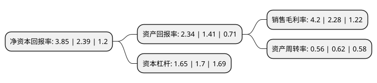

> 本页面由自动化程序生成于 2022年5月20日 01:02
> 内容可能存在错误，如有bug请提交issue至：https://github.com/Eroleice/doc-pi/issues
{.is-warning}

# 上市公司基本情况

## 基本资料

常柴股份有限公司（以下简称“苏常柴A”）成立于1994年05月05日，常州市。于1994年07月01日在深交所主板上市。

苏常柴A注册资本70,569.251万元，主要业务:农用柴油机，联合收割机，农用运输车的制造与销售。主要产品:柴油机，零配件。以下是详细信息：

- 公司名称: 常柴股份有限公司
- 股票代码: 000570.SZ
- 所在地: 江苏 - 常州市
- 成立日期: 1994年05月05日
- 注册资本: 70,569.251万元
- 法定代表人: 史新昆
- 主营业务: 农用柴油机，联合收割机，农用运输车的制造与销售主要产品:柴油机，零配件
- 公司官网: www.changchai.com.cn
- 公司介绍: 公司是具有一百多年历史的民族工业企业，是中国最早的内燃机专业制造商之一，也是全国农机行业及常州市第一家上市公司。公司拥有国家级企业技术中心和博士后科研工作站、江苏省中小功率内燃机工程技术研究中心，采用国家环保部认可的高压共轨、电控单体泵、电控VE泵三种先进技术路线，在行业内成功推出非道路国Ⅲ、国IV电控柴油机及车用国V柴油机，形成了多系列、多品种机型。新技术的运用使常柴产品具有更高的可靠性和经济性，可全面满足车用运输、收割机、轮拖、装载机、植保机械等配套领域要求。同时常柴在非道路机械领域有多款多缸机通过了美国EPA、欧盟EC排放认证，获得了进军欧美市场的绿色通行证，具有在国际市场上的竞争力。“常柴”牌柴油机是中国名牌产品，企业通过了ISO9000质量体系认证、ISO14001环境管理体系认证、ISO/TS16949汽车产品质量管理体系认证，获得了国家出口商品免验企业资格。常柴品牌连续多年入选“中国500最具价值品牌”排行榜。

## 股东及高管情况

上市公司第一大股东为常州投资集团有限公司，持股227,663,417股，占比32.26%，为上市公司实际控制人。

截至2022年03月31日，上市公司的前十大股东中，共有5名自然人股东，3名机构股东，1个产品账户，1个海外主体，其中5%以上大股东共有1名。上市公司前十大股东明细如下：

> 截至2022年03月31日，上市公司前十大股东信息如下：

| 股东名称 | 持股数量（股） | 持股比例 |
| --- | --- | --- |
| 常州投资集团有限公司 | 227,663,417 | 32.26% |
| 诺德基金-华章天地传媒投资控股集团有限公司-诺德基金浦江64号单一资产管理计划 | 10,490,336 | 1.49% |
| 中国黄金集团资产管理有限公司 | 6,520,000 | 0.92% |
| 陈建 | 4,506,000 | 0.64% |
| 常州交通建设投资开发有限公司 | 3,345,454 | 0.47% |
| KGI ASIA LIMITED | 3,101,695 | 0.44% |
| 姚建全 | 1,699,954 | 0.24% |
| 黎穗南 | 1,548,100 | 0.22% |
| 黄国良 | 1,528,891 | 0.22% |
| 陈晓静 | 1,408,300 | 0.2% |

## 利润表分析

上市公司2021年总收入为24.52亿元，净利润为1.02亿元，实现盈利。

## 杜邦分析

> 数据列示周期：2021年 | 2020年 | 2019年
{.is-info}

上市公司的净资产收益率在近一年有所上升，上升幅度为61.09%，其变化情况分解如下：
- 上市公司的销售毛利率在近一年上升了84.21%，可能是生产效率的提升、商品原材料价格下跌或商品价格的上涨所致。
- 上市公司的资产周转率在近一年下降了-9.68%，可能是源自于更慢的销售回款或库存管理效果下降。
- 上市公司的财务杠杆比率在近一年下降了-2.94%，可能是减少负债降低财务费用。

