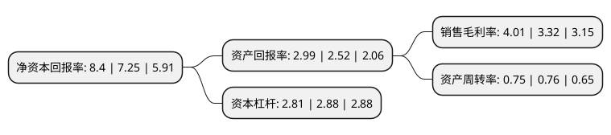

> 本页面由自动化程序生成于 2022年5月20日 01:04
> 内容可能存在错误，如有bug请提交issue至：https://github.com/Eroleice/doc-pi/issues
{.is-warning}

# 上市公司基本情况

## 基本资料

潍柴重机股份有限公司（以下简称“潍柴重机”）成立于1993年06月28日，潍坊市。于1998年04月02日在深交所主板上市。

潍柴重机注册资本33,132.06万元，主要产品:农用车，拖拉机，复合管。以下是详细信息：

- 公司名称: 潍柴重机股份有限公司
- 股票代码: 000880.SZ
- 所在地: 山东 - 潍坊市
- 成立日期: 1993年06月28日
- 注册资本: 33,132.06万元
- 法定代表人: 王志坚
- 主营业务: 主要产品:农用车，拖拉机，复合管
- 公司官网: www.weichaihm.com
- 公司介绍: 公司于1998年在深圳证券交易所上市。2006年，公司进行重大资产重组，置入潍柴控股集团有限公司的中速柴油机和发电设备制造等优良的经营性资产。公司主要开发、制造和销售船舶动力和发电设备市场用30-12000马力的发动机、发电机组及动力集成系统，提供全系列船用主推、电推、发电设备、泵用动力发动机等产品，覆盖远洋、近海、内河和发电四个领域。同时，公司提供发动机、齿轮箱、轴系、螺旋桨及遥控系统等推进系统的集成产品及内部设计、匹配、集成管理等整套解决方案。公司国内船电业务所辖区域内共300余家维修站，覆盖了中国内陆、沿海及主要岛屿、内河、湖泊等区域，形成了“有潍柴产品，就有潍柴服务”的全天候、全地域的服务网络。公司在海外设立100多家维修站，建立海外配件配送中心，形成了完善的国际服务网络。

## 股东及高管情况

上市公司第一大股东为潍柴控股集团有限公司，持股101,358,600股，占比30.59%，为上市公司实际控制人。

截至2022年03月31日，上市公司的前十大股东中，共有7名自然人股东，3名机构股东，其中5%以上大股东共有2名。上市公司前十大股东明细如下：

> 截至2022年03月31日，上市公司前十大股东信息如下：

| 股东名称 | 持股数量（股） | 持股比例 |
| --- | --- | --- |
| 潍柴控股集团有限公司 | 101,358,600 | 30.59% |
| 潍坊市投资集团有限公司 | 67,800,000 | 20.46% |
| 山东省国有资产投资控股有限公司 | 16,524,005 | 4.99% |
| 洪泽君 | 16,460,000 | 4.97% |
| 吴海燕 | 9,358,520 | 2.82% |
| 胡祖平 | 1,138,928 | 0.34% |
| 于淑芳 | 830,060 | 0.25% |
| 王兰英 | 827,843 | 0.25% |
| 敬晓东 | 693,153 | 0.21% |
| 黄佩玲 | 608,600 | 0.18% |

## 利润表分析

上市公司2021年总收入为34.1亿元，净利润为1.36亿元，实现盈利。

## 杜邦分析

> 数据列示周期：2021年 | 2020年 | 2019年
{.is-info}

上市公司的净资产收益率在近一年有所上升，上升幅度为15.86%，其变化情况分解如下：
- 上市公司的销售毛利率在近一年上升了20.78%，可能是生产效率的提升、商品原材料价格下跌或商品价格的上涨所致。
- 上市公司的资产周转率在近一年下降了-1.32%，可能是源自于更慢的销售回款或库存管理效果下降。
- 上市公司的财务杠杆比率在近一年下降了-2.43%，可能是减少负债降低财务费用。

