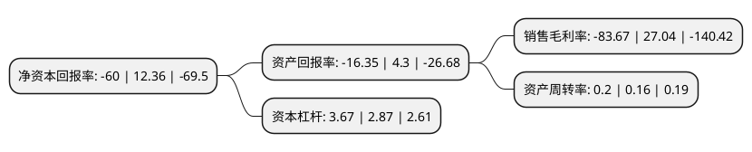

> 本页面由自动化程序生成于 2022年5月20日 01:06
> 内容可能存在错误，如有bug请提交issue至：https://github.com/Eroleice/doc-pi/issues
{.is-warning}

# 上市公司基本情况

## 基本资料

天马轴承集团股份有限公司（以下简称“ST天马”）成立于2002年11月18日，杭州市。于2007年03月28日在深交所中小板上市。

ST天马注册资本121,335.729万元，主营业务:通用轴承，铁路轴承及轴承配件的生产销售，企业云服务，大数据应用服务和商业人工智能服务以下是详细信息：

- 公司名称: 天马轴承集团股份有限公司
- 股票代码: 002122.SZ
- 所在地: 浙江 - 杭州市
- 成立日期: 2002年11月18日
- 注册资本: 121,335.729万元
- 法定代表人: 武剑飞
- 主营业务: 主营业务:通用轴承，铁路轴承及轴承配件的生产销售，企业云服务，大数据应用服务和商业人工智能服务
- 公司官网: www.tmb.net.cn/www.tianma-group.com
- 公司介绍: 公司主营业务包括轴承及机床业务主要产品包括轴承、圆钢、机床、农牧产品等。公司确立“做产业互联网时代大数据驱动的智能商业服务提供商，让商业简单”的企业愿景，明确“以智能商业开放平台AIaaS(ArtificialIntelligenceasaService，人工智能即服务)为核心技术能力，打造智能零售与生活服务、智能金融科技、智能城市与政务、智能制造等核心业务平台，以企业云服务、大数据应用和商业人工智能赋能核心业务应用场景”的智能商业π型战略，通过“星智工程、火星计划、生态赋能”三大战略执行路径，推动公司战略转型。公司提供的智能商业服务包括企业云服务、大数据应用服务和商业人工智能服务。公司的“TMB”天马牌轴承先后被评为杭州市名牌产品、浙江省名牌产品；“TMB”商标/产品荣获、国家免检、中国驰名商标和最具市场竞争力品牌等荣誉称号。

## 股东及高管情况

上市公司第一大股东为四合聚力信息科技集团有限公司，持股250,973,000股，占比20.68%，**疑似为**上市公司实际控制人。

截至2022年03月31日，上市公司的前十大股东中，共有2名自然人股东，8名机构股东，其中5%以上大股东共有2名。上市公司前十大股东明细如下：

> 未能通过持股比例判定出上市公司实际控制人（持股30%以上）
> 可能存在通过间接持股、联合持股、协议控制等方式拥有实际控制权的主体，具体请参考上市公司定期公告！
{.is-warning}

> 截至2022年03月31日，上市公司前十大股东信息如下：

| 股东名称 | 持股数量（股） | 持股比例 |
| --- | --- | --- |
| 四合聚力信息科技集团有限公司 | 250,973,000 | 20.68% |
| 霍尔果斯天马创业投资集团有限公司 | 106,945,761 | 8.81% |
| 深圳市中奇信息产业投资咨询有限公司 | 52,443,552 | 4.32% |
| 海南奇日升企业咨询股份有限公司 | 45,490,201 | 3.75% |
| 喀什星河创业投资有限公司 | 31,750,000 | 2.62% |
| 湖北天乾资产管理有限公司 | 30,000,000 | 2.47% |
| 深圳华创金盛投资咨询有限公司 | 28,000,000 | 2.31% |
| 杜洪海 | 12,980,000 | 1.07% |
| 齐齐哈尔市国有资本投资运营有限公司 | 11,260,000 | 0.93% |
| 余海涛 | 8,402,800 | 0.69% |

## 利润表分析

上市公司2021年总收入为8.37亿元，净利润为-7.01亿元，**未实现盈利**。

## 杜邦分析

> 数据列示周期：2021年 | 2020年 | 2019年
{.is-info}

上市公司的净资产收益率在近一年有所下降，下降幅度为-585.44%，其变化情况分解如下：
- 上市公司的销售毛利率在近一年下降了-409.43%，可能是生产效率的下降、商品原材料价格上涨或商品价格的下跌所致。
- 上市公司的资产周转率在近一年上升了25%，可能是源自于更快的销售回款或库存管理效果提升。
- 上市公司的财务杠杆比率在近一年上升了27.87%，可能是增加负债扩大生产规模。

