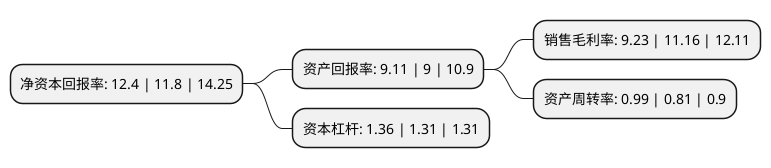

> 本页面由自动化程序生成于 2022年5月20日 01:06
> 内容可能存在错误，如有bug请提交issue至：https://github.com/Eroleice/doc-pi/issues
{.is-warning}

# 上市公司基本情况

## 基本资料

江苏通润装备科技股份有限公司（以下简称“通润装备”）成立于2002年10月28日，苏州市。于2007年08月10日在深交所中小板上市。

通润装备注册资本35,651.705万元，主要产品:各类钢制工具箱，工具柜，工具车;其他产品主要包括:钢制办公家具，工作台，支架，信箱，邮箱，钱柜，犬舍，油箱等其他薄板制品。主营业务:公钢制工具箱，工具柜，工具车，钢制办公家具及其他薄板制品的生产，研发及销售。以下是详细信息：

- 公司名称: 江苏通润装备科技股份有限公司
- 股票代码: 002150.SZ
- 所在地: 江苏 - 苏州市
- 成立日期: 2002年10月28日
- 注册资本: 35,651.705万元
- 法定代表人: 柳振江
- 主营业务: 主要产品:各类钢制工具箱，工具柜，工具车;其他产品主要包括:钢制办公家具，工作台，支架，信箱，邮箱，钱柜，犬舍，油箱等其他薄板制品主营业务:公钢制工具箱，工具柜，工具车，钢制办公家具及其他薄板制品的生产，研发及销售
- 公司官网: www.tongrunindustries.com
- 公司介绍: 公司是钢制工具箱柜行业的规模企业，主要业务为金属箱柜制品和输配电控制设备两大类产品的生产、研发和销售。金属箱柜业务主要产品有金属工具箱、工具柜、工具车、工作台、金属办公家具、机电箱柜等钣金箱柜制品。输配电控制设备业务主要产品包括高压成套开关设备、中低压成套开关设备、高低压开关元件及控制电器等。公司不仅拥有国际先进的钣金加工中心、涂装生产线，还拥有实力强大的研发机构和实验室，被授予江苏省认定“企业技术中心”称号。公司始终按现代公司的科学制度实施规范管理，取得了良好的经济效益和社会声誉，产品先后获得了“江苏省名牌产品”、“江苏省高新技术产品”等称号。

## 股东及高管情况

上市公司第一大股东为常熟市千斤顶厂，持股136,671,707股，占比38.34%，为上市公司实际控制人。

截至2022年03月31日，上市公司的前十大股东中，共有5名自然人股东，3名机构股东，1个海外主体，1名其他股东，其中5%以上大股东共有2名。上市公司前十大股东明细如下：

> 截至2022年03月31日，上市公司前十大股东信息如下：

| 股东名称 | 持股数量（股） | 持股比例 |
| --- | --- | --- |
| 常熟市千斤顶厂 | 136,671,707 | 38.34% |
| TORIN JACKS INC. | 58,110,000 | 16.3% |
| 常熟长城轴承有限公司 | 9,300,330 | 2.61% |
| 新余新观念投资管理有限公司 | 6,084,000 | 1.71% |
| 谭益洋 | 2,979,600 | 0.84% |
| 潘振安 | 1,957,800 | 0.55% |
| 荣俪婷 | 1,567,000 | 0.44% |
| 任平 | 1,519,666 | 0.43% |
| 郭维 | 1,339,338 | 0.38% |
| 申万宏源证券有限公司 | 1,333,400 | 0.37% |

## 利润表分析

上市公司2021年总收入为19.21亿元，净利润为1.77亿元，实现盈利。

## 杜邦分析

> 数据列示周期：2021年 | 2020年 | 2019年
{.is-info}

上市公司的净资产收益率在近一年有所上升，上升幅度为5.08%，其变化情况分解如下：
- 上市公司的销售毛利率在近一年下降了-17.29%，可能是生产效率的下降、商品原材料价格上涨或商品价格的下跌所致。
- 上市公司的资产周转率在近一年上升了22.22%，可能是源自于更快的销售回款或库存管理效果提升。
- 上市公司的财务杠杆比率在近一年上升了3.82%，可能是增加负债扩大生产规模。

