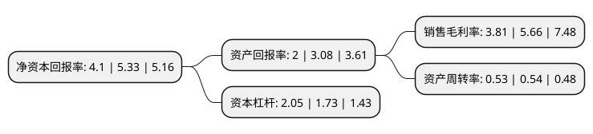

> 本页面由自动化程序生成于 2022年5月20日 01:07
> 内容可能存在错误，如有bug请提交issue至：https://github.com/Eroleice/doc-pi/issues
{.is-warning}

# 上市公司基本情况

## 基本资料

四川川润股份有限公司（以下简称“川润股份”）成立于1997年09月12日，自贡市。于2008年09月19日在深交所中小板上市。

川润股份注册资本43,828万元，流体机械与控制技术，节能环保动力装备的研发，生产和销售，以及清洁能源项目投资运营及EPC服务以下是详细信息：

- 公司名称: 四川川润股份有限公司
- 股票代码: 002272.SZ
- 所在地: 四川 - 自贡市
- 成立日期: 1997年09月12日
- 注册资本: 43,828万元
- 法定代表人: 罗永忠
- 主营业务: 流体机械与控制技术，节能环保动力装备的研发，生产和销售，以及清洁能源项目投资运营及EPC服务
- 公司官网: www.chuanrun.com
- 公司介绍: 公司主要从事流体机械与控制技术、节能环保动力装备的研发、生产和销售，以及清洁能源项目投资运营及EPC服务。主要产品包括润滑设备、液压设备、风电液压润滑冷却设备、余热锅炉等，广泛应用于新能源、石油化工、电力、建材水泥、冶金矿山、工程机械和轻工等诸多行业。经过多年的努力，公司已发展成为国内技术水平先进、规模化生产的产品设备供应商和技术服务商，在行业中具有显著的品牌竞争优势。公司是四川省普通机械制造工业企业最大规模20强，国家高新技术企业，四川省重合同守信用企业。

## 股东及高管情况

上市公司第一大股东为罗丽华，持股77,399,150股，占比17.66%，**疑似为**上市公司实际控制人。

截至2022年03月31日，上市公司的前十大股东中，共有8名自然人股东，2个产品账户，其中5%以上大股东共有3名。上市公司前十大股东明细如下：

> 未能通过持股比例判定出上市公司实际控制人（持股30%以上）
> 可能存在通过间接持股、联合持股、协议控制等方式拥有实际控制权的主体，具体请参考上市公司定期公告！
{.is-warning}

> 截至2022年03月31日，上市公司前十大股东信息如下：

| 股东名称 | 持股数量（股） | 持股比例 |
| --- | --- | --- |
| 罗丽华 | 77,399,150 | 17.66% |
| 钟利钢 | 28,520,000 | 6.51% |
| 罗永忠 | 26,155,000 | 5.97% |
| 罗全 | 8,662,000 | 1.98% |
| 芜湖长元股权投资基金(有限合伙) | 7,716,865 | 1.76% |
| 罗永清 | 2,681,000 | 0.61% |
| 上海浦东发展银行股份有限公司-工银瑞信生态环境行业股票型证券投资基金 | 1,860,300 | 0.42% |
| 程玉光 | 1,644,975 | 0.38% |
| 钟智刚 | 1,301,650 | 0.3% |
| 罗小峰 | 1,180,000 | 0.27% |

## 利润表分析

上市公司2021年总收入为15.31亿元，净利润为0.58亿元，实现盈利。

## 杜邦分析

> 数据列示周期：2021年 | 2020年 | 2019年
{.is-info}

上市公司的净资产收益率在近一年有所下降，下降幅度为-23.08%，其变化情况分解如下：
- 上市公司的销售毛利率在近一年下降了-32.69%，可能是生产效率的下降、商品原材料价格上涨或商品价格的下跌所致。
- 上市公司的资产周转率在近一年下降了-1.85%，可能是源自于更慢的销售回款或库存管理效果下降。
- 上市公司的财务杠杆比率在近一年上升了18.5%，可能是增加负债扩大生产规模。

