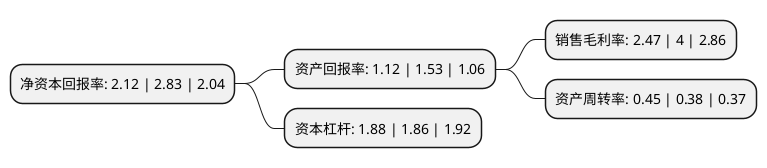

> 本页面由自动化程序生成于 2022年5月20日 01:08
> 内容可能存在错误，如有bug请提交issue至：https://github.com/Eroleice/doc-pi/issues
{.is-warning}

# 上市公司基本情况

## 基本资料

泰尔重工股份有限公司（以下简称“泰尔股份”）成立于2001年12月18日，马鞍山市。于2010年01月28日在深交所中小板上市。

泰尔股份注册资本50,470.228万元，主要产品:应用于钢铁行业，为钢铁企业的轧制设备提供配套传动零部件。主营业务:动力传动机械及剪刃产品的开发和制造，专注于十字轴式万向联轴器，鼓形齿式联轴器和剪刃等三类产品的设计，生产和销售。以下是详细信息：

- 公司名称: 泰尔重工股份有限公司
- 股票代码: 002347.SZ
- 所在地: 安徽 - 马鞍山市
- 成立日期: 2001年12月18日
- 注册资本: 50,470.228万元
- 法定代表人: 邰正彪
- 主营业务: 主要产品:应用于钢铁行业，为钢铁企业的轧制设备提供配套传动零部件主营业务:动力传动机械及剪刃产品的开发和制造，专注于十字轴式万向联轴器，鼓形齿式联轴器和剪刃等三类产品的设计，生产和销售
- 公司官网: www.taiergroup.com
- 公司介绍: 公司是世界冶金行业装备制造领域的领军企业之一，主要从事工业万向轴、齿轮联轴器、剪刃、滑板、卷取机及卷取轴、包装机器人等产品的设计、研发、制造、销售与服务。公司以开放共享打造冶金产业价值链，致力于成为国际一流的先进装备制造商、冶金产业全生命周期的总包服务商和智能钢厂方案解决商。凭借持续增强的创新能力，规范、快速、灵活的服务模式赢得了客户的信任与合作。公司为中国钢铁工业协会冶金设备分会副会长单位、中国机械通用零部件工业协会副理事长单位、传动联结件分会理事长单位、中国重型机械工业协会重型基础件分会副理长单位、中国钢铁工业协会理事单位。设有国家级企业技术中心、国家级博士后工作站、冶金装备再制造院士工作站，获批中国驰名商标、中国专利优秀奖、国家级守合同重信用企业、国家技术创新示范企业等。

## 股东及高管情况

上市公司第一大股东为邰正彪，持股140,368,202股，占比27.81%，**疑似为**上市公司实际控制人。

截至2022年03月31日，上市公司的前十大股东中，共有5名自然人股东，3名机构股东，1个产品账户，1个海外主体，其中5%以上大股东共有1名。上市公司前十大股东明细如下：

> 未能通过持股比例判定出上市公司实际控制人（持股30%以上）
> 可能存在通过间接持股、联合持股、协议控制等方式拥有实际控制权的主体，具体请参考上市公司定期公告！
{.is-warning}

> 截至2022年03月31日，上市公司前十大股东信息如下：

| 股东名称 | 持股数量（股） | 持股比例 |
| --- | --- | --- |
| 邰正彪 | 140,368,202 | 27.81% |
| 黄春燕 | 17,075,200 | 3.38% |
| 一重集团融创科技发展有限公司 | 15,113,350 | 2.99% |
| 邰紫鹏 | 14,633,500 | 2.9% |
| 马鞍山经济技术开发区建设投资有限公司 | 12,594,458 | 2.5% |
| 安徽江东产业投资集团有限公司 | 7,556,675 | 1.5% |
| UBS AG | 4,927,216 | 0.98% |
| 邰紫薇 | 3,933,500 | 0.78% |
| 财通基金-华泰证券股份有限公司-财通基金君享永熙单一资产管理计划 | 3,778,338 | 0.75% |
| 林万鸿 | 3,778,337 | 0.75% |

## 利润表分析

上市公司2021年总收入为10.59亿元，净利润为0.26亿元，实现盈利。

## 杜邦分析

> 数据列示周期：2021年 | 2020年 | 2019年
{.is-info}

上市公司的净资产收益率在近一年有所下降，下降幅度为-25.09%，其变化情况分解如下：
- 上市公司的销售毛利率在近一年下降了-38.25%，可能是生产效率的下降、商品原材料价格上涨或商品价格的下跌所致。
- 上市公司的资产周转率在近一年上升了18.42%，可能是源自于更快的销售回款或库存管理效果提升。
- 上市公司的财务杠杆比率在近一年上升了1.08%，可能是增加负债扩大生产规模。

