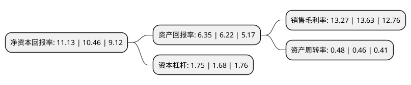

> 本页面由自动化程序生成于 2022年5月20日 01:09
> 内容可能存在错误，如有bug请提交issue至：https://github.com/Eroleice/doc-pi/issues
{.is-warning}

# 上市公司基本情况

## 基本资料

江苏神通阀门股份有限公司（以下简称“江苏神通”）成立于2001年01月04日，南通市。于2010年06月23日在深交所中小板上市。

江苏神通注册资本50,753.746万元，主营业务:研发，生产和销售应用于冶金领域的高炉煤气全干法除尘系统，转炉煤气除尘与回收系统，焦炉烟气除尘系统，煤气管网系统的特种阀门，法兰，应用于核电站的核级蝶阀，核级球阀，核级法兰和锻件，非核级蝶阀，非核级球阀及其配套设备，以及应用于煤化工，超(超)临界火电，LNG超低温阀门和石油石化专用阀门和法兰及锻件。以下是详细信息：

- 公司名称: 江苏神通阀门股份有限公司
- 股票代码: 002438.SZ
- 所在地: 江苏 - 南通市
- 成立日期: 2001年01月04日
- 注册资本: 50,753.746万元
- 法定代表人: 吴建新
- 主营业务: 主营业务:研发，生产和销售应用于冶金领域的高炉煤气全干法除尘系统，转炉煤气除尘与回收系统，焦炉烟气除尘系统，煤气管网系统的特种阀门，法兰，应用于核电站的核级蝶阀，核级球阀，核级法兰和锻件，非核级蝶阀，非核级球阀及其配套设备，以及应用于煤化工，超(超)临界火电，LNG超低温阀门和石油石化专用阀门和法兰及锻件
- 公司官网: www.stfm.cn
- 公司介绍: 公司是中国阀门行业的重点骨干企业，是国内冶金、核电、超(超)临界火电、煤化工、液化天然气(LNG)及石油炼化等领域专用特种阀门的生产基地之一，是国家级高新技术企业、江苏省创新型企业、节能减排示范企业和江苏省知识产权管理标准化示范企业；建有国家博士后科研工作站、江苏省工程技术研究中心、江苏省核电阀门重点实验室；公司是中国阀门行业协会副理事长单位、全国阀门标准化技术委员会蝶阀工作组组长单位、宝钢设备与备件联合研制供应中心成员单位、中国石油化工集团公司物资供应网络成员单位、中广核核电设备国产化联合研发中心成员单位。拥有民用核安全设备设计和制造许可证、压力容器和压力管道元件特种设备制造许可证。通过了美国石油学会API6D、API609认证以及ISO9001质量管理体系、ISO10012测量管理体系、ISO14001环境管理体系、GB/T28001职业健康安全管理体系认证。

## 股东及高管情况

上市公司第一大股东为宁波聚源瑞利投资合伙企业(有限合伙)，持股82,578,557股，占比16.27%，**疑似为**上市公司实际控制人。

截至2022年03月31日，上市公司的前十大股东中，共有5名自然人股东，2名机构股东，3个产品账户，其中5%以上大股东共有3名。上市公司前十大股东明细如下：

> 未能通过持股比例判定出上市公司实际控制人（持股30%以上）
> 可能存在通过间接持股、联合持股、协议控制等方式拥有实际控制权的主体，具体请参考上市公司定期公告！
{.is-warning}

> 截至2022年03月31日，上市公司前十大股东信息如下：

| 股东名称 | 持股数量（股） | 持股比例 |
| --- | --- | --- |
| 宁波聚源瑞利投资合伙企业(有限合伙) | 82,578,557 | 16.27% |
| 湖州风林火山股权投资合伙企业(有限合伙) | 47,804,138 | 9.42% |
| 吴建新 | 41,111,592 | 8.1% |
| 黄高杨 | 11,755,376 | 2.32% |
| 招商证券股份有限公司-建信中小盘先锋股票型证券投资基金 | 9,840,385 | 1.94% |
| 韩力 | 9,700,000 | 1.91% |
| 张逸芳 | 8,497,982 | 1.67% |
| 郁正涛 | 7,641,283 | 1.51% |
| 中国工商银行股份有限公司-海富通改革驱动灵活配置混合型证券投资基金 | 6,706,258 | 1.32% |
| 中国银行股份有限公司-建信创新驱动混合型证券投资基金 | 6,529,400 | 1.29% |

## 杜邦分析

> 数据列示周期：2021年 | 2020年 | 2019年
{.is-info}

上市公司的净资产收益率在近一年有所上升，上升幅度为6.41%，其变化情况分解如下：
- 上市公司的销售毛利率在近一年下降了-2.64%，可能是生产效率的下降、商品原材料价格上涨或商品价格的下跌所致。
- 上市公司的资产周转率在近一年上升了4.35%，可能是源自于更快的销售回款或库存管理效果提升。
- 上市公司的财务杠杆比率在近一年上升了4.17%，可能是增加负债扩大生产规模。

