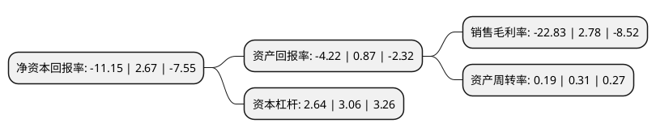

> 本页面由自动化程序生成于 2022年5月20日 01:09
> 内容可能存在错误，如有bug请提交issue至：https://github.com/Eroleice/doc-pi/issues
{.is-warning}

# 上市公司基本情况

## 基本资料

成都市新筑路桥机械股份有限公司（以下简称“新筑股份”）成立于2001年03月28日，成都市。于2010年09月21日在深交所中小板上市。

新筑股份注册资本76,916.867万元，主营业务为公司主要从事桥梁支座，桥梁伸缩装置，预应力锚具等公路，铁路桥梁功能部件的研发，设计，生产，销售和服务。公司还从事路面施工和养护设备(包括摊铺机，挖掘机等)，混凝土机械等产品的研发，生产，销售和服务。主要产品为桥梁支座，桥梁伸缩装置和预应力锚具。以下是详细信息：

- 公司名称: 成都市新筑路桥机械股份有限公司
- 股票代码: 002480.SZ
- 所在地: 四川 - 成都市
- 成立日期: 2001年03月28日
- 注册资本: 76,916.867万元
- 法定代表人: 肖光辉
- 主营业务: 主营业务为公司主要从事桥梁支座，桥梁伸缩装置，预应力锚具等公路，铁路桥梁功能部件的研发，设计，生产，销售和服务公司还从事路面施工和养护设备(包括摊铺机，挖掘机等)，混凝土机械等产品的研发，生产，销售和服务主要产品为桥梁支座，桥梁伸缩装置和预应力锚具
- 公司官网: www.xinzhu.com
- 公司介绍: 公司是我国桥梁功能部件行业中拥有CRCC认证产品品种最齐全、产品链最完整的企业之一。历经多年非凡历程，从一个仅能生产伸缩缝装置和橡胶支座的企业发展成为了一个能在公共交通及民用建筑领域提供系统集成产品和服务的企业。公司拥有完整的产业链和跨地区的产业布局，形成了轨道交通系统、桥梁功能部件、工程施工装备、地质灾害处理、超能电池制造、噪声及污水处理、特种汽车、纯电动公交系统、电动物流系统等产业，在成都、北京、上海、合肥、眉山、雅安、杜塞尔多夫等地建设有制造基地、合资公司和分公司，产品与服务覆盖了全国各地和全球四大洲的47个国家。

## 股东及高管情况

上市公司第一大股东为四川发展轨道交通产业投资有限公司，持股122,333,000股，占比15.9%，**疑似为**上市公司实际控制人。

截至2022年03月31日，上市公司的前十大股东中，共有2名自然人股东，6名机构股东，1个产品账户，1个海外主体，其中5%以上大股东共有2名。上市公司前十大股东明细如下：

> 未能通过持股比例判定出上市公司实际控制人（持股30%以上）
> 可能存在通过间接持股、联合持股、协议控制等方式拥有实际控制权的主体，具体请参考上市公司定期公告！
{.is-warning}

> 截至2022年03月31日，上市公司前十大股东信息如下：

| 股东名称 | 持股数量（股） | 持股比例 |
| --- | --- | --- |
| 四川发展轨道交通产业投资有限公司 | 122,333,000 | 15.9% |
| 四川发展(控股)有限责任公司 | 104,572,204 | 13.6% |
| 新筑投资集团有限公司 | 37,056,851 | 4.82% |
| 广州广日股份有限公司 | 32,268,492 | 4.2% |
| 新津聚英科技发展有限公司 | 16,092,000 | 2.09% |
| 芜湖长元股权投资基金(有限合伙) | 5,741,828 | 0.75% |
| 吴国英 | 4,180,500 | 0.54% |
| 高华-汇丰-GOLDMAN, SACHS & CO.LLC | 4,069,700 | 0.53% |
| 深圳中电能源控股有限责任公司 | 4,043,400 | 0.53% |
| 谢凤伟 | 4,010,613 | 0.52% |

## 利润表分析

上市公司2021年总收入为12.49亿元，净利润为-2.86亿元，**未实现盈利**。

## 杜邦分析

> 数据列示周期：2021年 | 2020年 | 2019年
{.is-info}

上市公司的净资产收益率在近一年有所下降，下降幅度为-517.6%，其变化情况分解如下：
- 上市公司的销售毛利率在近一年下降了-921.22%，可能是生产效率的下降、商品原材料价格上涨或商品价格的下跌所致。
- 上市公司的资产周转率在近一年下降了-38.71%，可能是源自于更慢的销售回款或库存管理效果下降。
- 上市公司的财务杠杆比率在近一年下降了-13.73%，可能是减少负债降低财务费用。

