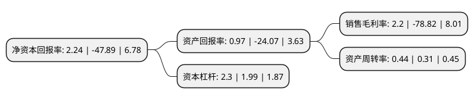

> 本页面由自动化程序生成于 2022年5月20日 01:09
> 内容可能存在错误，如有bug请提交issue至：https://github.com/Eroleice/doc-pi/issues
{.is-warning}

# 上市公司基本情况

## 基本资料

江苏宝馨科技股份有限公司（以下简称“宝馨科技”）成立于2001年10月08日，泰州市。于2010年12月03日在深交所中小板上市。

宝馨科技注册资本55,403.426万元，主营业务:电力，通讯，医疗，金融及新能源等领域的数控钣金结构件及结构体。。以下是详细信息：

- 公司名称: 江苏宝馨科技股份有限公司
- 股票代码: 002514.SZ
- 所在地: 江苏 - 泰州市
- 成立日期: 2001年10月08日
- 注册资本: 55,403.426万元
- 法定代表人: 王思淇
- 主营业务: 主营业务:电力，通讯，医疗，金融及新能源等领域的数控钣金结构件及结构体
- 公司官网: www.boamax.com
- 公司介绍: 公司是一家集研发、设计、生产、销售工业级数控钣金结构产品为一体的大型高新技术企业，致力于为客户提供包括结构设计、样品开发、结构性能测试、结构件制造、结构组装、售后维护等钣金结构产品及技术支持的全方位解决方案。公司定位于为世界知名企业提供产品和服务，并在客户中享有良好声誉。公司导入了ISO9000质量管理体系、ISO14000环境管理体系、TS16949汽车行业质量管理体系、实行欧盟的RoHS管理，并与用友软件合作开发了应用于数控钣金行业的ERP管理系统，将公司各个方面都纳入系统化管理，大大提高了公司运营的效率，对保证公司产品品质和交期、降低成本、增强快速反应能力起到了重要的推动作用。

## 股东及高管情况

上市公司第一大股东为广讯有限公司，持股84,000,000股，占比15.16%，**疑似为**上市公司实际控制人。

截至2022年05月10日，上市公司的前十大股东中，共有5名自然人股东，3名机构股东，2个产品账户，其中5%以上大股东共有2名。上市公司前十大股东明细如下：

> 未能通过持股比例判定出上市公司实际控制人（持股30%以上）
> 可能存在通过间接持股、联合持股、协议控制等方式拥有实际控制权的主体，具体请参考上市公司定期公告！
{.is-warning}

> 截至2022年05月10日，上市公司前十大股东信息如下：

| 股东名称 | 持股数量（股） | 持股比例 |
| --- | --- | --- |
| 广讯有限公司 | 84,000,000 | 15.16% |
| 陈东 | 80,268,368 | 14.49% |
| 江苏捷登智能制造科技有限公司 | 27,701,714 | 5% |
| 江苏捷登智能制造科技有限公司 | 27,701,714 | 5% |
| 上海子午投资管理有限公司-子午增强二号私募证券投资基金 | 15,600,000 | 2.82% |
| 汪敏 | 9,422,526 | 1.7% |
| 沈怡 | 3,655,200 | 0.66% |
| 魏品乐 | 3,362,100 | 0.61% |
| 王墨兰 | 2,736,900 | 0.49% |
| 上海方圆达创投资合伙企业(有限合伙)-方圆-智享1号私募投资基金 | 2,225,854 | 0.4% |

## 利润表分析

上市公司2021年总收入为6.34亿元，净利润为0.13亿元，实现盈利。

## 杜邦分析

> 数据列示周期：2021年 | 2020年 | 2019年
{.is-info}

上市公司的净资产收益率在近一年有所下降，下降幅度为-104.68%，其变化情况分解如下：
- 上市公司的销售毛利率在近一年下降了-102.79%，可能是生产效率的下降、商品原材料价格上涨或商品价格的下跌所致。
- 上市公司的资产周转率在近一年上升了41.94%，可能是源自于更快的销售回款或库存管理效果提升。
- 上市公司的财务杠杆比率在近一年上升了15.58%，可能是增加负债扩大生产规模。

