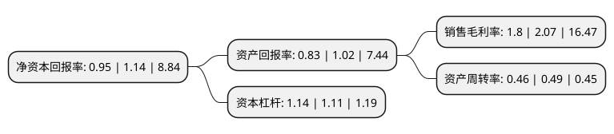

> 本页面由自动化程序生成于 2022年5月20日 01:10
> 内容可能存在错误，如有bug请提交issue至：https://github.com/Eroleice/doc-pi/issues
{.is-warning}

# 上市公司基本情况

## 基本资料

宝鼎科技股份有限公司（以下简称“宝鼎科技”）成立于1999年03月25日，杭州市。于2011年02月25日在深交所中小板上市。

宝鼎科技注册资本30,623.234万元，主营业务为大型铸锻件的研发，生产和销售。主要产品为船舶配套大型铸锻件，电力配套大型铸锻件，工程机械配套大型铸锻件，石化配套大型铸锻件。以下是详细信息：

- 公司名称: 宝鼎科技股份有限公司
- 股票代码: 002552.SZ
- 所在地: 浙江 - 杭州市
- 成立日期: 1999年03月25日
- 注册资本: 30,623.234万元
- 法定代表人: 朱宝松
- 主营业务: 主营业务为大型铸锻件的研发，生产和销售主要产品为船舶配套大型铸锻件，电力配套大型铸锻件，工程机械配套大型铸锻件，石化配套大型铸锻件
- 公司官网: www.baoding-tech.com
- 公司介绍: 公司是一家主要从事各类大型铸锻件产品研发、生产和销售的高新技术企业，主要为客户提供各类钢种的大型铸锻件、吊钩总成及成套设备，产品作为装备制造业所必须的关键核心部件，广泛用于船舶、海洋工程、电力、工程机械和军工等行业。至今，公司产品基本覆盖全国各地，部分产品出口至德国、挪威、法国、芬兰、加拿大、新加坡等国际市场。公司重视产品的研发与生产，产品和技术处于国内领先水平，是高新技术企业，拥有独立的研发团队，并设立了市级技术中心，拥有8项核心技术，是国内目前唯一同时拥有CCS、DNV、NK、RINA、GL、ABS、KR、BV、LR、RS等全球十大主流船级社认证的大型铸锻件生产企业，是国家起重吊钩标准修订成员单位及试制单位。

## 股东及高管情况

上市公司第一大股东为山东招金集团有限公司，持股116,062,100股，占比37.9%，为上市公司实际控制人。

截至2022年03月31日，上市公司的前十大股东中，共有7名自然人股东，2名机构股东，1个产品账户，其中5%以上大股东共有3名。上市公司前十大股东明细如下：

> 截至2022年03月31日，上市公司前十大股东信息如下：

| 股东名称 | 持股数量（股） | 持股比例 |
| --- | --- | --- |
| 山东招金集团有限公司 | 116,062,100 | 37.9% |
| 朱丽霞 | 73,875,000 | 24.12% |
| 朱宝松 | 25,976,056 | 8.48% |
| 宝鼎科技股份有限公司-第1期员工持股计划 | 4,479,709 | 1.46% |
| 中信证券股份有限公司 | 3,888,302 | 1.27% |
| 赵宏钊 | 2,572,400 | 0.84% |
| 赵连未 | 1,480,443 | 0.48% |
| 钱玉英 | 1,275,014 | 0.42% |
| 吴旭凌 | 663,300 | 0.22% |
| 朱有芹 | 599,600 | 0.2% |

## 利润表分析

上市公司2021年总收入为3.53亿元，净利润为0.06亿元，实现盈利。

## 杜邦分析

> 数据列示周期：2021年 | 2020年 | 2019年
{.is-info}

上市公司的净资产收益率在近一年有所下降，下降幅度为-16.67%，其变化情况分解如下：
- 上市公司的销售毛利率在近一年下降了-13.04%，可能是生产效率的下降、商品原材料价格上涨或商品价格的下跌所致。
- 上市公司的资产周转率在近一年下降了-6.12%，可能是源自于更慢的销售回款或库存管理效果下降。
- 上市公司的财务杠杆比率在近一年上升了2.7%，可能是增加负债扩大生产规模。

