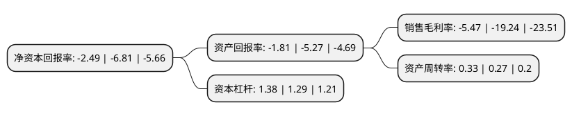

> 本页面由自动化程序生成于 2022年5月20日 01:10
> 内容可能存在错误，如有bug请提交issue至：https://github.com/Eroleice/doc-pi/issues
{.is-warning}

# 上市公司基本情况

## 基本资料

申科滑动轴承股份有限公司（以下简称“申科股份”）成立于1996年12月05日，绍兴市。于2011年11月22日在深交所中小板上市。

申科股份注册资本15,000万元，主营业务为厚壁滑动轴承及部套件的研发，生产及销售。公司生产的厚壁滑动轴承及部套件产品涉及六大系列200多种规格，主要包括DQY端盖式滑动轴承系列，ZQ/ZQKT座式滑动轴承系列，ZH动静压座式滑动轴承系列，VTBS立式推力轴承系列，1000MW/600MW/300MW轴承系列及轴承部套件等。以下是详细信息：

- 公司名称: 申科滑动轴承股份有限公司
- 股票代码: 002633.SZ
- 所在地: 浙江 - 绍兴市
- 成立日期: 1996年12月05日
- 注册资本: 15,000万元
- 法定代表人: 何建南
- 主营业务: 主营业务为厚壁滑动轴承及部套件的研发，生产及销售公司生产的厚壁滑动轴承及部套件产品涉及六大系列200多种规格，主要包括DQY端盖式滑动轴承系列，ZQ/ZQKT座式滑动轴承系列，ZH动静压座式滑动轴承系列，VTBS立式推力轴承系列，1000MW/600MW/300MW轴承系列及轴承部套件等
- 公司官网: www.shenke.com
- 公司介绍: 公司坚持以科技创新为主导，先后开发了DQY系列端盖式球面滑动轴承、VTB系列推力滑动轴承、60万千瓦汽轮发电机可倾瓦轴承、ZQK系列座式滑动轴承以及电机用ZH型动静压座式滑动轴承等新产品。其中，DQY系列端盖式球面滑动轴承、60万千瓦汽轮发电机可倾瓦轴承、ZQK系列座式滑动轴承已被评为国家重点新产品。公司主要生产交直流电机、汽轮发电机、汽轮机、水轮机、风机、水泵、压缩机及其他旋转机器用的轴承。产品广泛用于机械工业、化学工业、电力工业、钢铁工业、水利工程、冶金、矿山及水泥等领域，并出口巴基斯坦、土耳其、印度、日本、澳大利亚、孟加拉国、英国等国家。

## 股东及高管情况

上市公司第一大股东为何全波，持股42,187,466股，占比28.12%，**疑似为**上市公司实际控制人。

截至2022年03月31日，上市公司的前十大股东中，共有8名自然人股东，2名机构股东，其中5%以上大股东共有3名。上市公司前十大股东明细如下：

> 未能通过持股比例判定出上市公司实际控制人（持股30%以上）
> 可能存在通过间接持股、联合持股、协议控制等方式拥有实际控制权的主体，具体请参考上市公司定期公告！
{.is-warning}

> 截至2022年03月31日，上市公司前十大股东信息如下：

| 股东名称 | 持股数量（股） | 持股比例 |
| --- | --- | --- |
| 何全波 | 42,187,466 | 28.12% |
| 北京华创易盛资产管理中心(有限合伙) | 20,643,750 | 13.76% |
| 何建东 | 19,743,784 | 13.16% |
| 周宇光 | 2,790,220 | 1.86% |
| 林玮 | 1,340,400 | 0.89% |
| 万坚强 | 1,336,900 | 0.89% |
| 施侃 | 1,188,900 | 0.79% |
| 宗佩民 | 1,152,000 | 0.77% |
| 严斌 | 1,046,600 | 0.7% |
| 深圳市茂安源投资有限公司 | 811,200 | 0.54% |

## 杜邦分析

> 数据列示周期：2021年 | 2020年 | 2019年
{.is-info}

上市公司的净资产收益率在近一年有所下降，下降幅度为-63.44%，其变化情况分解如下：
- 上市公司的销售毛利率在近一年下降了-71.57%，可能是生产效率的下降、商品原材料价格上涨或商品价格的下跌所致。
- 上市公司的资产周转率在近一年上升了22.22%，可能是源自于更快的销售回款或库存管理效果提升。
- 上市公司的财务杠杆比率在近一年上升了6.98%，可能是增加负债扩大生产规模。

