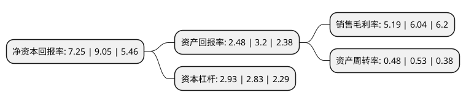

> 本页面由自动化程序生成于 2022年5月20日 01:11
> 内容可能存在错误，如有bug请提交issue至：https://github.com/Eroleice/doc-pi/issues
{.is-warning}

# 上市公司基本情况

## 基本资料

南京埃斯顿自动化股份有限公司（以下简称“埃斯顿”）成立于2002年02月26日，南京市。于2015年03月20日在深交所中小板上市。

埃斯顿注册资本86,863.837万元，主要产品:自动化核心部件及运动控制系统，工业机器人及智能制造系统。主营业务:两个核心业务模块:一是自动化核心部件及运动控制系统，二是工业机器人及智能制造系统。以下是详细信息：

- 公司名称: 南京埃斯顿自动化股份有限公司
- 股票代码: 002747.SZ
- 所在地: 江苏 - 南京市
- 成立日期: 2002年02月26日
- 注册资本: 86,863.837万元
- 法定代表人: 吴波
- 主营业务: 主要产品:自动化核心部件及运动控制系统，工业机器人及智能制造系统主营业务:两个核心业务模块:一是自动化核心部件及运动控制系统，二是工业机器人及智能制造系统
- 公司官网: www.estun.com
- 公司介绍: 公司业务覆盖了从自动化核心部件及运动控制系统、工业机器人到机器人集成应用的全产业链，构建了从技术、成本到服务的全方位竞争优势。公司业务主要分为两个核心业务模块：一是自动化核心部件及运动控制系统，二是工业机器人及智能制造系统。公司作为中国运动控制领域具有影响力的企业之一，自动化核心部件产品线已完成从交流伺服系统到运动控制系统解决方案的战略转型，业务模式正在实现从单轴—单机—单元的全面升华；工业机器人产品线在公司自主核心部件的支撑下得到超高速发展，奠定公司作为国产机器人行业的龙头地位，通过推进机器人产品线“ALL Made By ESTUN”的战略，形成核心部件—工业机器人—机器人智能系统工程的全产业链竞争力，构建了从技术、成本到服务的全方位竞争优势。

## 股东及高管情况

上市公司第一大股东为南京派雷斯特科技有限公司，持股254,894,742股，占比29.34%，**疑似为**上市公司实际控制人。

截至2022年03月31日，上市公司的前十大股东中，共有3名自然人股东，2名机构股东，4个产品账户，1个海外主体，其中5%以上大股东共有3名。上市公司前十大股东明细如下：

> 未能通过持股比例判定出上市公司实际控制人（持股30%以上）
> 可能存在通过间接持股、联合持股、协议控制等方式拥有实际控制权的主体，具体请参考上市公司定期公告！
{.is-warning}

> 截至2022年03月31日，上市公司前十大股东信息如下：

| 股东名称 | 持股数量（股） | 持股比例 |
| --- | --- | --- |
| 南京派雷斯特科技有限公司 | 254,894,742 | 29.34% |
| 香港中央结算有限公司(陆股通) | 205,165,570 | 23.62% |
| 吴波 | 109,960,000 | 12.66% |
| 中国建设银行股份有限公司-广发成长精选混合型证券投资基金 | 15,500,096 | 1.78% |
| 中国工商银行-广发聚丰混合型证券投资基金 | 12,000,004 | 1.38% |
| 中国工商银行股份有限公司-富国天惠精选成长混合型证券投资基金(LOF) | 8,000,000 | 0.92% |
| 南京埃斯顿投资有限公司 | 7,436,986 | 0.86% |
| 富达基金(香港)有限公司-客户资金 | 6,028,265 | 0.69% |
| 张忠孝 | 4,555,714 | 0.52% |
| 司景戈 | 4,345,705 | 0.5% |

## 利润表分析

上市公司2021年总收入为30.2亿元，净利润为1.56亿元，实现盈利。

## 杜邦分析

> 数据列示周期：2021年 | 2020年 | 2019年
{.is-info}

上市公司的净资产收益率在近一年有所下降，下降幅度为-19.89%，其变化情况分解如下：
- 上市公司的销售毛利率在近一年下降了-14.07%，可能是生产效率的下降、商品原材料价格上涨或商品价格的下跌所致。
- 上市公司的资产周转率在近一年下降了-9.43%，可能是源自于更慢的销售回款或库存管理效果下降。
- 上市公司的财务杠杆比率在近一年上升了3.53%，可能是增加负债扩大生产规模。

