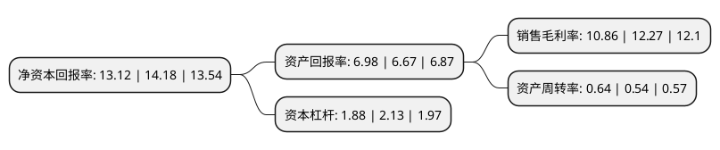

> 本页面由自动化程序生成于 2022年5月20日 01:11
> 内容可能存在错误，如有bug请提交issue至：https://github.com/Eroleice/doc-pi/issues
{.is-warning}

# 上市公司基本情况

## 基本资料

凤形股份有限公司（以下简称“凤形股份”）成立于1997年12月29日，南昌市。于2015年06月11日在深交所中小板上市。

凤形股份注册资本10,798.871万元，主要产品:“凤形”牌高低铬合金铸球段，多元合金铸球段及衬板等不同系列产品，属于新型研磨介质，广泛应用于冶金矿山，建材水泥，火力发电，磁性材料等行业的物料研磨生产环节，是国内领先的耐磨材料专业供应商。主营业务:金属铸件行业专业从事耐磨材料的研发，生产，销售和技术服务的高新技术企业，目前已发展成为国内领先的耐磨材料生产企业。以下是详细信息：

- 公司名称: 凤形股份有限公司
- 股票代码: 002760.SZ
- 所在地: 江西 - 南昌市
- 成立日期: 1997年12月29日
- 注册资本: 10,798.871万元
- 法定代表人: 杨剑
- 主营业务: 主要产品:“凤形”牌高低铬合金铸球段，多元合金铸球段及衬板等不同系列产品，属于新型研磨介质，广泛应用于冶金矿山，建材水泥，火力发电，磁性材料等行业的物料研磨生产环节，是国内领先的耐磨材料专业供应商主营业务:金属铸件行业专业从事耐磨材料的研发，生产，销售和技术服务的高新技术企业，目前已发展成为国内领先的耐磨材料生产企业
- 公司官网: www.fengxing.com
- 公司介绍: 公司是一家在金属铸件领域专业从事耐磨材料研发、生产、销售和技术服务的高新技术企业。公司主要生产“凤形”牌高铬合金铸球(高铬球)、高铬合金铸段(高铬段)、低铬合金铸球(低铬球)、低铬合金铸球段(低铬锻)、多元合金铸球(中铬球)、多元合金铸球段(中铬段)及衬板、锤头等不同系列耐磨产品，属于新型研磨介质。由于耐磨球段是工业生产中关键设备的消耗品，而高性能的耐磨球段能大幅降低材料的损耗、提高研磨效率、减少装球量、降低设备运转载荷，实现节能减排的目标，其产品被广泛应用于冶金矿山、建材水泥、火力发电、磁性材料等行业的物料研磨生产环节，是国内领先的耐磨材料专业供应商。公司自成立以来，开展了对耐磨铸件应用技术领域的深入研究，通过对国内外先进技术的消化、吸收、借鉴和创新，自行研制了金属型覆砂铸球机械化、叠箱串铸等生产线，能够严格按照ASTM、JIS、DIN、BS等国际标准组织生产各类耐磨、耐热和耐腐蚀的优质铸件。公司已和众多国内外知名企业建立了稳定的合作关系，确立了公司在行业内的品牌优势和客户优势。

## 股东及高管情况

上市公司第一大股东为泰豪集团有限公司，持股25,142,857股，占比23.28%，**疑似为**上市公司实际控制人。

截至2022年03月31日，上市公司的前十大股东中，共有5名自然人股东，4名机构股东，1个产品账户，其中5%以上大股东共有5名。上市公司前十大股东明细如下：

> 未能通过持股比例判定出上市公司实际控制人（持股30%以上）
> 可能存在通过间接持股、联合持股、协议控制等方式拥有实际控制权的主体，具体请参考上市公司定期公告！
{.is-warning}

> 截至2022年03月31日，上市公司前十大股东信息如下：

| 股东名称 | 持股数量（股） | 持股比例 |
| --- | --- | --- |
| 泰豪集团有限公司 | 25,142,857 | 23.28% |
| 泰豪集团有限公司 | 25,142,857 | 23.28% |
| 江西泰豪技术发展有限公司 | 19,988,706 | 18.51% |
| 陈晓 | 7,504,631 | 6.9495% |
| 陈晓 | 7,504,631 | 6.9495% |
| 安徽齐丰浩瑞投资管理合伙企业(有限合伙) | 2,140,000 | 1.98% |
| 黄嘉雯 | 964,900 | 0.89% |
| 深圳市大华信安资产管理企业(有限合伙)-信安成长一号私募证券投资基金 | 900,000 | 0.83% |
| 郭艺 | 600,000 | 0.56% |
| 徐炳 | 523,251 | 0.48% |

## 利润表分析

上市公司2021年总收入为9.45亿元，净利润为1.02亿元，实现盈利。

## 杜邦分析

> 数据列示周期：2021年 | 2020年 | 2019年
{.is-info}

上市公司的净资产收益率在近一年有所下降，下降幅度为-7.48%，其变化情况分解如下：
- 上市公司的销售毛利率在近一年下降了-11.49%，可能是生产效率的下降、商品原材料价格上涨或商品价格的下跌所致。
- 上市公司的资产周转率在近一年上升了18.52%，可能是源自于更快的销售回款或库存管理效果提升。
- 上市公司的财务杠杆比率在近一年下降了-11.74%，可能是减少负债降低财务费用。

