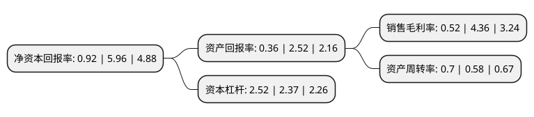

> 本页面由自动化程序生成于 2022年5月20日 01:12
> 内容可能存在错误，如有bug请提交issue至：https://github.com/Eroleice/doc-pi/issues
{.is-warning}

# 上市公司基本情况

## 基本资料

深圳市凯中精密技术股份有限公司（以下简称“凯中精密”）成立于2009年05月05日，深圳市。于2016年11月24日在深交所中小板上市。

凯中精密注册资本28,709.29万元，主营业务:微特电机用换向器，集电环的研发，生产与销售。主要产品为各类微特电机用换向器。以下是详细信息：

- 公司名称: 深圳市凯中精密技术股份有限公司
- 股票代码: 002823.SZ
- 所在地: 广东 - 深圳市
- 成立日期: 2009年05月05日
- 注册资本: 28,709.29万元
- 法定代表人: 张浩宇
- 主营业务: 主营业务:微特电机用换向器，集电环的研发，生产与销售主要产品为各类微特电机用换向器
- 公司官网: www.kaizhong.com
- 公司介绍: 公司是国家级高新技术企业，精密零部件供应商，中国换向器行业龙头企业。公司专注于定制开发各类高技术要求的换向器、集电环、连接器等精密零部件，产品广泛用于汽车、办公用品、电动工具、家用电器、航空航天和其它领域。公司拥有行业领先的生产装备，拥有具有自主知识产权的精密冲压模具、塑胶成型模具、精加工自动化生产线、自动检测技术的研发和制造能力，具有为客户提供高端零部件一体化解决方案的完整产业链。公司早期便通过国际知名认证机构的质量体系认证，拥有规范的管理体系，ISO/TS16949质量管理体系、ISO14001环境管理体系、OHSAS18001职业健康安全管理体系。

## 股东及高管情况

上市公司第一大股东为吴瑛，持股82,348,295股，占比28.68%，**疑似为**上市公司实际控制人。

截至2022年03月31日，上市公司的前十大股东中，共有8名自然人股东，2个产品账户，其中5%以上大股东共有4名。上市公司前十大股东明细如下：

> 未能通过持股比例判定出上市公司实际控制人（持股30%以上）
> 可能存在通过间接持股、联合持股、协议控制等方式拥有实际控制权的主体，具体请参考上市公司定期公告！
{.is-warning}

> 截至2022年03月31日，上市公司前十大股东信息如下：

| 股东名称 | 持股数量（股） | 持股比例 |
| --- | --- | --- |
| 吴瑛 | 82,348,295 | 28.68% |
| 张浩宇 | 77,428,676 | 26.97% |
| 张浩宇 | 77,428,676 | 26.97% |
| 吴瑛 | 76,890,295 | 26.7821% |
| 朱兵 | 9,806,900 | 3.42% |
| 珠海阿巴马资产管理有限公司-阿巴马悦享红利63号私募证券投资基金 | 5,475,800 | 1.91% |
| 深圳固禾私募证券基金管理有限公司-固禾珍珠一号私募基金 | 4,167,350 | 1.45% |
| 朱全英 | 3,441,675 | 1.2% |
| 谢建锋 | 2,702,277 | 0.94% |
| 吴全红 | 2,533,094 | 0.88% |

## 利润表分析

上市公司2021年总收入为24.47亿元，净利润为0.12亿元，实现盈利。

## 杜邦分析

> 数据列示周期：2021年 | 2020年 | 2019年
{.is-info}

上市公司的净资产收益率在近一年有所下降，下降幅度为-84.56%，其变化情况分解如下：
- 上市公司的销售毛利率在近一年下降了-88.07%，可能是生产效率的下降、商品原材料价格上涨或商品价格的下跌所致。
- 上市公司的资产周转率在近一年上升了20.69%，可能是源自于更快的销售回款或库存管理效果提升。
- 上市公司的财务杠杆比率在近一年上升了6.33%，可能是增加负债扩大生产规模。

