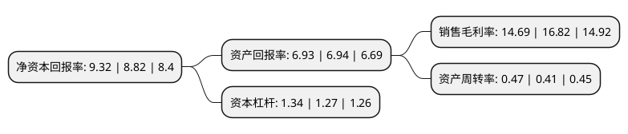

> 本页面由自动化程序生成于 2022年5月20日 01:12
> 内容可能存在错误，如有bug请提交issue至：https://github.com/Eroleice/doc-pi/issues
{.is-warning}

# 上市公司基本情况

## 基本资料

青岛伟隆阀门股份有限公司（以下简称“伟隆股份”）成立于1995年06月08日，青岛市。于2017年05月11日在深交所中小板上市。

伟隆股份注册资本16,903.265万元，公司主要从事给排水阀门产品的设计，研发，生产和销售，为城镇给排水系统，消防给水系统，空调暖通系统以及污水处理系统等下游应用领域提供产品及解决方案。主要产品有闸阀系列，蝶阀系列，调节阀系列，止回阀系列，过滤器系列，不停水加装闸门。以下是详细信息：

- 公司名称: 青岛伟隆阀门股份有限公司
- 股票代码: 002871.SZ
- 所在地: 山东 - 青岛市
- 成立日期: 1995年06月08日
- 注册资本: 16,903.265万元
- 法定代表人: 范庆伟
- 主营业务: 公司主要从事给排水阀门产品的设计，研发，生产和销售，为城镇给排水系统，消防给水系统，空调暖通系统以及污水处理系统等下游应用领域提供产品及解决方案主要产品有闸阀系列，蝶阀系列，调节阀系列，止回阀系列，过滤器系列，不停水加装闸门
- 公司官网: www.weilongvalve.com
- 公司介绍: 公司是专业从事给排水阀门产品的设计研发、生产制造和销售服务的高新技术企业，为城镇给排水系统、消防给水系统、空调暖通系统以及污水处理系统等下游应用领域提供产品及解决方案。目前公司已形成以闸阀、蝶阀、调节阀、止回阀等为主的8大系列产品，共有150多个型号、2,000多个规格，能够满足客户一站式采购需求。公司产品取得了欧盟CE产品安全认证、英国WRAS饮用水认证、美国UL认证、美国FM认证、美国NSF认证、加拿大UL认证、澳大利亚IAPMO审核WaterMark认证、中国船级社型式认可证书、武器装备质量管理体系认证证书、俄罗斯GOST认证、CCC中国国家强制性产品认证证书、中国香港水务署认证、德国VDS认证等多项产品质量认证，成为国内给排水阀门行业取得认证较多的企业之一。

## 股东及高管情况

上市公司第一大股东为范庆伟，持股97,235,355股，占比57.52%，为上市公司实际控制人。

截至2022年03月31日，上市公司的前十大股东中，共有7名自然人股东，1名机构股东，2个产品账户，其中5%以上大股东共有2名。上市公司前十大股东明细如下：

> 截至2022年03月31日，上市公司前十大股东信息如下：

| 股东名称 | 持股数量（股） | 持股比例 |
| --- | --- | --- |
| 范庆伟 | 97,235,355 | 57.52% |
| 江西惠隆企业管理有限公司 | 8,920,000 | 5.28% |
| 范玉隆 | 6,285,750 | 3.72% |
| 杨学良 | 2,496,800 | 1.48% |
| 德邦基金-益安地风2号私募证券投资基金-德邦基金北京益安一号单一资产管理计划 | 2,380,000 | 1.41% |
| 张建飞 | 1,464,755 | 0.87% |
| 青岛森泰股权投资基金管理有限责任公司 | 1,391,900 | 0.82% |
| 谢莉 | 742,766 | 0.44% |
| 周学枚 | 740,500 | 0.44% |
| 龚美华 | 654,730 | 0.39% |

## 利润表分析

上市公司2021年总收入为4.15亿元，净利润为0.6亿元，实现盈利。

## 杜邦分析

> 数据列示周期：2021年 | 2020年 | 2019年
{.is-info}

上市公司的净资产收益率在近一年有所上升，上升幅度为5.67%，其变化情况分解如下：
- 上市公司的销售毛利率在近一年下降了-12.66%，可能是生产效率的下降、商品原材料价格上涨或商品价格的下跌所致。
- 上市公司的资产周转率在近一年上升了14.63%，可能是源自于更快的销售回款或库存管理效果提升。
- 上市公司的财务杠杆比率在近一年上升了5.51%，可能是增加负债扩大生产规模。

