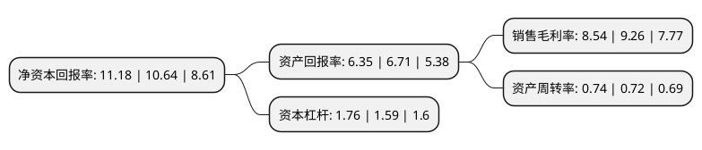

> 本页面由自动化程序生成于 2022年5月20日 01:13
> 内容可能存在错误，如有bug请提交issue至：https://github.com/Eroleice/doc-pi/issues
{.is-warning}

# 上市公司基本情况

## 基本资料

宁波中大力德智能传动股份有限公司（以下简称“中大力德”）成立于2006年08月28日，宁波市。于2017年08月29日在深交所中小板上市。

中大力德注册资本10,400万元，主营业务:从事机械传动与控制应用领域关键零部件的研发，生产，销售和服务。主要产品包括精密减速器，传动行星减速器，各类小型及微型减速电机等。以下是详细信息：

- 公司名称: 宁波中大力德智能传动股份有限公司
- 股票代码: 002896.SZ
- 所在地: 浙江 - 宁波市
- 成立日期: 2006年08月28日
- 注册资本: 10,400万元
- 法定代表人: 岑国建
- 主营业务: 主营业务:从事机械传动与控制应用领域关键零部件的研发，生产，销售和服务主要产品包括精密减速器，传动行星减速器，各类小型及微型减速电机等
- 公司官网: www.zd-motor.com
- 公司介绍: 公司是从事机械传动与控制应用领域关键零部件的研发、生产、销售和服务的高新技术企业，主要产品包括精密减速器、传动行星减速器、各类小型及微型减速电机等，为各类机械设备提供安全、高效、精密的动力传动与控制应用解决方案。公司所处行业属于国家产业政策鼓励的先进制造领域，产品广泛应用于工业机器人、智能物流、新能源、工作母机等领域及食品、包装、纺织、电子、医疗等专用机械设备。公司不断结合市场需求，借鉴国内外先进经验，加大研发投入，相继推出微型无刷直流减速电机、精密行星减速电机、滚筒电机、RV减速器等新品，实现产品结构升级。

## 股东及高管情况

上市公司第一大股东为宁波中大力德投资有限公司，持股28,899,000股，占比27.79%，**疑似为**上市公司实际控制人。

截至2022年03月31日，上市公司的前十大股东中，共有3名自然人股东，5名机构股东，2个产品账户，其中5%以上大股东共有2名。上市公司前十大股东明细如下：

> 未能通过持股比例判定出上市公司实际控制人（持股30%以上）
> 可能存在通过间接持股、联合持股、协议控制等方式拥有实际控制权的主体，具体请参考上市公司定期公告！
{.is-warning}

> 截至2022年03月31日，上市公司前十大股东信息如下：

| 股东名称 | 持股数量（股） | 持股比例 |
| --- | --- | --- |
| 宁波中大力德投资有限公司 | 28,899,000 | 27.79% |
| 中大(香港)投资有限公司 | 26,676,000 | 25.65% |
| 中国工商银行股份有限公司-诺安先锋混合型证券投资基金 | 2,905,450 | 2.79% |
| 慈溪德立投资管理合伙企业(有限合伙) | 2,340,000 | 2.25% |
| 慈溪德正投资管理合伙企业(有限合伙) | 1,560,000 | 1.5% |
| 李娜 | 1,474,050 | 1.42% |
| 宁波芸芸投资管理中心(有限合伙) | 652,730 | 0.63% |
| 王晖 | 500,000 | 0.48% |
| 罗必荣 | 496,900 | 0.48% |
| 诺安基金-建设银行-中国人寿-中国人寿委托诺安基金股票型组合 | 477,400 | 0.46% |

## 利润表分析

上市公司2021年总收入为9.52亿元，净利润为0.81亿元，实现盈利。

## 杜邦分析

> 数据列示周期：2021年 | 2020年 | 2019年
{.is-info}

上市公司的净资产收益率在近一年有所上升，上升幅度为5.08%，其变化情况分解如下：
- 上市公司的销售毛利率在近一年下降了-7.78%，可能是生产效率的下降、商品原材料价格上涨或商品价格的下跌所致。
- 上市公司的资产周转率在近一年上升了2.78%，可能是源自于更快的销售回款或库存管理效果提升。
- 上市公司的财务杠杆比率在近一年上升了10.69%，可能是增加负债扩大生产规模。

