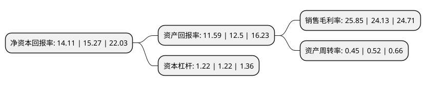

> 本页面由自动化程序生成于 2022年5月20日 01:14
> 内容可能存在错误，如有bug请提交issue至：https://github.com/Eroleice/doc-pi/issues
{.is-warning}

# 上市公司基本情况

## 基本资料

思进智能成形装备股份有限公司（以下简称“思进智能”）成立于1993年01月15日，宁波市。于2020年12月11日在深交所中小板上市。

思进智能注册资本11,254.6万元，公司的主营业务为机械加工业务及压铸设备的研发，生产与销售。主导产品为各类冷成形装备。以下是详细信息：

- 公司名称: 思进智能成形装备股份有限公司
- 股票代码: 003025.SZ
- 所在地: 浙江 - 宁波市
- 成立日期: 1993年01月15日
- 注册资本: 11,254.6万元
- 法定代表人: 李忠明
- 主营业务: 公司的主营业务为机械加工业务及压铸设备的研发，生产与销售主导产品为各类冷成形装备
- 公司官网: www.sijin.cc/www.machinesijin.com
- 公司介绍: 公司主要从事多工位高速自动冷成形装备和压铸设备的研发、生产与销售，是一家致力于提升我国冷成形装备技术水平、推动冷成形工艺发展进步、实现紧固件及异形零件产业升级的高新技术企业。公司秉持精益求精的工匠精神，培养了一批敬业、精准、具有创新意识的技术人才，经过多年持续不断的技术创新，掌握了多工位高速自动冷成形装备和压铸设备的系列核心技术，并发展成为国内领先的多工位高速自动冷成形装备供应商，自公司设立至2007年，公司的主营业务为机械加工业务及压铸设备的研发、生产与销售。2007年公司经过市场调查和技术调研，结合市场需求和自身技术储备情况，开始研发冷成形装备，并于2008年研发成功第一台冷成形装备，随后公司加大冷成形装备的市场开拓，业务量逐年提升。目前公司主导产品为各类冷成形装备，压铸设备业务量占比相对较小。

## 股东及高管情况

上市公司第一大股东为李忠明，持股24,021,523股，占比21.34%，**疑似为**上市公司实际控制人。

截至2022年03月31日，上市公司的前十大股东中，共有3名自然人股东，5名机构股东，2个产品账户，其中5%以上大股东共有5名。上市公司前十大股东明细如下：

> 未能通过持股比例判定出上市公司实际控制人（持股30%以上）
> 可能存在通过间接持股、联合持股、协议控制等方式拥有实际控制权的主体，具体请参考上市公司定期公告！
{.is-warning}

> 截至2022年03月31日，上市公司前十大股东信息如下：

| 股东名称 | 持股数量（股） | 持股比例 |
| --- | --- | --- |
| 李忠明 | 24,021,523 | 21.34% |
| 宁波思进创达投资咨询有限公司 | 21,418,320 | 19.03% |
| 宁波富博睿祺创业投资中心(有限合伙) | 12,427,144 | 11.04% |
| 宁波国俊贸易有限公司 | 7,233,072 | 6.43% |
| 李梦思 | 6,385,469 | 5.67% |
| 宁波田宽投资管理合伙企业(有限合伙) | 4,018,000 | 3.57% |
| 宁波银泰睿祺创业投资有限公司 | 3,119,640 | 2.77% |
| 刘晓妹 | 2,106,720 | 1.87% |
| 中国工商银行股份有限公司-宝盈优势产业灵活配置混合型证券投资基金 | 1,553,027 | 1.38% |
| 中国银行股份有限公司-宝盈国家安全战略沪港深股票型证券投资基金 | 934,800 | 0.83% |

## 利润表分析

上市公司2021年总收入为4.77亿元，净利润为1.23亿元，实现盈利。

## 杜邦分析

> 数据列示周期：2021年 | 2020年 | 2019年
{.is-info}

上市公司的净资产收益率在近一年有所下降，下降幅度为-7.6%，其变化情况分解如下：
- 上市公司的销售毛利率在近一年上升了7.13%，可能是生产效率的提升、商品原材料价格下跌或商品价格的上涨所致。
- 上市公司的资产周转率在近一年下降了-13.46%，可能是源自于更慢的销售回款或库存管理效果下降。
- 上市公司的财务杠杆比率在近一年下降了0%，可能是减少负债降低财务费用。

