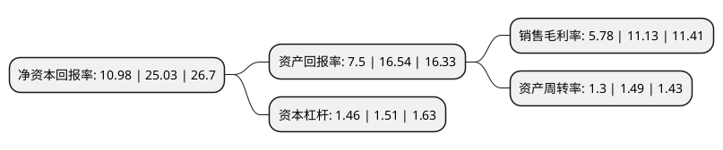

> 本页面由自动化程序生成于 2022年5月20日 01:14
> 内容可能存在错误，如有bug请提交issue至：https://github.com/Eroleice/doc-pi/issues
{.is-warning}

# 上市公司基本情况

## 基本资料

青岛征和工业股份有限公司（以下简称“征和工业”）成立于1999年10月09日，青岛市。于2021年01月11日在深交所中小板上市。

征和工业注册资本8,175万元，从事各类链传动系统的研发，制造和销售，主要产品包括车辆链系统，农业机械链系统及工业设备链系统三大类。以下是详细信息：

- 公司名称: 青岛征和工业股份有限公司
- 股票代码: 003033.SZ
- 所在地: 山东 - 青岛市
- 成立日期: 1999年10月09日
- 注册资本: 8,175万元
- 法定代表人: 金玉谟
- 主营业务: 从事各类链传动系统的研发，制造和销售，主要产品包括车辆链系统，农业机械链系统及工业设备链系统三大类
- 公司官网: www.chohogroup.com
- 公司介绍: 公司是国内链传动行业的领军企业,公司从事各类链传动系统的研发、制造和销售，产品主要应用于各类车辆的发动机和传动系统、农业机械传动和输送系统、工业设备传动和输送系统等。随着技术的升级与市场的积累，公司产品线不断拓展，车辆链系统已经延伸至高铁/动车制动系统和舰船发动机等领域，农业机械方面依托现有技术经验，进一步研发了农业机械使用的旋耕刀、犁铧等耕整部件，凭借行业领先的研发技术、产品质量及服务水平，征和工业积累了丰富优质的客户资源。公司为吉利集团、江铃汽车、五羊本田、新大洲本田、豪爵集团、轻骑铃木、重庆雅马哈等知名车辆制造企业提供车辆链系统产品；为德国克拉斯、雷沃集团、爱科农业机械、金大丰、科乐收、江苏沃得、河北中农、勇猛机械、河北英虎等境内外知名农业机械厂家提供相关农业机械链系统产品；为德国伊维氏、广东信源、昆船物流、青岛科捷及新松机器人等知名企业提供工业设备链系统产品。

## 股东及高管情况

上市公司第一大股东为青岛魁峰机械有限公司，持股46,410,000股，占比56.77%，为上市公司实际控制人。

截至2022年03月31日，上市公司的前十大股东中，共有4名自然人股东，6名机构股东，其中5%以上大股东共有2名。上市公司前十大股东明细如下：

> 截至2022年03月31日，上市公司前十大股东信息如下：

| 股东名称 | 持股数量（股） | 持股比例 |
| --- | --- | --- |
| 青岛魁峰机械有限公司 | 46,410,000 | 56.77% |
| 青岛金硕股权投资企业(有限合伙) | 8,500,000 | 10.4% |
| 青岛金果股权投资企业(有限合伙) | 1,300,000 | 1.59% |
| 深圳市达晨创泰股权投资企业(有限合伙) | 1,075,758 | 1.32% |
| 深圳市达晨创恒股权投资企业(有限合伙) | 1,045,455 | 1.28% |
| 深圳市达晨创瑞股权投资企业(有限合伙) | 878,787 | 1.07% |
| 陈立鹏 | 500,000 | 0.61% |
| 相华 | 400,000 | 0.49% |
| 金雪臻 | 350,000 | 0.43% |
| 牟家海 | 340,000 | 0.42% |

## 利润表分析

上市公司2021年总收入为13.62亿元，净利润为0.78亿元，实现盈利。

## 杜邦分析

> 数据列示周期：2021年 | 2020年 | 2019年
{.is-info}

上市公司的净资产收益率在近一年有所下降，下降幅度为-56.13%，其变化情况分解如下：
- 上市公司的销售毛利率在近一年下降了-48.07%，可能是生产效率的下降、商品原材料价格上涨或商品价格的下跌所致。
- 上市公司的资产周转率在近一年下降了-12.75%，可能是源自于更慢的销售回款或库存管理效果下降。
- 上市公司的财务杠杆比率在近一年下降了-3.31%，可能是减少负债降低财务费用。

