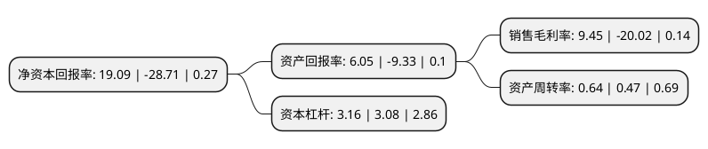

> 本页面由自动化程序生成于 2022年5月20日 01:14
> 内容可能存在错误，如有bug请提交issue至：https://github.com/Eroleice/doc-pi/issues
{.is-warning}

# 上市公司基本情况

## 基本资料

广东创世纪智能装备集团股份有限公司（以下简称“创世纪”）成立于2003年04月11日，东莞市。于2010年05月20日在深交所创业板上市。

创世纪注册资本154,317.638万元，核心主业为高端智能装备业务，主要的产品:3C系列产品，通用系列产品以下是详细信息：

- 公司名称: 广东创世纪智能装备集团股份有限公司
- 股票代码: 300083.SZ
- 所在地: 广东 - 东莞市
- 成立日期: 2003年04月11日
- 注册资本: 154,317.638万元
- 法定代表人: 蔡万峰
- 主营业务: 核心主业为高端智能装备业务，主要的产品:3C系列产品，通用系列产品
- 公司官网: www.gdcci.com
- 公司介绍: 公司是集数控机床研发、生产、销售、服务于一体的高端智能装备制造企业，旗下机床核心品牌有台群精机(Taikan)、宇德(YuKen)。公司数控机床产品品种齐全，涵盖金属切削机床和非金属切削机床品类，产品涵括钻攻机、立式加工中心、卧式加工中心、龙门加工中心、数控车床、雕铣机、精雕机、高光机、热弯机、走心机等系列精密加工设备，主要产品广泛应用于3C供应链、5G产业链、汽车零部件、模具、医疗器械、轨道交通、航空航天、石油化工装备、风电、船舶重工等诸多领域，是国内同类型企业中技术宽度最广、产品宽度最全的企业之一，能够为客户提供整套机加工解决方案。

## 股东及高管情况

上市公司第一大股东为夏军，持股259,103,167股，占比16.79%，**疑似为**上市公司实际控制人。

截至2022年03月31日，上市公司的前十大股东中，共有3名自然人股东，3名机构股东，4个产品账户，其中5%以上大股东共有1名。上市公司前十大股东明细如下：

> 未能通过持股比例判定出上市公司实际控制人（持股30%以上）
> 可能存在通过间接持股、联合持股、协议控制等方式拥有实际控制权的主体，具体请参考上市公司定期公告！
{.is-warning}

> 截至2022年03月31日，上市公司前十大股东信息如下：

| 股东名称 | 持股数量（股） | 持股比例 |
| --- | --- | --- |
| 夏军 | 259,103,167 | 16.79% |
| 劲辉国际企业有限公司 | 75,983,100 | 4.92% |
| 全国社保基金一零三组合 | 74,700,280 | 4.84% |
| 何海江 | 42,335,412 | 2.74% |
| 凌慧 | 33,909,428 | 2.2% |
| 深圳市创世纪投资中心(有限合伙) | 28,996,416 | 1.88% |
| KB资产运用-KB中国大陆基金 | 22,399,918 | 1.45% |
| 全国社保基金一一八组合 | 18,657,100 | 1.21% |
| 招商银行股份有限公司-兴全合润混合型证券投资基金 | 18,599,322 | 1.21% |
| 华夏人寿保险股份有限公司-自有资金 | 17,698,627 | 1.15% |

## 利润表分析

上市公司2021年总收入为52.61亿元，净利润为4.97亿元，实现盈利。

## 杜邦分析

> 数据列示周期：2021年 | 2020年 | 2019年
{.is-info}

上市公司的净资产收益率在近一年有所下降，下降幅度为-166.49%，其变化情况分解如下：
- 上市公司的销售毛利率在近一年下降了-147.2%，可能是生产效率的下降、商品原材料价格上涨或商品价格的下跌所致。
- 上市公司的资产周转率在近一年上升了36.17%，可能是源自于更快的销售回款或库存管理效果提升。
- 上市公司的财务杠杆比率在近一年上升了2.6%，可能是增加负债扩大生产规模。

