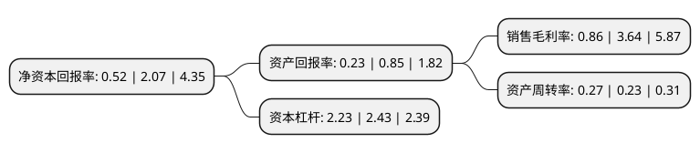

> 本页面由自动化程序生成于 2022年5月20日 01:14
> 内容可能存在错误，如有bug请提交issue至：https://github.com/Eroleice/doc-pi/issues
{.is-warning}

# 上市公司基本情况

## 基本资料

金通灵科技集团股份有限公司（以下简称“金通灵”）成立于1993年04月09日，南通市。于2010年06月25日在深交所创业板上市。

金通灵注册资本148,916.421万元，公司主要产品为工业用各类大型离心通风机，大型离心鼓风机，高压离心鼓风机等五十多个系列，四百多种规格的产品，广泛应用于钢铁冶炼，火力发电，新型干法水泥，石油化工，污水处理，余热回收，核电等领域。主营业务为向客户提供风系统需求分析，风系统研发设计，离心风机产品制造，风系统节能改造等端到端完整的全生命周期风系统解决方案，最终以风机产品为载体实现销售和盈利。以下是详细信息：

- 公司名称: 金通灵科技集团股份有限公司
- 股票代码: 300091.SZ
- 所在地: 江苏 - 南通市
- 成立日期: 1993年04月09日
- 注册资本: 148,916.421万元
- 法定代表人: 季伟
- 主营业务: 公司主要产品为工业用各类大型离心通风机，大型离心鼓风机，高压离心鼓风机等五十多个系列，四百多种规格的产品，广泛应用于钢铁冶炼，火力发电，新型干法水泥，石油化工，污水处理，余热回收，核电等领域主营业务为向客户提供风系统需求分析，风系统研发设计，离心风机产品制造，风系统节能改造等端到端完整的全生命周期风系统解决方案，最终以风机产品为载体实现销售和盈利
- 公司官网: www.jtltech.cn
- 公司介绍: 公司一直专注于离心风机领域，以“服务+制造+服务”的业务模式向用户提供风系统需求分析、风系统研发设计、离心风机产品制造、风系统节能改造等端到端完整的全生命周期的风系统解决方案。公司主要产品有大型工业鼓风机、通风机、煤气鼓风机、焦炉鼓风机、多级高压离心鼓风机、单级高速离心鼓风机等五十多个系列，四百多种规格的节能离心风机产品，广泛应用于钢铁冶炼、火力发电、新型干法水泥、石油化工、污水处理、余热回收、煤气回收及核电等领域。公司陆续添置了进口五轴联动数控加工中心、数控落地镗床等大型加工检测设备，建成了4000KW压缩机试验检测平台，形成了集设计、制造、试验、检测、和服务于一体的专业化格局。2018年公司通过重大资产重组收购上海运能100%股权，完成后公司具备锅炉和汽轮机两大核心设备研发生产能力带来的协同优势，以增强公司核心竞争力及行业地位。

## 股东及高管情况

上市公司第一大股东为南通产业控股集团有限公司，持股415,148,776股，占比27.88%，**疑似为**上市公司实际控制人。

截至2022年03月31日，上市公司的前十大股东中，共有5名自然人股东，2名机构股东，3个产品账户，其中5%以上大股东共有3名。上市公司前十大股东明细如下：

> 未能通过持股比例判定出上市公司实际控制人（持股30%以上）
> 可能存在通过间接持股、联合持股、协议控制等方式拥有实际控制权的主体，具体请参考上市公司定期公告！
{.is-warning}

> 截至2022年03月31日，上市公司前十大股东信息如下：

| 股东名称 | 持股数量（股） | 持股比例 |
| --- | --- | --- |
| 南通产业控股集团有限公司 | 415,148,776 | 27.88% |
| 季伟 | 105,693,405 | 7.1% |
| 季维东 | 105,182,340 | 7.06% |
| 上海滚石投资管理有限公司-滚石9号股权投资私募基金 | 23,277,179 | 1.56% |
| 南通科创创业投资管理有限公司 | 15,748,160 | 1.06% |
| 李昌贵 | 12,253,900 | 0.82% |
| 上海滚石投资管理有限公司-滚石3号运能能源股权投资基金 | 11,410,087 | 0.77% |
| 孙勇军 | 9,506,175 | 0.64% |
| 陕西省国际信托股份有限公司-陕国投·祥瑞6号结构化证券投资集合资金信托计划 | 7,961,190 | 0.53% |
| 杨芳 | 7,180,000 | 0.48% |

## 利润表分析

上市公司2021年总收入为17.54亿元，净利润为0.15亿元，实现盈利。

## 杜邦分析

> 数据列示周期：2021年 | 2020年 | 2019年
{.is-info}

上市公司的净资产收益率在近一年有所下降，下降幅度为-74.88%，其变化情况分解如下：
- 上市公司的销售毛利率在近一年下降了-76.37%，可能是生产效率的下降、商品原材料价格上涨或商品价格的下跌所致。
- 上市公司的资产周转率在近一年上升了17.39%，可能是源自于更快的销售回款或库存管理效果提升。
- 上市公司的财务杠杆比率在近一年下降了-8.23%，可能是减少负债降低财务费用。

