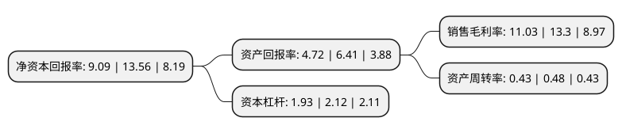

> 本页面由自动化程序生成于 2022年5月20日 01:14
> 内容可能存在错误，如有bug请提交issue至：https://github.com/Eroleice/doc-pi/issues
{.is-warning}

# 上市公司基本情况

## 基本资料

江西华伍制动器股份有限公司（以下简称“华伍股份”）成立于2001年01月18日，宜春市。于2010年07月28日在深交所创业板上市。

华伍股份注册资本42,009.016万元，主要产品或提供的劳务:工业制动装置高端产品，包括:高速轴制动器(电力液压鼓式制动器，电力液压盘式制动器和电磁制动器等)，低速轴制动器(安全制动器)，防风制动装置(夹轮器，夹轨器，顶轨器等)，以及工业制动摩擦材料。以下是详细信息：

- 公司名称: 江西华伍制动器股份有限公司
- 股票代码: 300095.SZ
- 所在地: 江西 - 宜春市
- 成立日期: 2001年01月18日
- 注册资本: 42,009.016万元
- 法定代表人: 聂景华
- 主营业务: 主要产品或提供的劳务:工业制动装置高端产品，包括:高速轴制动器(电力液压鼓式制动器，电力液压盘式制动器和电磁制动器等)，低速轴制动器(安全制动器)，防风制动装置(夹轮器，夹轨器，顶轨器等)，以及工业制动摩擦材料
- 公司官网: www.hua-wu.com
- 公司介绍: 公司主要从事工业制动器及其控制系统的研发、设计、制造和销售。公司多年来一直为行业领先并具备较强自主创新能力的工业制动器专业生产商和工业制动系统解决方案提供商，是我国工业制动器现有多项行业标准的第一起草单位，其中部分为国家标准。公司是国内首家实现自主研发摩擦材料配方及生产的工业制动器生产企业，公司能根据客户主机应用环境及工况需要，调整摩擦材料的原料配方，并通过特殊成型工艺，生产具备相应摩擦系数、强度以及耐高温的摩擦衬垫。公司以“通过科技创新，为客户提供最优配套方案和服务，推动工业装备技术进步，把华伍建成员工安居乐业的和谐家园”为使命，致力于工业装备传动安全，精心打造中国制动精品，全力塑造世界制动名牌。

## 股东及高管情况

上市公司第一大股东为聂景华，持股62,267,500股，占比14.82%，**疑似为**上市公司实际控制人。

截至2022年03月31日，上市公司的前十大股东中，共有2名自然人股东，3名机构股东，5个产品账户，其中5%以上大股东共有3名。上市公司前十大股东明细如下：

> 未能通过持股比例判定出上市公司实际控制人（持股30%以上）
> 可能存在通过间接持股、联合持股、协议控制等方式拥有实际控制权的主体，具体请参考上市公司定期公告！
{.is-warning}

> 截至2022年03月31日，上市公司前十大股东信息如下：

| 股东名称 | 持股数量（股） | 持股比例 |
| --- | --- | --- |
| 聂景华 | 62,267,500 | 14.82% |
| 聂璐璐 | 49,977,814 | 11.9% |
| 上海振华重工(集团)股份有限公司 | 22,257,800 | 5.3% |
| 中国银行股份有限公司-国泰江源优势精选灵活配置混合型证券投资基金 | 17,317,496 | 4.12% |
| 丰城市创东方丰水湖投资企业(有限合伙) | 17,101,000 | 4.07% |
| 中国银行股份有限公司-鹏华汇智优选混合型证券投资基金 | 13,667,800 | 3.25% |
| 中国银行股份有限公司-国泰致远优势混合型证券投资基金 | 10,886,600 | 2.59% |
| 广东天创私募证券投资基金管理有限公司-天创贤哲6号私募证券投资基金 | 8,275,862 | 1.97% |
| 江西华伍科技投资有限责任公司 | 7,800,000 | 1.86% |
| 江西华伍制动器股份有限公司-第二期员工持股计划 | 7,323,646 | 1.74% |

## 利润表分析

上市公司2021年总收入为14.35亿元，净利润为1.58亿元，实现盈利。

## 杜邦分析

> 数据列示周期：2021年 | 2020年 | 2019年
{.is-info}

上市公司的净资产收益率在近一年有所下降，下降幅度为-32.96%，其变化情况分解如下：
- 上市公司的销售毛利率在近一年下降了-17.07%，可能是生产效率的下降、商品原材料价格上涨或商品价格的下跌所致。
- 上市公司的资产周转率在近一年下降了-10.42%，可能是源自于更慢的销售回款或库存管理效果下降。
- 上市公司的财务杠杆比率在近一年下降了-8.96%，可能是减少负债降低财务费用。

