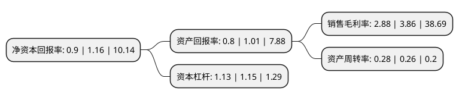

> 本页面由自动化程序生成于 2022年5月20日 01:16
> 内容可能存在错误，如有bug请提交issue至：https://github.com/Eroleice/doc-pi/issues
{.is-warning}

# 上市公司基本情况

## 基本资料

湖南华民控股集团股份有限公司（以下简称“华民股份”）成立于1995年07月31日，长沙市。于2012年08月01日在深交所创业板上市。

华民股份注册资本44,129.548万元，主要产品:公司的主导产品包括球磨机磨球，衬板，磨段，产品和服务广泛应用于矿山，水泥，火电，冶金等高能耗行业，能够为上述行业企业的球磨环节带来显著的节能，减排，降耗，提产效果。主营业务:公司专业从事耐磨铸件产品的研发，设计，生产，销售，并为客户量身定制耐磨铸件高效节能技术解决方案。以下是详细信息：

- 公司名称: 湖南华民控股集团股份有限公司
- 股票代码: 300345.SZ
- 所在地: 湖南 - 长沙市
- 成立日期: 1995年07月31日
- 注册资本: 44,129.548万元
- 法定代表人: 欧阳少红
- 主营业务: 主要产品:公司的主导产品包括球磨机磨球，衬板，磨段，产品和服务广泛应用于矿山，水泥，火电，冶金等高能耗行业，能够为上述行业企业的球磨环节带来显著的节能，减排，降耗，提产效果主营业务:公司专业从事耐磨铸件产品的研发，设计，生产，销售，并为客户量身定制耐磨铸件高效节能技术解决方案
- 公司官网: www.huaminchina.cn
- 公司介绍: 公司是一家专注于新材料技术开发与应用的高新技术企业。公司的主要业务包括：1、在矿山、水泥和火电行业推广高效球磨综合节能技术，为客户“提产、节能、降耗、环保”提供综合解决方案；2、可控离子渗入(PIP)技术的产业化推广，有效提升金属零部件的耐磨耐腐蚀性能，增强客户产品的竞争力；3、高能离子束3D喷焊技术的应用研究，实现关键零部件的绿色再制造。作为一家新材料行业的高新技术企业，公司依托高校、研究院所强大的研发资源，不断挖掘和整合新材料行业的技术、人才等资源，坚持走“节能、环保、高端”的产业化道路。品牌是企业核心价值的体现，公司始终坚持走中高端化路线同时兼顾自主品牌建设。公司的“高效球磨综合节能技术”入选《国家低碳节能推广目录》，提升了公司技术在该领域的知名度。2017年，“PIP技术及其产业化”项目被科技成果鉴定会鉴定为国际领先。

## 股东及高管情况

上市公司第一大股东为湖南建湘晖鸿产业投资有限公司，持股88,259,100股，占比20%，**疑似为**上市公司实际控制人。

截至2022年03月31日，上市公司的前十大股东中，共有8名自然人股东，1名机构股东，1个产品账户，其中5%以上大股东共有1名。上市公司前十大股东明细如下：

> 未能通过持股比例判定出上市公司实际控制人（持股30%以上）
> 可能存在通过间接持股、联合持股、协议控制等方式拥有实际控制权的主体，具体请参考上市公司定期公告！
{.is-warning}

> 截至2022年03月31日，上市公司前十大股东信息如下：

| 股东名称 | 持股数量（股） | 持股比例 |
| --- | --- | --- |
| 湖南建湘晖鸿产业投资有限公司 | 88,259,100 | 20% |
| 任立军 | 21,936,319 | 4.97% |
| 上海迎水投资管理有限公司-迎水巡洋15号私募证券投资基金 | 19,151,800 | 4.34% |
| 关海果 | 17,900,300 | 4.06% |
| 朱明楚 | 15,987,995 | 3.62% |
| 王涛 | 6,800,000 | 1.54% |
| 符真 | 6,011,200 | 1.36% |
| 曲波 | 5,296,800 | 1.2% |
| 朱红专 | 4,718,613 | 1.07% |
| 陈文妍 | 4,394,900 | 1% |

## 利润表分析

上市公司2021年总收入为1.57亿元，净利润为0.04亿元，实现盈利。

## 杜邦分析

> 数据列示周期：2021年 | 2020年 | 2019年
{.is-info}

上市公司的净资产收益率在近一年有所下降，下降幅度为-22.41%，其变化情况分解如下：
- 上市公司的销售毛利率在近一年下降了-25.39%，可能是生产效率的下降、商品原材料价格上涨或商品价格的下跌所致。
- 上市公司的资产周转率在近一年上升了7.69%，可能是源自于更快的销售回款或库存管理效果提升。
- 上市公司的财务杠杆比率在近一年下降了-1.74%，可能是减少负债降低财务费用。

