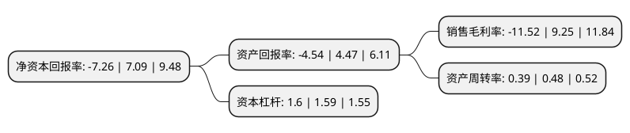

> 本页面由自动化程序生成于 2022年5月20日 01:17
> 内容可能存在错误，如有bug请提交issue至：https://github.com/Eroleice/doc-pi/issues
{.is-warning}

# 上市公司基本情况

## 基本资料

江苏五洋停车产业集团股份有限公司（以下简称“五洋停车”）成立于2001年06月22日，徐州市。于2015年02月17日在深交所创业板上市。

五洋停车注册资本111,638.356万元，专业从事散料搬运核心装置及设备研发，设计，生产和销售。公司主要产品包括张紧装置，制动装置，给料机和搅拌站。以下是详细信息：

- 公司名称: 江苏五洋停车产业集团股份有限公司
- 股票代码: 300420.SZ
- 所在地: 江苏 - 徐州市
- 成立日期: 2001年06月22日
- 注册资本: 111,638.356万元
- 法定代表人: 侯友夫
- 主营业务: 专业从事散料搬运核心装置及设备研发，设计，生产和销售公司主要产品包括张紧装置，制动装置，给料机和搅拌站
- 公司官网: www.wuyangkeji.com
- 公司介绍: 公司是国家级高新技术企业，教授博导创立的创新型科技企业，中国领先的智能停车投资建设运营一体化服务商。主营业务涵盖智能车库、自动化生产线、立体仓储、矿山安全设备、无人船、金融服务六大板块，拥有五洋、伟创两大品牌。公司建立健全了现代化的科学管理制度，企业获得ISO9001质量管理体系认证、ISO14000环境管理体系认证，HSAS18000职业健康与安全管理体系认证，煤安防爆认证。公司立足工业控制技术，专注自动化装备的研发、设计、生产和销售，充分利用上市公司平台，积极进军智能车库行业，2015年11月并购重组深圳市伟创自动化设备有限公司，一举成为中国领先的智能停车投资建设运营一体化服务商，实现了产业和产品结构的转型升级。与国内知名企业万达、万科、中海等多家企业建立了长期的合作关系，为政府机关、医院、学校等多家组织提供智能停车整体解决方案，所承建立体停车项目泊位数超过20万个。

## 股东及高管情况

上市公司第一大股东为蔡敏，持股99,588,450股，占比8.92%，**疑似为**上市公司实际控制人。

截至2022年03月31日，上市公司的前十大股东中，共有9名自然人股东，1名机构股东，其中5%以上大股东共有2名。上市公司前十大股东明细如下：

> 未能通过持股比例判定出上市公司实际控制人（持股30%以上）
> 可能存在通过间接持股、联合持股、协议控制等方式拥有实际控制权的主体，具体请参考上市公司定期公告！
{.is-warning}

> 上市公司第一大股东持股不超过10%，请检查是否存在公司控制权风险！
{.is-danger}

> 截至2022年03月31日，上市公司前十大股东信息如下：

| 股东名称 | 持股数量（股） | 持股比例 |
| --- | --- | --- |
| 蔡敏 | 99,588,450 | 8.92% |
| 侯友夫 | 68,936,144 | 6.17% |
| 寿招爱 | 51,844,748 | 4.64% |
| 刘龙保 | 30,257,606 | 2.71% |
| 孙晋明 | 30,180,052 | 2.7% |
| 济南天辰机器集团有限公司 | 12,041,407 | 1.08% |
| 胡光萍 | 11,740,000 | 1.05% |
| 丁浩 | 11,600,000 | 1.04% |
| 侯玉鹏 | 8,999,653 | 0.81% |
| 曹毕野 | 8,470,020 | 0.76% |

## 利润表分析

上市公司2021年总收入为15.55亿元，净利润为-1.8亿元，**未实现盈利**。

## 杜邦分析

> 数据列示周期：2021年 | 2020年 | 2019年
{.is-info}

上市公司的净资产收益率在近一年有所下降，下降幅度为-202.4%，其变化情况分解如下：
- 上市公司的销售毛利率在近一年下降了-224.54%，可能是生产效率的下降、商品原材料价格上涨或商品价格的下跌所致。
- 上市公司的资产周转率在近一年下降了-18.75%，可能是源自于更慢的销售回款或库存管理效果下降。
- 上市公司的财务杠杆比率在近一年上升了0.63%，可能是增加负债扩大生产规模。

