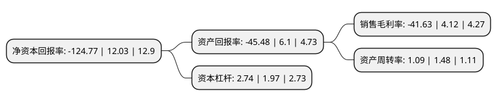

> 本页面由自动化程序生成于 2022年5月20日 01:17
> 内容可能存在错误，如有bug请提交issue至：https://github.com/Eroleice/doc-pi/issues
{.is-warning}

# 上市公司基本情况

## 基本资料

广东星徽精密制造股份有限公司（以下简称“星徽股份”）成立于1994年11月11日，佛山市。于2015年06月10日在深交所创业板上市。

星徽股份注册资本35,312.218万元，主营业务为集研发，设计，生产，销售及服务于一体的专业精密金属连接件供应商，将产品的开发方向定位为朝多功能，阻尼静音式，隐藏式，自动闭合，人性化的方向发展，公司主要向客户提供各种多功能，高精密的滑轨，铰链等金属连接件产品。以下是详细信息：

- 公司名称: 广东星徽精密制造股份有限公司
- 股票代码: 300464.SZ
- 所在地: 广东 - 佛山市
- 成立日期: 1994年11月11日
- 注册资本: 35,312.218万元
- 法定代表人: 蔡耿锡
- 主营业务: 主营业务为集研发，设计，生产，销售及服务于一体的专业精密金属连接件供应商，将产品的开发方向定位为朝多功能，阻尼静音式，隐藏式，自动闭合，人性化的方向发展，公司主要向客户提供各种多功能，高精密的滑轨，铰链等金属连接件产品
- 公司官网: www.sh-abc.cn
- 公司介绍: 公司是一家集研发、制造、销售于一体的现代化工业企业。公司生产的滑轨、铰链等五金产品广泛应用于家具、电器、工业设备、IT等行业，是东芝、伊莱克斯、史丹利、海尔、美的、华帝、万和、通润、全友、美克美家等国内外知名企业的供应商。公司已建立了科学全面的企业管理和质量管理体系，通过了ISO14001认证，设定了严格的生产标准来监控每一个生产工序。公司使用全球领先的ORACLE ERP和PLM信息管理软件，形成了支撑公司经营运作和管理控制基本信息化的架构，使公司管理更加精细化。公司采用各种先进的生产设备，拥有行业领先的全自动铰链生产线，中国台湾引进的高精度滑轨滚压成型冲孔一体化自动生产线、全自动滑轨组装生产线。拥有高素质的技术队伍，大部分技术骨干具有8年以上的行业经验。一直以来，公司始终坚持用心做事，精益求精的原则，赢得了社会和消费者的广泛赞誉，荣获了广东省著名商标、广东省名牌产品、广东省优秀自主品牌等荣誉。拥有多项核心技术专利，其中三节缓冲滑轨、隐藏式缓冲滑轨系列产品被评为广东省高新技术产品。公司营销网络遍布全国各省市，远销欧美、日本、韩国等国家和地区。公司立志成为全球高品质家居五金产品的缔造者。

## 股东及高管情况

上市公司第一大股东为广东星野投资有限责任公司，持股80,127,735股，占比22.69%，**疑似为**上市公司实际控制人。

截至2022年03月31日，上市公司的前十大股东中，共有4名自然人股东，5名机构股东，1个海外主体，其中5%以上大股东共有3名。上市公司前十大股东明细如下：

> 未能通过持股比例判定出上市公司实际控制人（持股30%以上）
> 可能存在通过间接持股、联合持股、协议控制等方式拥有实际控制权的主体，具体请参考上市公司定期公告！
{.is-warning}

> 截至2022年03月31日，上市公司前十大股东信息如下：

| 股东名称 | 持股数量（股） | 持股比例 |
| --- | --- | --- |
| 广东星野投资有限责任公司 | 80,127,735 | 22.69% |
| 孙才金 | 22,980,922 | 6.51% |
| 陈梓炎 | 19,500,000 | 5.52% |
| 陈惠吟 | 7,147,800 | 2.02% |
| 逹泰電商投資有限公司 | 6,830,910 | 1.93% |
| 新余市顺择齐欣咨询服务中心(有限合伙) | 4,749,700 | 1.35% |
| SUNVALLEYE-COMMERCE(HK)LIMITED | 3,983,928 | 1.13% |
| 朱佳佳 | 3,361,773 | 0.95% |
| 深圳市亿网众盈投资管理合伙企业(有限合伙) | 1,494,780 | 0.42% |
| 深圳市泽宝财富投资管理合伙企业(有限合伙) | 1,494,780 | 0.42% |

## 利润表分析

上市公司2021年总收入为36.59亿元，净利润为-15.24亿元，**未实现盈利**。

## 杜邦分析

> 数据列示周期：2021年 | 2020年 | 2019年
{.is-info}

上市公司的净资产收益率在近一年有所下降，下降幅度为-1137.16%，其变化情况分解如下：
- 上市公司的销售毛利率在近一年下降了-1110.44%，可能是生产效率的下降、商品原材料价格上涨或商品价格的下跌所致。
- 上市公司的资产周转率在近一年下降了-26.35%，可能是源自于更慢的销售回款或库存管理效果下降。
- 上市公司的财务杠杆比率在近一年上升了39.09%，可能是增加负债扩大生产规模。

