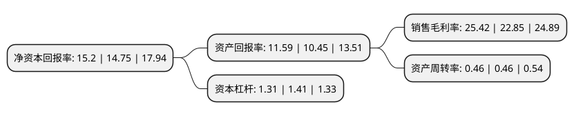

> 本页面由自动化程序生成于 2022年5月20日 01:17
> 内容可能存在错误，如有bug请提交issue至：https://github.com/Eroleice/doc-pi/issues
{.is-warning}

# 上市公司基本情况

## 基本资料

中密控股股份有限公司（以下简称“中密控股”）成立于1993年09月29日，成都市。于2015年06月12日在深交所创业板上市。

中密控股注册资本20,817.128万元，主营业务为各类机械密封的设计，研发，制造和销售，并为客户提供技术咨询，技术培训，现场安装，维修等售前，售中和售后全方位技术服务。以下是详细信息：

- 公司名称: 中密控股股份有限公司
- 股票代码: 300470.SZ
- 所在地: 四川 - 成都市
- 成立日期: 1993年09月29日
- 注册资本: 20,817.128万元
- 法定代表人: 赵其春
- 主营业务: 主营业务为各类机械密封的设计，研发，制造和销售，并为客户提供技术咨询，技术培训，现场安装，维修等售前，售中和售后全方位技术服务
- 公司官网: www.sns-china.com
- 公司介绍: 公司是中国A股上市企业，是中国流体密封行业的领航者。从专注的研究，到专业的生产运营，从单一的产品，到整体的解决方案，日机密封历经四十年的传承与积淀，凭借雄厚的技术实力，先进精湛的装备，“日机密封”品牌已享誉整个中国，并逐步走向国外，致力成为中国机械工业名牌产品。公司机械密封产品种类齐全、参数范围宽，适用范围广。机械密封产品承压范围：高真空~20MPa，最大转速：36000rpm，温度：-196~410℃,轴径：φ10~400mm。产品主要应用在炼油、乙烯、化肥、MTO、煤制油、煤制气、煤制烯烃、天然气化工、输油管线及其他领域，为泵、液力透平、螺杆压缩机、膨胀机、挤压造粒机、风机、反应釜等各类旋转设备提供安全可靠的密封产品。公司拥有数十种系列的符合API682标准的机械密封、通用型弹簧机械密封、金属波纹管密封、颗粒介质密封、双向平衡型机械密封及釜用机械密封，其中高压机械密封、高速机械密封、高低温机械密封等高参数密封产品已独具优势，并为极端工况提供专门的密封解决方案。

## 股东及高管情况

上市公司第一大股东为四川川机投资有限责任公司，持股45,970,265股，占比22.08%，**疑似为**上市公司实际控制人。

截至2022年04月25日，上市公司的前十大股东中，共有4名自然人股东，1名机构股东，4个产品账户，1个海外主体，其中5%以上大股东共有2名。上市公司前十大股东明细如下：

> 未能通过持股比例判定出上市公司实际控制人（持股30%以上）
> 可能存在通过间接持股、联合持股、协议控制等方式拥有实际控制权的主体，具体请参考上市公司定期公告！
{.is-warning}

> 截至2022年04月25日，上市公司前十大股东信息如下：

| 股东名称 | 持股数量（股） | 持股比例 |
| --- | --- | --- |
| 四川川机投资有限责任公司 | 45,970,265 | 22.08% |
| 香港中央结算有限公司(陆股通) | 12,508,336 | 6.01% |
| 中国工商银行股份有限公司-富国天惠精选成长混合型证券投资基金(LOF) | 10,003,094 | 4.81% |
| 全国社保基金一一三组合 | 6,299,929 | 3.03% |
| 施罗德投资管理(香港)有限公司-施罗德环球基金系列中国A股(交易所) | 5,492,700 | 2.64% |
| 黄泽沛 | 3,873,600 | 1.86% |
| 何方 | 3,304,800 | 1.59% |
| 中国农业银行股份有限公司-富国创业板两年定期开放混合型证券投资基金 | 3,079,638 | 1.48% |
| 陈虹 | 3,020,800 | 1.45% |
| 奉明忠 | 2,512,000 | 1.21% |

## 利润表分析

上市公司2021年总收入为11.31亿元，净利润为2.87亿元，实现盈利。

## 杜邦分析

> 数据列示周期：2021年 | 2020年 | 2019年
{.is-info}

上市公司的净资产收益率在近一年有所上升，上升幅度为3.05%，其变化情况分解如下：
- 上市公司的销售毛利率在近一年上升了11.25%，可能是生产效率的提升、商品原材料价格下跌或商品价格的上涨所致。
- 上市公司的资产周转率在近一年下降了0%，可能是源自于更慢的销售回款或库存管理效果下降。
- 上市公司的财务杠杆比率在近一年下降了-7.09%，可能是减少负债降低财务费用。

