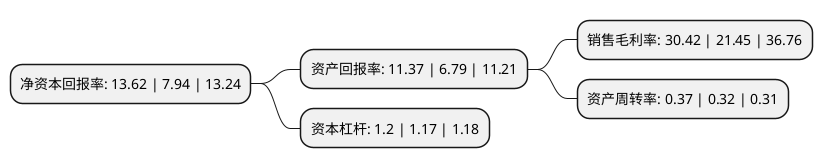

> 本页面由自动化程序生成于 2022年5月20日 01:18
> 内容可能存在错误，如有bug请提交issue至：https://github.com/Eroleice/doc-pi/issues
{.is-warning}

# 上市公司基本情况

## 基本资料

恒锋工具股份有限公司（以下简称“恒锋工具”）成立于1997年07月17日，嘉兴市。于2015年07月01日在深交所创业板上市。

恒锋工具注册资本16,567.928万元，主营业务为机床用工具的研发，生产与销售，产品为现代高效工具，主要包括精密复杂刀具，花键量具(两者合称精密复杂刃量具)，精密高效刀具等高速切削刀具及高精度测量仪器，同时为客户提供刀具精磨改制服务。产品主要包括精密复杂刃量具和精密高效刀具两大类，精密复杂刃量具细分为拉刀，搓齿刀，滚刀及成型铣刀，花键量具四大系列，精密高效刀具细分为高效钢板钻，高效铣刀及非标钻铣刀具三大系列。以下是详细信息：

- 公司名称: 恒锋工具股份有限公司
- 股票代码: 300488.SZ
- 所在地: 浙江 - 嘉兴市
- 成立日期: 1997年07月17日
- 注册资本: 16,567.928万元
- 法定代表人: 陈尔容
- 主营业务: 主营业务为机床用工具的研发，生产与销售，产品为现代高效工具，主要包括精密复杂刀具，花键量具(两者合称精密复杂刃量具)，精密高效刀具等高速切削刀具及高精度测量仪器，同时为客户提供刀具精磨改制服务产品主要包括精密复杂刃量具和精密高效刀具两大类，精密复杂刃量具细分为拉刀，搓齿刀，滚刀及成型铣刀，花键量具四大系列，精密高效刀具细分为高效钢板钻，高效铣刀及非标钻铣刀具三大系列
- 公司官网: www.esttools.com
- 公司介绍: 公司是一家专业从事现代高效刀具和量检具研发设计、生产制造的公司。公司的产品主要包括精密复杂刃量具和精密高效刀具两大类，精密复杂刃量具细分为拉削刀具、冷挤压刀具、齿轮刀具、花键量具四大系列，精密高效刀具细分为高效钢板钻、高效钻铣刀具二大系列。这些产品主要应用于汽车零部件制造、电站设备制造、飞机零部件制造、精密机械制造等领域。公司拥有省级高新技术研发中心，公司拥有省级高新技术研发中心和企业研究院。恒锋的技术创新团队是浙江省重点创新团队，公司的精密测量实验室被国防科工委确认为渐开线花键检测能力合格满意实验室，多个产品先后通过国家和省市科技部门组织的成果鉴定。多项产品填补国内行业空白，并列入国家创新基金项目和国家重点产品振兴项目，三项产品获得国内和省内装备制造业重点领域首台(套)产品称号。

## 股东及高管情况

上市公司第一大股东为恒锋控股有限公司，持股81,901,454股，占比49.43%，为上市公司实际控制人。

截至2022年03月31日，上市公司的前十大股东中，共有9名自然人股东，1名机构股东，其中5%以上大股东共有4名。上市公司前十大股东明细如下：

> 截至2022年03月31日，上市公司前十大股东信息如下：

| 股东名称 | 持股数量（股） | 持股比例 |
| --- | --- | --- |
| 恒锋控股有限公司 | 81,901,454 | 49.43% |
| 陈尔容 | 14,441,872 | 8.72% |
| 陈子彦 | 14,441,872 | 8.72% |
| 陈子怡 | 9,627,915 | 5.81% |
| 郑国基 | 7,364,851 | 4.45% |
| 刘克芳 | 296,400 | 0.18% |
| 叶志君 | 211,884 | 0.13% |
| 孙安源 | 206,000 | 0.12% |
| 夏雪琴 | 201,974 | 0.12% |
| 金耀 | 196,848 | 0.12% |

## 利润表分析

上市公司2021年总收入为5.09亿元，净利润为1.54亿元，实现盈利。

## 杜邦分析

> 数据列示周期：2021年 | 2020年 | 2019年
{.is-info}

上市公司的净资产收益率在近一年有所上升，上升幅度为71.54%，其变化情况分解如下：
- 上市公司的销售毛利率在近一年上升了41.82%，可能是生产效率的提升、商品原材料价格下跌或商品价格的上涨所致。
- 上市公司的资产周转率在近一年上升了15.63%，可能是源自于更快的销售回款或库存管理效果提升。
- 上市公司的财务杠杆比率在近一年上升了2.56%，可能是增加负债扩大生产规模。

