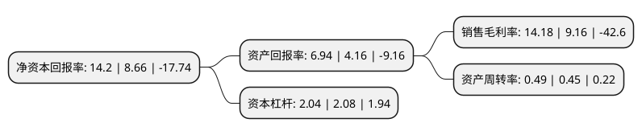

> 本页面由自动化程序生成于 2022年5月20日 01:18
> 内容可能存在错误，如有bug请提交issue至：https://github.com/Eroleice/doc-pi/issues
{.is-warning}

# 上市公司基本情况

## 基本资料

广州市昊志机电股份有限公司（以下简称“昊志机电”）成立于2006年12月14日，广州市。于2016年03月09日在深交所创业板上市。

昊志机电注册资本30,607.284万元，主营业务:从事高速精密电主轴及其零配件的研发设计，生产制造，销售与配套维修服务;主要产品:高速精密电主轴及其零配件。以下是详细信息：

- 公司名称: 广州市昊志机电股份有限公司
- 股票代码: 300503.SZ
- 所在地: 广东 - 广州市
- 成立日期: 2006年12月14日
- 注册资本: 30,607.284万元
- 法定代表人: 汤丽君
- 主营业务: 主营业务:从事高速精密电主轴及其零配件的研发设计，生产制造，销售与配套维修服务;主要产品:高速精密电主轴及其零配件
- 公司官网: www.haozhihs.com
- 公司介绍: 公司是一家专业从事高精密电主轴及其零配件的研发设计、生产制造、销售与维修服务的环保型高新技术、创业板上市企业，昊志机电“以中高端电主轴产品为核心、以电主轴精密零配件制造为支撑、以配套维修服务为特色”，通过坚持不懈的技术攻关和持之以恒的品质管理，构建了电主轴“整机—配件—服务”紧密结合的完整业务链。为满足不同类型机床的加工要求，设计研制了包括PCB钻孔机/成型机电主轴、/玻璃雕铣机电主轴、木工雕铣机电主轴、钻攻中心电主轴、转台、刀柄夹头等十数个系列主轴及配件产品。昊志机电秉承“立足自主技术创新，服务全球先进制造”的发展战略，以世界顶级装备核心功能部件设计、制造公司为愿景，致力于助力全球装备制造、提升人类良好体验而奋斗不止。

## 股东及高管情况

上市公司第一大股东为汤秀清，持股86,726,790股，占比28.34%，**疑似为**上市公司实际控制人。

截至2022年03月31日，上市公司的前十大股东中，共有6名自然人股东，3名机构股东，1个产品账户，其中5%以上大股东共有2名。上市公司前十大股东明细如下：

> 未能通过持股比例判定出上市公司实际控制人（持股30%以上）
> 可能存在通过间接持股、联合持股、协议控制等方式拥有实际控制权的主体，具体请参考上市公司定期公告！
{.is-warning}

> 截至2022年03月31日，上市公司前十大股东信息如下：

| 股东名称 | 持股数量（股） | 持股比例 |
| --- | --- | --- |
| 汤秀清 | 86,726,790 | 28.34% |
| 汤丽君 | 28,114,650 | 9.19% |
| 广西昊聚企业管理有限公司 | 11,083,892 | 3.62% |
| 文学义 | 4,051,300 | 1.32% |
| 汤秀松 | 4,008,200 | 1.31% |
| 昌戎投资管理(上海)有限公司-青岛昌戎投资管理合伙企业(有限合伙) | 2,678,991 | 0.88% |
| 金华市裕恒资本管理有限责任公司-裕恒资本双龙一号私募证券投资基金 | 2,312,600 | 0.76% |
| 安吉和泽管理咨询合伙企业(有限合伙) | 2,096,700 | 0.69% |
| 赵伟 | 1,980,000 | 0.65% |
| 雷群 | 1,537,262 | 0.5% |

## 杜邦分析

> 数据列示周期：2021年 | 2020年 | 2019年
{.is-info}

上市公司的净资产收益率在近一年有所上升，上升幅度为63.97%，其变化情况分解如下：
- 上市公司的销售毛利率在近一年上升了54.8%，可能是生产效率的提升、商品原材料价格下跌或商品价格的上涨所致。
- 上市公司的资产周转率在近一年上升了8.89%，可能是源自于更快的销售回款或库存管理效果提升。
- 上市公司的财务杠杆比率在近一年下降了-1.92%，可能是减少负债降低财务费用。

