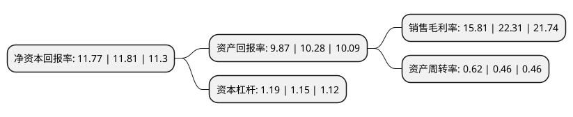

> 本页面由自动化程序生成于 2022年5月20日 01:20
> 内容可能存在错误，如有bug请提交issue至：https://github.com/Eroleice/doc-pi/issues
{.is-warning}

# 上市公司基本情况

## 基本资料

浙江长盛滑动轴承股份有限公司（以下简称“长盛轴承”）成立于1995年06月14日，嘉兴市。于2017年11月06日在深交所创业板上市。

长盛轴承注册资本29,722.2万元，公司主要从事自润滑轴承的研发，生产和销售的高新技术企业，为各工业领域提供自润滑轴承解决方案，并致力于自润滑材料的研发及其在新领域的推广与应用。产品广泛应用于汽车，工程机械，港口机械，塑料机械，农业机械等行业。以下是详细信息：

- 公司名称: 浙江长盛滑动轴承股份有限公司
- 股票代码: 300718.SZ
- 所在地: 浙江 - 嘉兴市
- 成立日期: 1995年06月14日
- 注册资本: 29,722.2万元
- 法定代表人: 孙志华
- 主营业务: 公司主要从事自润滑轴承的研发，生产和销售的高新技术企业，为各工业领域提供自润滑轴承解决方案，并致力于自润滑材料的研发及其在新领域的推广与应用产品广泛应用于汽车，工程机械，港口机械，塑料机械，农业机械等行业
- 公司官网: www.csb.com.cn
- 公司介绍: 公司是专业从事自润滑轴承的研发、生产和销售的高新技术企业。主要产品双金属自润滑轴承、金属塑料自润滑轴承、金属基自润滑轴承、塑料自润滑轴承，出口欧美、日本等多个国家和地区，主要用于汽车、工程机械、农业机械、建筑机械、轻工机械、高速高精数控机床等领域，自润滑轴承已成为轴承行业发展较快的子行业之一。公司拥有省级研究院、省级创新团队，具有较强的自主创新能力。公司先后被评为高新技术企业、浙江省创新型示范企业、浙江省专利示范企业、嘉善高分子材料省级高新技术特色产业基地骨干企业等。公司是全国滑动轴承标准化技术委员会自润滑轴承分技术委员会首届秘书处单位，是行业标准的主要制定者之一。

## 股东及高管情况

上市公司第一大股东为孙志华，持股101,210,781股，占比34.05%，为上市公司实际控制人。

截至2022年03月31日，上市公司的前十大股东中，共有8名自然人股东，1名机构股东，1个产品账户，其中5%以上大股东共有2名。上市公司前十大股东明细如下：

> 截至2022年03月31日，上市公司前十大股东信息如下：

| 股东名称 | 持股数量（股） | 持股比例 |
| --- | --- | --- |
| 孙志华 | 101,210,781 | 34.05% |
| 孙薇卿 | 44,550,000 | 14.99% |
| 褚晨剑 | 14,850,000 | 5% |
| 陆晓林 | 13,365,000 | 4.5% |
| 曹寅超 | 8,910,000 | 3% |
| 王伟杰 | 6,382,500 | 2.15% |
| 嘉善百盛投资管理合伙企业(有限合伙) | 6,014,250 | 2.02% |
| 陆忠泉 | 5,021,475 | 1.69% |
| 周锦祥 | 4,501,889 | 1.51% |
| 中国银行股份有限公司-富国红利混合型证券投资基金 | 2,950,000 | 0.99% |

## 利润表分析

上市公司2021年总收入为9.84亿元，净利润为1.55亿元，实现盈利。

## 杜邦分析

> 数据列示周期：2021年 | 2020年 | 2019年
{.is-info}

上市公司的净资产收益率在近一年有所下降，下降幅度为-0.34%，其变化情况分解如下：
- 上市公司的销售毛利率在近一年下降了-29.13%，可能是生产效率的下降、商品原材料价格上涨或商品价格的下跌所致。
- 上市公司的资产周转率在近一年上升了34.78%，可能是源自于更快的销售回款或库存管理效果提升。
- 上市公司的财务杠杆比率在近一年上升了3.48%，可能是增加负债扩大生产规模。

