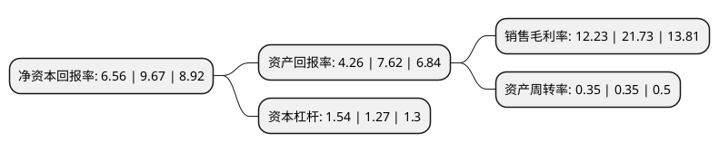

> 本页面由自动化程序生成于 2022年5月20日 01:20
> 内容可能存在错误，如有bug请提交issue至：https://github.com/Eroleice/doc-pi/issues
{.is-warning}

# 上市公司基本情况

## 基本资料

四川德恩精工科技股份有限公司（以下简称“德恩精工”）成立于2003年10月10日，眉山市。于2019年05月31日在深交所创业板上市。

德恩精工注册资本14,667万元，主营业务:从事皮带轮，锥套，同步带轮，胀套，链轮，减速机，联轴器，齿轮，法兰，工业皮带，聚氨酯同步带等机械传动零部件及其配套产品的研发，设计，生产和销售。主要产品为皮带轮，锥套，同步带轮，胀套，链轮，减速机，联轴器，齿轮，法兰，工业皮带，聚氨酯同步带等机械传动零部件。以下是详细信息：

- 公司名称: 四川德恩精工科技股份有限公司
- 股票代码: 300780.SZ
- 所在地: 四川 - 眉山市
- 成立日期: 2003年10月10日
- 注册资本: 14,667万元
- 法定代表人: 雷永志
- 主营业务: 主营业务:从事皮带轮，锥套，同步带轮，胀套，链轮，减速机，联轴器，齿轮，法兰，工业皮带，聚氨酯同步带等机械传动零部件及其配套产品的研发，设计，生产和销售主要产品为皮带轮，锥套，同步带轮，胀套，链轮，减速机，联轴器，齿轮，法兰，工业皮带，聚氨酯同步带等机械传动零部件
- 公司官网: www.cpt-world.com
- 公司介绍: 公司是国内知名的皮带轮、锥套等机械传动零部件制造商，是国内最大的专业生产并出口欧、美、日等国家皮带轮、锥套等机械传动零部件制造商之一，专业从事皮带轮、锥套、同步带轮、胀套、链轮、齿轮箱、法兰、联轴器等机械传动零部件及其配套产品的研发、设计、生产和销售；同时也根据客户需求提供定制化的非标机械零部件产品，核心产品机械用皮带轮传动系列产品出口规模在报告期内连续位居国内同行业第一。公司生产的机械传动零部件是机械工业基础零部件之一，属于国家重点支持的“三基”产业，公司产品广泛应用于通用机械设备和专用机械设备制造业，如风机、空调、汽车、机床、石油机械、木工机械、农牧机械、船舶和工程机械等行业。公司是经认定的国家级高新技术企业、四川省技术创新示范企业、四川省典型制造业信息化示范企业。公司作为机械传动零部件国家标准起草单位之一，先后参与完成了GB/T32220-2015《锥套型式、尺寸和及基本参数》、GB/T12734-2017《同步带传动-汽车同步带》、GB/T10414-2017《同步带传动-汽车同步带轮》等六项国家标准的制定工作，还参加了ISO5288-2017《Synchronous beltdrives-Vocabulary同步带传动—术语》国际标准的制定工作。

## 股东及高管情况

上市公司第一大股东为雷永志，持股29,717,135股，占比20.26%，**疑似为**上市公司实际控制人。

截至2022年03月31日，上市公司的前十大股东中，共有8名自然人股东，2名机构股东，其中5%以上大股东共有4名。上市公司前十大股东明细如下：

> 未能通过持股比例判定出上市公司实际控制人（持股30%以上）
> 可能存在通过间接持股、联合持股、协议控制等方式拥有实际控制权的主体，具体请参考上市公司定期公告！
{.is-warning}

> 截至2022年03月31日，上市公司前十大股东信息如下：

| 股东名称 | 持股数量（股） | 持股比例 |
| --- | --- | --- |
| 雷永志 | 29,717,135 | 20.26% |
| 雷永强 | 28,350,000 | 19.33% |
| 王富民 | 11,171,650 | 7.62% |
| 刘雨华 | 8,285,000 | 5.65% |
| 李茂洪 | 4,792,000 | 3.27% |
| 眉山有大股权投资中心(有限合伙) | 3,800,000 | 2.59% |
| 眉山黎明股权投资中心(有限合伙) | 3,800,000 | 2.59% |
| 苟瑕鸿 | 2,278,236 | 1.55% |
| 谢扬初 | 996,600 | 0.68% |
| 谢龙德 | 900,000 | 0.61% |

## 利润表分析

上市公司2021年总收入为5.8亿元，净利润为0.7亿元，实现盈利。

## 杜邦分析

> 数据列示周期：2021年 | 2020年 | 2019年
{.is-info}

上市公司的净资产收益率在近一年有所下降，下降幅度为-32.16%，其变化情况分解如下：
- 上市公司的销售毛利率在近一年下降了-43.72%，可能是生产效率的下降、商品原材料价格上涨或商品价格的下跌所致。
- 上市公司的资产周转率在近一年下降了0%，可能是源自于更慢的销售回款或库存管理效果下降。
- 上市公司的财务杠杆比率在近一年上升了21.26%，可能是增加负债扩大生产规模。

