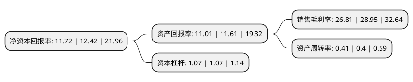

> 本页面由自动化程序生成于 2022年5月20日 01:21
> 内容可能存在错误，如有bug请提交issue至：https://github.com/Eroleice/doc-pi/issues
{.is-warning}

# 上市公司基本情况

## 基本资料

扬州海昌新材股份有限公司（以下简称“海昌新材”）成立于2001年01月11日，扬州市。于2020年09月10日在深交所创业板上市。

海昌新材注册资本15,200万元，主营业务为粉末冶金制品研发，生产和销售。公司的主要产品包括电动工具，汽车，办公设备，家电等粉末冶金零部件。以下是详细信息：

- 公司名称: 扬州海昌新材股份有限公司
- 股票代码: 300885.SZ
- 所在地: 江苏 - 扬州市
- 成立日期: 2001年01月11日
- 注册资本: 15,200万元
- 法定代表人: 周光荣
- 主营业务: 主营业务为粉末冶金制品研发，生产和销售公司的主要产品包括电动工具，汽车，办公设备，家电等粉末冶金零部件
- 公司官网: www.seashinepm.com
- 公司介绍: 公司是一家专注于粉末冶金制品的研发、生产和销售的高新技术企业，主要向电动工具、汽车、办公设备、家电等领域的客户批量生产销售定制化的粉末冶金零部件，目前可生产包括齿轮、轴承、结构件、齿轮箱、链轮、转子、偏心凸轮、摆臂等1,500余种粉末冶金零部件。凭借完善的质量管理体系和快速响应优势，公司已发展成为国内重要的粉末冶金零部件生产企业之一。报告期内，公司产品60%以上用于出口，产品远销至墨西哥、匈牙利、巴西、美国、捷克、英国、德国等欧美国家和印度、日本、菲律宾、马来西亚等亚洲国家。为了较好的满足客户需求，公司一直将技术创新作为业务发展的持续动力，截至本招股说明书签署之日，公司已拥有34项专利技术，累计承担了国家、省市级科技计划项目4项，公司的“高性能环保压缩机传动核心部件卸载套(UNLOADER)”产品获得粉末冶金产业技术创新战略联盟2017年度产品奖；公司还获得汽车领域的IATF16949:2016质量管理体系认证。

## 股东及高管情况

上市公司第一大股东为周光荣，持股65,360,000股，占比43%，为上市公司实际控制人。

截至2022年03月31日，上市公司的前十大股东中，共有5名自然人股东，2名机构股东，3个产品账户，其中5%以上大股东共有4名。上市公司前十大股东明细如下：

> 截至2022年03月31日，上市公司前十大股东信息如下：

| 股东名称 | 持股数量（股） | 持股比例 |
| --- | --- | --- |
| 周光荣 | 65,360,000 | 43% |
| 徐晓玉 | 19,000,000 | 12.5% |
| 扬州海昌协力股权投资合伙企业(有限合伙) | 11,400,000 | 7.5% |
| 桐乡海富股权投资中心(有限合伙) | 8,259,000 | 5.43% |
| 张君 | 3,802,000 | 2.5% |
| 周广华 | 1,140,000 | 0.75% |
| 曾勇 | 570,940 | 0.38% |
| 南京盛泉恒元投资有限公司-盛泉恒元灵活配置专项2号私募证券投资基金 | 340,000 | 0.22% |
| 南京盛泉恒元投资有限公司-盛泉恒元量化套利专项5号私募证券投资基金 | 330,000 | 0.22% |
| 南京盛泉恒元投资有限公司-盛泉恒元量化套利专项46号私募证券投资基金 | 330,000 | 0.22% |

## 利润表分析

上市公司2021年总收入为3.14亿元，净利润为0.84亿元，实现盈利。

## 杜邦分析

> 数据列示周期：2021年 | 2020年 | 2019年
{.is-info}

上市公司的净资产收益率在近一年有所下降，下降幅度为-5.64%，其变化情况分解如下：
- 上市公司的销售毛利率在近一年下降了-7.39%，可能是生产效率的下降、商品原材料价格上涨或商品价格的下跌所致。
- 上市公司的资产周转率在近一年上升了2.5%，可能是源自于更快的销售回款或库存管理效果提升。
- 上市公司的财务杠杆比率在近一年下降了0%，可能是减少负债降低财务费用。

