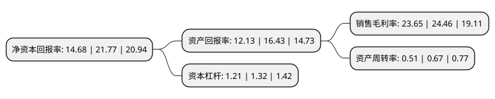

> 本页面由自动化程序生成于 2022年5月20日 01:21
> 内容可能存在错误，如有bug请提交issue至：https://github.com/Eroleice/doc-pi/issues
{.is-warning}

# 上市公司基本情况

## 基本资料

福建恒而达新材料股份有限公司（以下简称“恒而达”）成立于1995年11月20日，莆田市。于2021年02月08日在深交所创业板上市。

恒而达注册资本6,667万元，主要从事模切工具，锯切工具，裁切工具等金属切削工具的研发，生产和销售，主要产品为金属切削工具及配套智能数控装备。以下是详细信息：

- 公司名称: 福建恒而达新材料股份有限公司
- 股票代码: 300946.SZ
- 所在地: 福建 - 莆田市
- 成立日期: 1995年11月20日
- 注册资本: 6,667万元
- 法定代表人: 林正华
- 主营业务: 主要从事模切工具，锯切工具，裁切工具等金属切削工具的研发，生产和销售，主要产品为金属切削工具及配套智能数控装备
- 公司官网: www.hengda-china.com.cn
- 公司介绍: 公司基于多年对金属材料与热处理的研究积累，形成了金属热处理工艺、金属材料加工技术和自动化专用装备制造三大核心自主知识产权与技术优势，主要从事模切工具、锯切工具、裁切工具等金属切削工具研发、生产和销售，并逐步延伸至产业链下游，为客户提供配套智能数控装备。发行人致力于为轻工、装备制造、建筑建材、汽车、电子信息等国民经济基础性产业，提供产品系列化及装备配套一体化的切削加工方案，助力上述产业转型升级，推动智能制造和工具、装备的进口替代。受益于多年的研发创新成果，公司获得了福建省科技小巨人领军企业、福建省专精特新企业、福建省制造业单项冠军企业(产品)、福建省服务型制造示范企业等荣誉称号，已成为国内金属切削工具领域的龙头企业之一。

## 股东及高管情况

上市公司第一大股东为林正华，持股44,200,000股，占比66.3%，为上市公司实际控制人。

截至2022年03月31日，上市公司的前十大股东中，共有8名自然人股东，2名机构股东，其中5%以上大股东共有1名。上市公司前十大股东明细如下：

> 截至2022年03月31日，上市公司前十大股东信息如下：

| 股东名称 | 持股数量（股） | 持股比例 |
| --- | --- | --- |
| 林正华 | 44,200,000 | 66.3% |
| 莆田市壶山兰水投资合伙企业(有限合伙) | 2,050,000 | 3.07% |
| 林正雄 | 1,500,000 | 2.25% |
| 沈群宾 | 1,000,000 | 1.5% |
| 林素媛 | 500,000 | 0.75% |
| 莆田市恒而达之投资合伙企业(有限合伙) | 500,000 | 0.75% |
| 陈丽容 | 250,000 | 0.37% |
| 柴晓庆 | 176,600 | 0.26% |
| 欧阳春 | 137,400 | 0.21% |
| 杨学慧 | 131,400 | 0.2% |

## 利润表分析

上市公司2021年总收入为4.55亿元，净利润为1.07亿元，实现盈利。

## 杜邦分析

> 数据列示周期：2021年 | 2020年 | 2019年
{.is-info}

上市公司的净资产收益率在近一年有所下降，下降幅度为-32.57%，其变化情况分解如下：
- 上市公司的销售毛利率在近一年下降了-3.31%，可能是生产效率的下降、商品原材料价格上涨或商品价格的下跌所致。
- 上市公司的资产周转率在近一年下降了-23.88%，可能是源自于更慢的销售回款或库存管理效果下降。
- 上市公司的财务杠杆比率在近一年下降了-8.33%，可能是减少负债降低财务费用。

