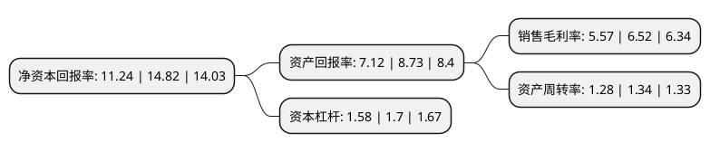

> 本页面由自动化程序生成于 2022年5月20日 01:22
> 内容可能存在错误，如有bug请提交issue至：https://github.com/Eroleice/doc-pi/issues
{.is-warning}

# 上市公司基本情况

## 基本资料

天津津荣天宇精密机械股份有限公司（以下简称“津荣天宇”）成立于2004年06月09日，天津市。于2021年05月12日在深交所创业板上市。

津荣天宇注册资本7,388万元，公司专业从事精密冲压模具，精密冲压制件的研发，生产，组装和销售等一体化的高端产品制造和服务。以下是详细信息：

- 公司名称: 天津津荣天宇精密机械股份有限公司
- 股票代码: 300988.SZ
- 所在地: 天津 - 天津市
- 成立日期: 2004年06月09日
- 注册资本: 7,388万元
- 法定代表人: 孙兴文
- 主营业务: 公司专业从事精密冲压模具，精密冲压制件的研发，生产，组装和销售等一体化的高端产品制造和服务
- 公司官网: www.tjjinrong.com
- 公司介绍: 公司是国内领先的专业从事精密金属模具及相关部品的研发、生产和销售的高新技术企业，公司以精密模具开发、精密冲压、精密钣金、铝合金超低速压铸、自动化焊接及自动化组装六大核心技术为支撑，以精益化、柔性化和规模化生产为目标，为电气及汽车领域全球高端客户提供贴合需求的低成本、高品质产品和服务。公司的产品涵盖电气和汽车两大领域，其中电气精密部品包括低压配电部品、中压配电及能源设备部品和工业自动化部品，主要客户包括施耐德、ABB和西门子等全球领先的电力电气巨头；汽车精密部品包括减震部品、安全部品、空调及座椅部品、轻量化部品，主要客户包括东海橡塑、电装、丰田纺织、丰田合成及采埃孚-天合等全球汽车零部件供应商百强企业，最终产品广泛应用于丰田、本田、日产、大众、通用等知名汽车品牌。

## 股东及高管情况

上市公司第一大股东为闫学伟，持股19,567,600股，占比26.49%，**疑似为**上市公司实际控制人。

截至2022年03月31日，上市公司的前十大股东中，共有10名自然人股东，其中5%以上大股东共有2名。上市公司前十大股东明细如下：

> 未能通过持股比例判定出上市公司实际控制人（持股30%以上）
> 可能存在通过间接持股、联合持股、协议控制等方式拥有实际控制权的主体，具体请参考上市公司定期公告！
{.is-warning}

> 截至2022年03月31日，上市公司前十大股东信息如下：

| 股东名称 | 持股数量（股） | 持股比例 |
| --- | --- | --- |
| 闫学伟 | 19,567,600 | 26.49% |
| 孙兴文 | 16,567,600 | 22.43% |
| 云志 | 3,500,000 | 4.74% |
| 韩凤芝 | 3,000,000 | 4.06% |
| 赵红 | 2,500,000 | 3.38% |
| 秦万覃 | 2,000,000 | 2.71% |
| 韩社会 | 1,876,000 | 2.54% |
| 戚志华 | 1,800,000 | 2.44% |
| 魏利剑 | 1,000,000 | 1.35% |
| 张浩 | 746,000 | 1.01% |

## 利润表分析

上市公司2021年总收入为13.41亿元，净利润为0.74亿元，实现盈利。

## 杜邦分析

> 数据列示周期：2021年 | 2020年 | 2019年
{.is-info}

上市公司的净资产收益率在近一年有所下降，下降幅度为-24.16%，其变化情况分解如下：
- 上市公司的销售毛利率在近一年下降了-14.57%，可能是生产效率的下降、商品原材料价格上涨或商品价格的下跌所致。
- 上市公司的资产周转率在近一年下降了-4.48%，可能是源自于更慢的销售回款或库存管理效果下降。
- 上市公司的财务杠杆比率在近一年下降了-7.06%，可能是减少负债降低财务费用。

