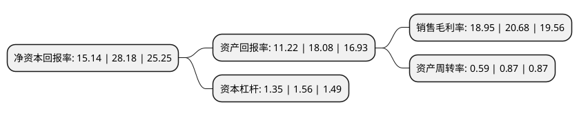

> 本页面由自动化程序生成于 2022年5月20日 01:22
> 内容可能存在错误，如有bug请提交issue至：https://github.com/Eroleice/doc-pi/issues
{.is-warning}

# 上市公司基本情况

## 基本资料

烟台石川密封科技股份有限公司（以下简称“密封科技”）成立于1991年04月13日，烟台市。于2021年07月06日在深交所创业板上市。

密封科技注册资本14,640万元，主要从事密封垫片，隔热防护罩，密封纤维板以及金属涂胶板产品的研发，生产和销售。以下是详细信息：

- 公司名称: 烟台石川密封科技股份有限公司
- 股票代码: 301020.SZ
- 所在地: 山东 - 烟台市
- 成立日期: 1991年04月13日
- 注册资本: 14,640万元
- 法定代表人: 娄江波
- 主营业务: 主要从事密封垫片，隔热防护罩，密封纤维板以及金属涂胶板产品的研发，生产和销售
- 公司官网: www.ytsc.cn
- 公司介绍: 公司主要生产密封垫片、隔热防护罩、密封纤维板和金属涂胶板产品。凭借多年积累的研发经验和长期培育的客户关系，公司在主营密封垫片和密封纤维板的基础上，一方面持续研发上游密封材料，在国内率先建成金属涂胶板卷材自动化生产线1，所生产的金属涂胶板是一种高性能复合材料，除可用于制造密封垫片外，还是汽车用刹车消音片的主要原材料；另一方面，公司积极利用下游客户资源，开发了隔热防护罩系列产品。公司于2017年获得中国内燃机工业协会颁发的“中国内燃机零部件行业排头兵(2014~2016年度)”称号及全国商用车配件产销联合会颁发的“最具影响力品牌企业”称号；于2019年8月被烟台市工信局选拔为中小企业“小巨人”和“隐形冠军”入库培育企业；公司“车用柴油气缸垫片”项目于2019年12月进入山东省工业和信息化厅颁布的第三批山东省制造业单项冠军企业名单。此外，公司是中国摩擦密封材料协会副理事长单位和中国内燃机工业协会理事会理事单位，参与制定了10余项国家或行业标准，是行业标准的制定者和行业发展的引领者。

## 股东及高管情况

上市公司第一大股东为烟台铭祥控股有限公司，持股70,162,200股，占比47.93%，为上市公司实际控制人。

截至2022年03月31日，上市公司的前十大股东中，共有6名自然人股东，3名机构股东，1名其他股东，其中5%以上大股东共有3名。上市公司前十大股东明细如下：

> 截至2022年03月31日，上市公司前十大股东信息如下：

| 股东名称 | 持股数量（股） | 持股比例 |
| --- | --- | --- |
| 烟台铭祥控股有限公司 | 70,162,200 | 47.93% |
| 烟台厚瑞投资中心(有限合伙) | 19,807,920 | 13.53% |
| 日本石川密封垫板株式会社 | 16,513,920 | 11.28% |
| 冰轮环境技术股份有限公司 | 3,315,960 | 2.27% |
| 颜有燕 | 2,393,949 | 1.64% |
| 鱼杰 | 392,600 | 0.27% |
| 林志彬 | 343,300 | 0.23% |
| 王福德 | 286,000 | 0.2% |
| 黄朝江 | 260,300 | 0.18% |
| 潘可群 | 254,800 | 0.17% |

## 利润表分析

上市公司2021年总收入为4.88亿元，净利润为0.92亿元，实现盈利。

## 杜邦分析

> 数据列示周期：2021年 | 2020年 | 2019年
{.is-info}

上市公司的净资产收益率在近一年有所下降，下降幅度为-46.27%，其变化情况分解如下：
- 上市公司的销售毛利率在近一年下降了-8.37%，可能是生产效率的下降、商品原材料价格上涨或商品价格的下跌所致。
- 上市公司的资产周转率在近一年下降了-32.18%，可能是源自于更慢的销售回款或库存管理效果下降。
- 上市公司的财务杠杆比率在近一年下降了-13.46%，可能是减少负债降低财务费用。

