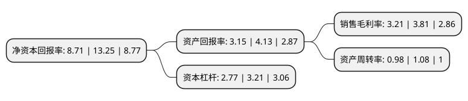

> 本页面由自动化程序生成于 2022年5月20日 01:22
> 内容可能存在错误，如有bug请提交issue至：https://github.com/Eroleice/doc-pi/issues
{.is-warning}

# 上市公司基本情况

## 基本资料

浙江新柴股份有限公司（以下简称“新柴股份”）成立于2007年06月15日，绍兴市。于2021年07月22日在深交所创业板上市。

新柴股份注册资本24,113.34万元，公司主营业务为非道路用柴油发动机及相关零部件的研发，生产与销售。主要产品为非道路用柴油机，被广泛应用于叉车，挖掘机，装载机等工程机械，拖拉机，收割机等农用机械以及发电机组，船舶等其他领域。以下是详细信息：

- 公司名称: 浙江新柴股份有限公司
- 股票代码: 301032.SZ
- 所在地: 浙江 - 绍兴市
- 成立日期: 2007年06月15日
- 注册资本: 24,113.34万元
- 法定代表人: 白洪法
- 主营业务: 公司主营业务为非道路用柴油发动机及相关零部件的研发，生产与销售主要产品为非道路用柴油机，被广泛应用于叉车，挖掘机，装载机等工程机械，拖拉机，收割机等农用机械以及发电机组，船舶等其他领域
- 公司官网: www.xinchaipower.com
- 公司介绍: 公司主营业务为非道路用柴油发动机及相关零部件的研发、生产与销售。目前，公司已发展成为一家集研发、制造于一体，产品系列化、生产专业化、管理规范化的非道路用柴油机生产企业。公司自成立以来一直专注于非道路用柴油发动机领域，获取了“中国内燃机行业排头兵企业”、“中国机械工业百强”、“中国机械500强”等多项荣誉，公司生产的新柴牌内燃机被评为浙江省品牌产品。公司是国家级重点高新技术企业，拥有省级企业技术中心、省级高新技术研究开发中心和国家级博士后科研工作站，截至报告期末，公司已获得专利权85项，省级工业新产品(新技术)以及科技成果21项，并参与了多项国家及行业标准制定。2019年，公司研制的4E30型号柴油发动机成功出口至欧洲，达到了欧Ⅴ排放标准。

## 股东及高管情况

上市公司第一大股东为巨星控股集团有限公司，持股51,000,000股，占比21.15%，**疑似为**上市公司实际控制人。

截至2022年03月31日，上市公司的前十大股东中，共有8名自然人股东，2名机构股东，其中5%以上大股东共有5名。上市公司前十大股东明细如下：

> 未能通过持股比例判定出上市公司实际控制人（持股30%以上）
> 可能存在通过间接持股、联合持股、协议控制等方式拥有实际控制权的主体，具体请参考上市公司定期公告！
{.is-warning}

> 截至2022年03月31日，上市公司前十大股东信息如下：

| 股东名称 | 持股数量（股） | 持股比例 |
| --- | --- | --- |
| 巨星控股集团有限公司 | 51,000,000 | 21.15% |
| 巨星控股集团有限公司 | 51,000,000 | 21.15% |
| 仇建平 | 50,000,000 | 20.74% |
| 朱观岚 | 42,400,000 | 17.58% |
| 朱观岚 | 42,400,000 | 17.58% |
| 石荣 | 4,000,000 | 1.66% |
| 张春 | 4,000,000 | 1.66% |
| 凌坤生 | 2,720,000 | 1.13% |
| 黄劲松 | 2,000,000 | 0.83% |
| 梁仲庆 | 1,100,000 | 0.46% |

## 利润表分析

上市公司2021年总收入为24.82亿元，净利润为0.79亿元，实现盈利。

## 杜邦分析

> 数据列示周期：2021年 | 2020年 | 2019年
{.is-info}

上市公司的净资产收益率在近一年有所下降，下降幅度为-34.26%，其变化情况分解如下：
- 上市公司的销售毛利率在近一年下降了-15.75%，可能是生产效率的下降、商品原材料价格上涨或商品价格的下跌所致。
- 上市公司的资产周转率在近一年下降了-9.26%，可能是源自于更慢的销售回款或库存管理效果下降。
- 上市公司的财务杠杆比率在近一年下降了-13.71%，可能是减少负债降低财务费用。

