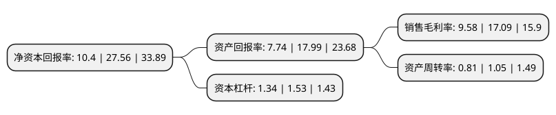

> 本页面由自动化程序生成于 2022年5月20日 01:22
> 内容可能存在错误，如有bug请提交issue至：https://github.com/Eroleice/doc-pi/issues
{.is-warning}

# 上市公司基本情况

## 基本资料

广东绿岛风空气系统股份有限公司（以下简称“绿岛风”）成立于2009年09月07日，江门市。于2021年08月11日在深交所创业板上市。

绿岛风注册资本6,800万元，从事室内通风系统产品的设计研发，生产及销售，致力于改善室内空气质量，提高建筑节能水平，为客户提供智能化，定制化，一体化室内通风系统解决方案。公司主要产品覆盖新风系列产品，风幕机两大品类，上百个系列，数千种型号，适用于民用住宅，市政基建，商业场所，工业厂房等国民经济各个领域。以下是详细信息：

- 公司名称: 广东绿岛风空气系统股份有限公司
- 股票代码: 301043.SZ
- 所在地: 广东 - 江门市
- 成立日期: 2009年09月07日
- 注册资本: 6,800万元
- 法定代表人: 李清泉
- 主营业务: 从事室内通风系统产品的设计研发，生产及销售，致力于改善室内空气质量，提高建筑节能水平，为客户提供智能化，定制化，一体化室内通风系统解决方案公司主要产品覆盖新风系列产品，风幕机两大品类，上百个系列，数千种型号，适用于民用住宅，市政基建，商业场所，工业厂房等国民经济各个领域
- 公司官网: www.nedfon.com
- 公司介绍: 公司长期从事室内通风系统产品的设计研发、生产及销售，致力于改善室内空气质量、提高建筑节能水平，为客户提供智能化、定制化、一体化室内通风系统解决方案。公司主要产品覆盖新风系列产品、风幕机两大品类、上百个系列、数千种型号，适用于民用住宅、市政基建、商业场所、工业厂房等国民经济各个领域。公司主要产品通过了CCC、ETL、HVI、SASO、CE、GCC、INMETRO等标准认证，公司自主品牌“NEDFON绿岛风”主要产品被授予“广东省名牌产品”称号，产品质量得到了国内外市场的广泛认可。公司销售模式以境内经销为主，通过经销渠道覆盖的终端销售网点遍布全国各地。公司现为高新技术企业、国家知识产权优势企业、广东省室内通风系统工程技术研究中心、AMCA会员单位及中国通用机械工业协会风机分会会员单位，参与了《家用和类似用途的交流换气扇及其调速器》(GB/T14806-2017)、《家用和类似用途的交流换气扇能效限定值及能效等级》(GB32049-2015)、《热回收新风机组》等多项国家标准的起草制订工作。

## 股东及高管情况

上市公司第一大股东为台山市奥达投资有限公司，持股29,997,000股，占比44.11%，为上市公司实际控制人。

截至2022年03月31日，上市公司的前十大股东中，共有6名自然人股东，3名机构股东，1个海外主体，其中5%以上大股东共有3名。上市公司前十大股东明细如下：

> 截至2022年03月31日，上市公司前十大股东信息如下：

| 股东名称 | 持股数量（股） | 持股比例 |
| --- | --- | --- |
| 台山市奥达投资有限公司 | 29,997,000 | 44.11% |
| 李清泉 | 15,000,000 | 22.06% |
| 台山市振中投资合伙企业(有限合伙) | 5,000,000 | 7.35% |
| 孙振德 | 1,000,000 | 1.47% |
| 泮杰 | 290,800 | 0.43% |
| 楚学军 | 190,000 | 0.28% |
| 华泰证券股份有限公司 | 163,767 | 0.24% |
| 戴成华 | 142,100 | 0.21% |
| JPMORGAN CHASE BANK,NATIONAL ASSOCIATION | 115,941 | 0.17% |
| 李占华 | 114,900 | 0.17% |

## 利润表分析

上市公司2021年总收入为5.51亿元，净利润为0.52亿元，实现盈利。

## 杜邦分析

> 数据列示周期：2021年 | 2020年 | 2019年
{.is-info}

上市公司的净资产收益率在近一年有所下降，下降幅度为-62.26%，其变化情况分解如下：
- 上市公司的销售毛利率在近一年下降了-43.94%，可能是生产效率的下降、商品原材料价格上涨或商品价格的下跌所致。
- 上市公司的资产周转率在近一年下降了-22.86%，可能是源自于更慢的销售回款或库存管理效果下降。
- 上市公司的财务杠杆比率在近一年下降了-12.42%，可能是减少负债降低财务费用。

