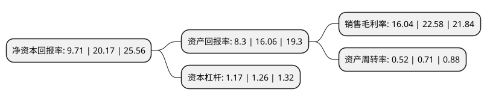

> 本页面由自动化程序生成于 2022年5月20日 01:22
> 内容可能存在错误，如有bug请提交issue至：https://github.com/Eroleice/doc-pi/issues
{.is-warning}

# 上市公司基本情况

## 基本资料

开勒环境科技(上海)股份有限公司（以下简称“开勒股份”）成立于2010年02月08日，上海市。于2021年09月23日在深交所创业板上市。

开勒股份注册资本6,455.52万元，公司主要从事HVLS风扇的研发，生产，销售，安装与相关技术服务。主要产品为HVLS风扇。以下是详细信息：

- 公司名称: 开勒环境科技(上海)股份有限公司
- 股票代码: 301070.SZ
- 所在地: 上海 - 上海市
- 成立日期: 2010年02月08日
- 注册资本: 6,455.52万元
- 法定代表人: 卢小波
- 主营业务: 公司主要从事HVLS风扇的研发，生产，销售，安装与相关技术服务主要产品为HVLS风扇
- 公司官网: www.kalefans.com
- 公司介绍: 公司主要从事大型工业风扇(即HVLS风扇)的研发、生产、销售、安装及相关技术服务.公司主要产品为大型工业风扇。凭借可靠的产品质量和良好的售后服务，公司在多个行业成功拓展了众多客户，包括汽车及配件行业、电子商务行业、商超物流快递行业等，其中不乏行业内知名企业，如日立海立、大众汽车、苏宁电器、京东商城、1号店、亚马逊、唯品会等。公司是高新技术企业，产品通过了SGS-CE认证，且部分外购的产品核心部件分别经CCC、ROHS和EMC等认证。目前，公司拥有1项计算机软件著作权、14项实用新型专利。

## 股东及高管情况

上市公司第一大股东为卢小波，持股16,610,000股，占比25.73%，**疑似为**上市公司实际控制人。

截至2022年03月31日，上市公司的前十大股东中，共有3名自然人股东，6名机构股东，1个产品账户，其中5%以上大股东共有4名。上市公司前十大股东明细如下：

> 未能通过持股比例判定出上市公司实际控制人（持股30%以上）
> 可能存在通过间接持股、联合持股、协议控制等方式拥有实际控制权的主体，具体请参考上市公司定期公告！
{.is-warning}

> 截至2022年03月31日，上市公司前十大股东信息如下：

| 股东名称 | 持股数量（股） | 持股比例 |
| --- | --- | --- |
| 卢小波 | 16,610,000 | 25.73% |
| 熊炜 | 12,051,920 | 18.67% |
| 共青城睿博投资管理合伙企业(有限合伙) | 4,000,000 | 6.2% |
| 于清梵 | 3,612,880 | 5.6% |
| 宁波定优企业管理合伙企业(有限合伙) | 3,080,000 | 4.77% |
| 共青城领汇投资管理合伙企业(有限合伙) | 3,000,000 | 4.65% |
| 传化控股集团有限公司 | 2,800,000 | 4.34% |
| 河南宏科军民融合产业投资基金(有限合伙) | 1,720,400 | 2.67% |
| 上海易泓致合投资管理有限公司-新余易鹏投资管理中心(有限合伙) | 1,000,000 | 1.55% |
| 上海致钊投资管理中心(有限合伙) | 500,000 | 0.77% |

## 利润表分析

上市公司2021年总收入为3.43亿元，净利润为0.55亿元，实现盈利。

## 杜邦分析

> 数据列示周期：2021年 | 2020年 | 2019年
{.is-info}

上市公司的净资产收益率在近一年有所下降，下降幅度为-51.86%，其变化情况分解如下：
- 上市公司的销售毛利率在近一年下降了-28.96%，可能是生产效率的下降、商品原材料价格上涨或商品价格的下跌所致。
- 上市公司的资产周转率在近一年下降了-26.76%，可能是源自于更慢的销售回款或库存管理效果下降。
- 上市公司的财务杠杆比率在近一年下降了-7.14%，可能是减少负债降低财务费用。

