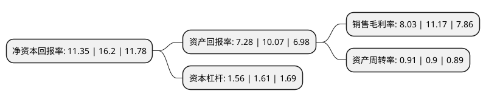

> 本页面由自动化程序生成于 2022年5月20日 01:23
> 内容可能存在错误，如有bug请提交issue至：https://github.com/Eroleice/doc-pi/issues
{.is-warning}

## 股东及高管情况

上市公司第一大股东为杨金德，持股35,059,208股，占比42.96%，为上市公司实际控制人。

截至2022年04月19日，上市公司的前十大股东中，共有8名自然人股东，2名机构股东，其中5%以上大股东共有2名。上市公司前十大股东明细如下：

> 截至2022年04月19日，上市公司前十大股东信息如下：

| 股东名称 | 持股数量（股） | 持股比例 |
| --- | --- | --- |
| 杨金德 | 35,059,208 | 42.96% |
| 杨蕾 | 8,764,802 | 10.74% |
| 北京大土洋投资管理中心(有限合伙) | 3,842,227 | 4.71% |
| 李建 | 2,834,488 | 3.47% |
| 南通悦享企业管理中心(有限合伙) | 1,673,318 | 2.05% |
| 宋永华 | 1,286,613 | 1.58% |
| 曹汉林 | 1,286,613 | 1.58% |
| 卞建华 | 1,286,613 | 1.58% |
| 赵德新 | 1,030,274 | 1.26% |
| 王进 | 1,030,274 | 1.26% |

## 利润表分析

上市公司2021年总收入为7.55亿元，净利润为0.6亿元，实现盈利。

## 杜邦分析

> 数据列示周期：2021年 | 2020年 | 2019年
{.is-info}

上市公司的净资产收益率在近一年有所下降，下降幅度为-29.94%，其变化情况分解如下：
- 上市公司的销售毛利率在近一年下降了-28.11%，可能是生产效率的下降、商品原材料价格上涨或商品价格的下跌所致。
- 上市公司的资产周转率在近一年上升了1.11%，可能是源自于更快的销售回款或库存管理效果提升。
- 上市公司的财务杠杆比率在近一年下降了-3.11%，可能是减少负债降低财务费用。

