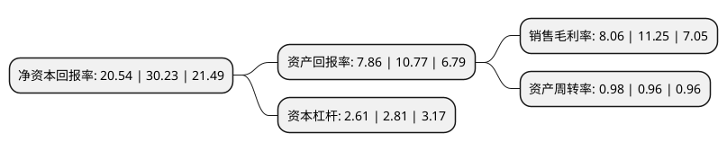

> 本页面由自动化程序生成于 2022年5月20日 01:23
> 内容可能存在错误，如有bug请提交issue至：https://github.com/Eroleice/doc-pi/issues
{.is-warning}

# 上市公司基本情况

## 基本资料

深圳市铭利达精密技术股份有限公司（以下简称“铭利达”）成立于2004年07月27日，深圳市。于2022年04月07日在深交所创业板上市。

铭利达注册资本36,000万元，公司专业从事精密结构件及模具的设计，研发，生产及销售，以产品研发，模具设计和工艺设计与创新为核心，以精密压铸，精密注塑，型材加工和五金冲压技术为基础，为国内外优质客户提供多类型，一站式的精密结构件产品。以下是详细信息：

- 公司名称: 深圳市铭利达精密技术股份有限公司
- 股票代码: 301268.SZ
- 所在地: 广东 - 深圳市
- 成立日期: 2004年07月27日
- 注册资本: 36,000万元
- 法定代表人: 陶诚
- 主营业务: 公司专业从事精密结构件及模具的设计，研发，生产及销售，以产品研发，模具设计和工艺设计与创新为核心，以精密压铸，精密注塑，型材加工和五金冲压技术为基础，为国内外优质客户提供多类型，一站式的精密结构件产品
- 公司官网: www.minglidagroup.com
- 公司介绍: 铭利达成立于2004年，是一家集科研、开发、生产、销售于一体民营高新技术企业，是模具设计与制造、压铸生产、塑胶射出、精密机加工、铝型材加工、冲压钣金、表面处理等结构产品的一站式服务提供者，致力于新能源汽车、太阳能发电、大健康、安防、新型行业等核心精密零部件成型加工。铭利达生产基地布局华南、华东、西南区域，面积达48万平方米，员工2000余人，服务布局欧洲、北美、亚太等地区，拥有丰富的模具设计经验、压铸、注塑成型与品质控制专业技术人员；配备先进的高精尖生产与检测设备。铭利达始终把向客户提供优质产品及优质服务作为根本立足点。

## 股东及高管情况

上市公司第一大股东为深圳市达磊投资发展有限责任公司，持股152,893,800股，占比38.22%，为上市公司实际控制人。

截至2022年04月07日，上市公司的前十大股东中，共有5名自然人股东，4名机构股东，1个产品账户，其中5%以上大股东共有3名。上市公司前十大股东明细如下：

> 截至2022年04月07日，上市公司前十大股东信息如下：

| 股东名称 | 持股数量（股） | 持股比例 |
| --- | --- | --- |
| 深圳市达磊投资发展有限责任公司 | 152,893,800 | 38.22% |
| 张贤明 | 40,209,480 | 10.05% |
| 深圳市赛铭股权投资企业(有限合伙) | 26,079,480 | 6.52% |
| 杭州剑智股权投资合伙企业(有限合伙) | 16,416,000 | 4.1% |
| 邵雨田 | 16,279,200 | 4.07% |
| 郑素贞 | 16,279,200 | 4.07% |
| 深圳市红土智能股权投资基金合伙企业(有限合伙) | 14,688,000 | 3.67% |
| 陶晓海 | 14,488,560 | 3.62% |
| 陶诚 | 10,874,880 | 2.72% |
| 东莞市赛腾股权投资合伙企业(有限合伙) | 9,377,280 | 2.34% |

## 利润表分析

上市公司2021年总收入为18.37亿元，净利润为1.48亿元，实现盈利。

## 杜邦分析

> 数据列示周期：2021年 | 2020年 | 2019年
{.is-info}

上市公司的净资产收益率在近一年有所下降，下降幅度为-32.05%，其变化情况分解如下：
- 上市公司的销售毛利率在近一年下降了-28.36%，可能是生产效率的下降、商品原材料价格上涨或商品价格的下跌所致。
- 上市公司的资产周转率在近一年上升了2.08%，可能是源自于更快的销售回款或库存管理效果提升。
- 上市公司的财务杠杆比率在近一年下降了-7.12%，可能是减少负债降低财务费用。

