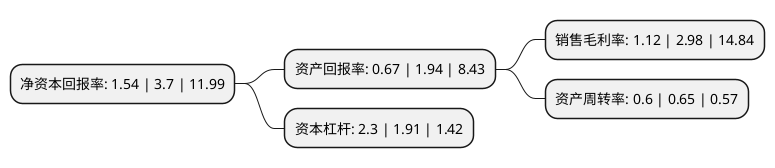

> 本页面由自动化程序生成于 2022年5月20日 01:24
> 内容可能存在错误，如有bug请提交issue至：https://github.com/Eroleice/doc-pi/issues
{.is-warning}

# 上市公司基本情况

## 基本资料

东睦新材料集团股份有限公司（以下简称“东睦股份”）成立于1994年07月11日，宁波市。于2004年05月11日在上交所主板上市。

东睦股份注册资本61,638.348万元，摩托车，空调压缩机，冰箱压缩机，电动工具和轿车粉末冶金零件。以下是详细信息：

- 公司名称: 东睦新材料集团股份有限公司
- 股票代码: 600114.SH
- 所在地: 浙江 - 宁波市
- 成立日期: 1994年07月11日
- 注册资本: 61,638.348万元
- 法定代表人: 朱志荣
- 主营业务: 摩托车，空调压缩机，冰箱压缩机，电动工具和轿车粉末冶金零件
- 公司官网: www.pm-china.com
- 公司介绍: 公司是国内以粉末冶金机械零件生产为主业的企业，连续多年在国内粉末冶金行业中处于市场绝对领先地位，在国际粉末冶金行业及相关市场也具备一定的品牌知名度，2017年，公司成功入选国家“第二批制造业单项冠军示范企业”。公司所从事的主要业务为粉末冶金机械结构零件和软磁材料的生产和销售，产品广泛应用于汽车、家电、摩托车、工程机械等产业。其中：粉末冶金汽车零件主要用于发动机、变速箱、底盘等主要部件中；粉末冶金家电零件则主要用于空调压缩机和冰箱压缩机；粉末冶金摩托车零件主要用于摩托车发动机、离合器等部件；公司生产的软磁材料包括合金粉末、铁粉芯、合金磁粉芯等，产品广泛用于纯电动汽车、充电桩、太阳能、UPS、白色家电等领域。公司具有几十年的粉末冶金专业生产经验，拥有一整套国际先进的粉末冶金生产技术和设备，拥有发明专利52项，实用新型专利147项，软件著作权1项，外观设计专利4项。公司建立了“国家级企业技术中心”、“国家认证实验室”、“博士后科研工作站”、“浙江省东睦新材料粉末冶金研究院(省级重点)”，具备开发和生产各种粉末冶金模具和粉末冶金零件的能力。

## 股东及高管情况

上市公司第一大股东为睦特殊金属工业株式会社，持股65,467,200股，占比10.62%，**疑似为**上市公司实际控制人。

截至2022年03月31日，上市公司的前十大股东中，共有1名自然人股东，2名机构股东，6个产品账户，1名其他股东，其中5%以上大股东共有2名。上市公司前十大股东明细如下：

> 未能通过持股比例判定出上市公司实际控制人（持股30%以上）
> 可能存在通过间接持股、联合持股、协议控制等方式拥有实际控制权的主体，具体请参考上市公司定期公告！
{.is-warning}

> 截至2022年03月31日，上市公司前十大股东信息如下：

| 股东名称 | 持股数量（股） | 持股比例 |
| --- | --- | --- |
| 睦特殊金属工业株式会社 | 65,467,200 | 10.62% |
| 宁波金广投资股份有限公司 | 51,111,016 | 8.29% |
| 宁波新金广投资管理有限公司 | 29,468,000 | 4.78% |
| 湖州国赞投资管理合伙企业(有限合伙)-国赞价值6号私募证券投资基金 | 29,100,000 | 4.72% |
| 上海一村投资管理有限公司-一村投资弈鸣6号私募证券投资基金 | 10,400,000 | 1.69% |
| 应伟国 | 8,542,796 | 1.39% |
| 广东莲花私募证券投资基金管理有限公司-莲花复利增长私募证券投资基金 | 6,492,800 | 1.05% |
| 中国工商银行股份有限公司-信达澳银周期动力混合型证券投资基金 | 5,938,108 | 0.96% |
| 中国建设银行股份有限公司-信达澳银新能源产业股票型证券投资基金 | 5,801,302 | 0.94% |
| 中国建设银行股份有限公司-信达澳银匠心臻选两年持有期混合型证券投资基金 | 4,855,433 | 0.79% |

## 杜邦分析

> 数据列示周期：2021年 | 2020年 | 2019年
{.is-info}

上市公司的净资产收益率在近一年有所下降，下降幅度为-58.38%，其变化情况分解如下：
- 上市公司的销售毛利率在近一年下降了-62.42%，可能是生产效率的下降、商品原材料价格上涨或商品价格的下跌所致。
- 上市公司的资产周转率在近一年下降了-7.69%，可能是源自于更慢的销售回款或库存管理效果下降。
- 上市公司的财务杠杆比率在近一年上升了20.42%，可能是增加负债扩大生产规模。

