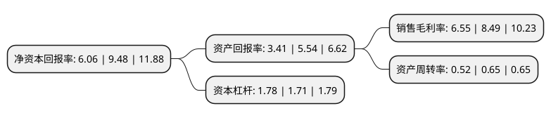

> 本页面由自动化程序生成于 2022年5月20日 01:26
> 内容可能存在错误，如有bug请提交issue至：https://github.com/Eroleice/doc-pi/issues
{.is-warning}

# 上市公司基本情况

## 基本资料

双良节能系统股份有限公司（以下简称“双良节能”）成立于1995年10月05日，无锡市。于2003年04月22日在上交所主板上市。

双良节能注册资本162,725.581万元，主要产品:溴化锂制冷机(热泵)，高效换热器，空冷器等换热设备和苯乙烯，聚苯乙烯产品。以下是详细信息：

- 公司名称: 双良节能系统股份有限公司
- 股票代码: 600481.SH
- 所在地: 江苏 - 无锡市
- 成立日期: 1995年10月05日
- 注册资本: 162,725.581万元
- 法定代表人: 刘正宇
- 主营业务: 主要产品:溴化锂制冷机(热泵)，高效换热器，空冷器等换热设备和苯乙烯，聚苯乙烯产品
- 公司官网: www.shuangliang.com
- 公司介绍: 双良节能系统股份有限公司的主营业务包括余热利用溴化锂制冷机/热泵产品、电制冷/电热泵系统、烟气余热回收系统、空冷系统、换热器、工业及民用建筑能源管理系统、多晶硅还原炉和大尺寸单晶硅片等。公司是中国最大的溴化锂制冷机、热泵和空冷器生产商和集成商，具有国际领先的产品技术和制造能力，并且产品之间能够相互结合形成综合技术方案。公司的多晶硅还原炉的市场份额稳居国内第一，第二代40对棒还原炉是目前国内的主导炉型，制造的世界上最大炉型的还原炉已经交货并调试运行，大尺寸硅片的一期投资规模达20GW。公司围绕核心工艺包开发各类产品和系统，综合其他能源管理的手段，拓展EPC工程总承包、合同能源管理项目，提升工业余热利用、公共建筑节能、供热工程、智能运维和光伏新能源等市场的竞争力。

## 股东及高管情况

上市公司第一大股东为双良集团有限公司，持股329,370,517股，占比20.24%，**疑似为**上市公司实际控制人。

截至2022年03月31日，上市公司的前十大股东中，共有3名自然人股东，5名机构股东，2个产品账户，其中5%以上大股东共有3名。上市公司前十大股东明细如下：

> 未能通过持股比例判定出上市公司实际控制人（持股30%以上）
> 可能存在通过间接持股、联合持股、协议控制等方式拥有实际控制权的主体，具体请参考上市公司定期公告！
{.is-warning}

> 截至2022年03月31日，上市公司前十大股东信息如下：

| 股东名称 | 持股数量（股） | 持股比例 |
| --- | --- | --- |
| 双良集团有限公司 | 329,370,517 | 20.24% |
| 上海同盛永盈企业管理中心(有限合伙) | 307,894,203 | 18.92% |
| 江苏双良科技有限公司 | 168,367,210 | 10.35% |
| 江苏利创新能源有限公司 | 19,392,000 | 1.19% |
| 缪双大 | 14,607,722 | 0.9% |
| 毛幼聪 | 14,564,726 | 0.9% |
| 江苏澄利投资咨询有限公司 | 9,696,000 | 0.6% |
| 中国银行股份有限公司-上投摩根远见两年持有期混合型证券投资基金 | 9,360,266 | 0.58% |
| 全国社保基金四一二组合 | 9,027,365 | 0.55% |
| 蹇泽勇 | 8,934,902 | 0.55% |

## 利润表分析

上市公司2021年总收入为38.29亿元，净利润为3.39亿元，实现盈利。

## 杜邦分析

> 数据列示周期：2020年 | 2019年 | 2018年
{.is-info}

上市公司的净资产收益率在近一年有所下降，下降幅度为-36.08%，其变化情况分解如下：
- 上市公司的销售毛利率在近一年下降了-22.85%，可能是生产效率的下降、商品原材料价格上涨或商品价格的下跌所致。
- 上市公司的资产周转率在近一年下降了-20%，可能是源自于更慢的销售回款或库存管理效果下降。
- 上市公司的财务杠杆比率在近一年上升了4.09%，可能是增加负债扩大生产规模。

