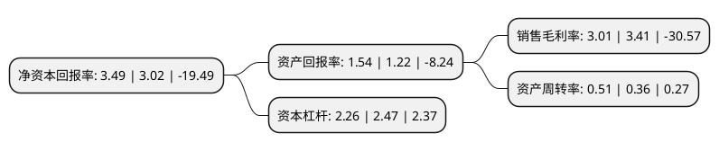

> 本页面由自动化程序生成于 2022年5月20日 01:27
> 内容可能存在错误，如有bug请提交issue至：https://github.com/Eroleice/doc-pi/issues
{.is-warning}

# 上市公司基本情况

## 基本资料

文一三佳科技股份有限公司（以下简称“文一科技”）成立于2000年04月28日，铜陵市。于2002年01月08日在上交所主板上市。

文一科技注册资本15,843万元，主要产品:半导体集成电路塑封模具与化学建材挤出模具，LED支架。以下是详细信息：

- 公司名称: 文一三佳科技股份有限公司
- 股票代码: 600520.SH
- 所在地: 安徽 - 铜陵市
- 成立日期: 2000年04月28日
- 注册资本: 15,843万元
- 法定代表人: 黄言勇
- 主营业务: 主要产品:半导体集成电路塑封模具与化学建材挤出模具，LED支架
- 公司官网: www.chinatrinity.com
- 公司介绍: 公司是国内唯一的模具制造上市公司。公司主营半导体集成电路专用模具和化学建材专用模具的设计、研发、生产，是国家科技部授予的国家重点高新技术企业。公司拥有一流的加工设备，并拥有自主知识产权，多项技术在中国、美国、欧洲申请专利，具有独特的行业优势。公司生产的集成电路塑封模具和塑料异材挤出模具产销量均为全国第一，挤出模具年生产能力位居世界前列。在全球的化学建材模具市场上，公司位列全球第三，70%的产品销往美国、泰国、土耳其等国。

## 股东及高管情况

上市公司第一大股东为铜陵市三佳电子(集团)有限责任公司，持股27,073,333股，占比17.09%，**疑似为**上市公司实际控制人。

截至2022年03月31日，上市公司的前十大股东中，共有4名自然人股东，5名机构股东，1个产品账户，其中5%以上大股东共有2名。上市公司前十大股东明细如下：

> 未能通过持股比例判定出上市公司实际控制人（持股30%以上）
> 可能存在通过间接持股、联合持股、协议控制等方式拥有实际控制权的主体，具体请参考上市公司定期公告！
{.is-warning}

> 截至2022年03月31日，上市公司前十大股东信息如下：

| 股东名称 | 持股数量（股） | 持股比例 |
| --- | --- | --- |
| 铜陵市三佳电子(集团)有限责任公司 | 27,073,333 | 17.09% |
| 安徽省瑞真商业管理有限公司 | 14,283,884 | 9.02% |
| 方正和生投资有限责任公司-铜陵和生产业发展基金合伙企业(有限合伙) | 3,152,900 | 1.99% |
| 何群华 | 1,840,201 | 1.16% |
| 西藏金实力电子科技有限公司 | 1,595,800 | 1.01% |
| 安徽省文一资产管理有限公司 | 1,567,903 | 0.99% |
| 吴少雄 | 1,332,470 | 0.84% |
| 吴金松 | 1,052,500 | 0.66% |
| 郭燕芬 | 1,049,200 | 0.66% |
| 拉萨市星晴网络科技有限公司 | 1,038,200 | 0.66% |

## 利润表分析

上市公司2021年总收入为4.43亿元，净利润为0.13亿元，实现盈利。

## 杜邦分析

> 数据列示周期：2021年 | 2020年 | 2019年
{.is-info}

上市公司的净资产收益率在近一年有所上升，上升幅度为15.56%，其变化情况分解如下：
- 上市公司的销售毛利率在近一年下降了-11.73%，可能是生产效率的下降、商品原材料价格上涨或商品价格的下跌所致。
- 上市公司的资产周转率在近一年上升了41.67%，可能是源自于更快的销售回款或库存管理效果提升。
- 上市公司的财务杠杆比率在近一年下降了-8.5%，可能是减少负债降低财务费用。

