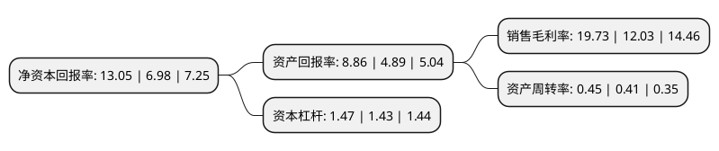

> 本页面由自动化程序生成于 2022年5月20日 01:27
> 内容可能存在错误，如有bug请提交issue至：https://github.com/Eroleice/doc-pi/issues
{.is-warning}

# 上市公司基本情况

## 基本资料

福建龙溪轴承(集团)股份有限公司（以下简称“龙溪股份”）成立于1997年12月24日，漳州市。于2002年08月05日在上交所主板上市。

龙溪股份注册资本39,955.357万元，主要产品:轴承，汽车配件。以下是详细信息：

- 公司名称: 福建龙溪轴承(集团)股份有限公司
- 股票代码: 600592.SH
- 所在地: 福建 - 漳州市
- 成立日期: 1997年12月24日
- 注册资本: 39,955.357万元
- 法定代表人: 陈晋辉
- 主营业务: 主要产品:轴承，汽车配件
- 公司官网: www.ls.com.cn
- 公司介绍: 公司主营关节轴承等特种轴承、汽车配件等，产品不仅广泛应用于国民经济各行业的各类机械设备，并为国家重点工程等配套，而且大量出口欧美亚等四十多个工业发达国家和地区。公司研发体系完善、研发能力强大，创立了全国唯一的关节轴承研究所和国家级关节轴承检测实验中心，并获批为福建省关节轴承企业重点实验室和福建省精密轴承工程研发中心；成立了企业博士后科研工作站；公司企业技术中心被认定为国家级企业技术中心；是全国滚动轴承标准化技术委员会关节轴承分技术委员会秘书处单位、关节轴承国家标准和行业标准的主要起草单位；曾荣获福建省标准贡献奖一等奖。先后获得全国模范劳动关系和谐企业、全国就业先进企业、全国工业品牌培育示范企业、全国文明单位、全国机械行业文明单位、全国机械工业质量奖、中国机械工业科学技术奖、中国优秀诚信企业、国家创新型试点企业、全国机械工业先进集体等多项荣誉。

## 股东及高管情况

上市公司第一大股东为漳州市九龙江集团有限公司，持股151,233,800股，占比37.85%，为上市公司实际控制人。

截至2022年03月31日，上市公司的前十大股东中，共有7名自然人股东，2名机构股东，1个产品账户，其中5%以上大股东共有1名。上市公司前十大股东明细如下：

> 截至2022年03月31日，上市公司前十大股东信息如下：

| 股东名称 | 持股数量（股） | 持股比例 |
| --- | --- | --- |
| 漳州市九龙江集团有限公司 | 151,233,800 | 37.85% |
| 国机资产管理有限公司 | 14,219,296 | 3.56% |
| 胡红丹 | 6,858,152 | 1.72% |
| 俞旭斐 | 6,600,000 | 1.65% |
| 张鹏 | 4,640,569 | 1.16% |
| 上海七王资产管理有限公司-七王瑞德2号证券投资基金 | 4,328,000 | 1.08% |
| 陈能依 | 3,827,300 | 0.96% |
| 邱信富 | 3,767,000 | 0.94% |
| 周丽萍 | 2,825,206 | 0.71% |
| 周志刚 | 2,499,800 | 0.63% |

## 利润表分析

上市公司2021年总收入为14.35亿元，净利润为2.83亿元，实现盈利。

## 杜邦分析

> 数据列示周期：2021年 | 2020年 | 2019年
{.is-info}

上市公司的净资产收益率在近一年有所上升，上升幅度为86.96%，其变化情况分解如下：
- 上市公司的销售毛利率在近一年上升了64.01%，可能是生产效率的提升、商品原材料价格下跌或商品价格的上涨所致。
- 上市公司的资产周转率在近一年上升了9.76%，可能是源自于更快的销售回款或库存管理效果提升。
- 上市公司的财务杠杆比率在近一年上升了2.8%，可能是增加负债扩大生产规模。

