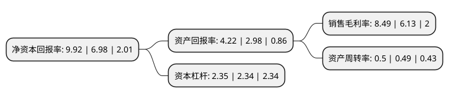

> 本页面由自动化程序生成于 2022年5月20日 01:30
> 内容可能存在错误，如有bug请提交issue至：https://github.com/Eroleice/doc-pi/issues
{.is-warning}

# 上市公司基本情况

## 基本资料

杭州前进齿轮箱集团股份有限公司（以下简称“杭齿前进”）成立于1997年03月14日，杭州市。于2010年10月11日在上交所主板上市。

杭齿前进注册资本40,006万元，主营业务为各类齿轮传动装置，粉末冶金制品和大型精密齿轮的设计，制造和销售。主要产品为船用齿轮箱及可调螺旋桨，工程机械变速箱及驱动轿，汽车变速器及特种车辆变速器，工业齿轮箱，风电增速箱，农业机械变速箱，摩擦材料及摩擦片，大型精密齿轮等。以下是详细信息：

- 公司名称: 杭州前进齿轮箱集团股份有限公司
- 股票代码: 601177.SH
- 所在地: 浙江 - 杭州市
- 成立日期: 1997年03月14日
- 注册资本: 40,006万元
- 法定代表人: 周焕辉
- 主营业务: 主营业务为各类齿轮传动装置，粉末冶金制品和大型精密齿轮的设计，制造和销售主要产品为船用齿轮箱及可调螺旋桨，工程机械变速箱及驱动轿，汽车变速器及特种车辆变速器，工业齿轮箱，风电增速箱，农业机械变速箱，摩擦材料及摩擦片，大型精密齿轮等
- 公司官网: www.chinaadvance.com
- 公司介绍: 杭州前进齿轮箱集团股份有限公司是我国专业设计、制造齿轮传动装置和粉末冶金制品的大型重点骨干企业，国家高新技术企业。公司前身为杭州齿轮箱厂，创建于1960年，2001年经国家批准实施“债转股”改制，成为国有多元投资的有限责任公司，2008年完成股份制改制正式变更为杭州前进齿轮箱集团股份有限公司，并于2010年10月在上海证券交易所上市。公司综合实力被列为“中国工业行业排头兵”企业和“中国机械工业100强”、中国大企业集团竞争力500强企业、全国第一批制造业单项冠军示范企业。企业设有国家级技术中心，“高端重载齿轮传动装置关键技术及产业化”及“大功率船用齿轮箱传动与推进系统关键技术研究及应用”项目先后荣获“国家科技进步二等奖”。公司立足传动装置主业，依靠科技进步，增强企业核心竞争力，确立了在行业中的领先地位。自上世纪80年代以来，公司在自主开发的基础上，引进国外先进技术，实现二次创新，产品领域从单一的船用齿轮箱扩展到船舶推进系统、工程机械变速器、风力发电及其他新能源齿轮箱、农业机械变速器、粉末冶金制品、汽车变速器、轨道交通传动装置、特种产品、工业齿轮箱、大型高精零部件等十大类千余个品种。随着国家制造强国战略的不断推进，公司将持续秉承“忠诚、奉献、团结、第一”的企业精神，加快智能制造建设和转型升级步伐，实现企业更高质量、更高效率、更好效益的可持续发展。

## 股东及高管情况

上市公司第一大股东为杭州萧山国有资产经营集团有限公司，持股180,056,250股，占比45.01%，为上市公司实际控制人。

截至2022年05月13日，上市公司的前十大股东中，共有6名自然人股东，4名机构股东，其中5%以上大股东共有3名。上市公司前十大股东明细如下：

> 截至2022年05月13日，上市公司前十大股东信息如下：

| 股东名称 | 持股数量（股） | 持股比例 |
| --- | --- | --- |
| 杭州萧山国有资产经营集团有限公司 | 180,056,250 | 45.01% |
| 杭州广发科技有限公司 | 79,971,900 | 19.99% |
| 中国东方资产管理股份有限公司 | 24,015,200 | 6% |
| 束志敏 | 7,580,000 | 1.89% |
| 中国华融资产管理股份有限公司 | 5,532,899 | 1.38% |
| 陈勤通 | 4,088,500 | 1.02% |
| 齐丽萍 | 3,713,497 | 0.93% |
| 南戈 | 3,407,500 | 0.85% |
| 殷永俊 | 2,810,121 | 0.7% |
| 张文娟 | 2,000,000 | 0.5% |

## 利润表分析

上市公司2021年总收入为21.4亿元，净利润为1.81亿元，实现盈利。

## 杜邦分析

> 数据列示周期：2021年 | 2020年 | 2019年
{.is-info}

上市公司的净资产收益率在近一年有所上升，上升幅度为42.12%，其变化情况分解如下：
- 上市公司的销售毛利率在近一年上升了38.5%，可能是生产效率的提升、商品原材料价格下跌或商品价格的上涨所致。
- 上市公司的资产周转率在近一年上升了2.04%，可能是源自于更快的销售回款或库存管理效果提升。
- 上市公司的财务杠杆比率在近一年上升了0.43%，可能是增加负债扩大生产规模。

