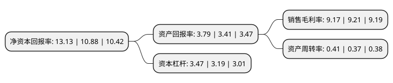

> 本页面由自动化程序生成于 2022年5月20日 01:31
> 内容可能存在错误，如有bug请提交issue至：https://github.com/Eroleice/doc-pi/issues
{.is-warning}

# 上市公司基本情况

## 基本资料

西安陕鼓动力股份有限公司（以下简称“陕鼓动力”）成立于1999年06月30日，西安市。于2010年04月28日在上交所主板上市。

陕鼓动力注册资本172,662.583万元，主营业务:能量转换设备制造，能量转换系统服务，能源基础设施运营。主要产品:轴流压缩机，能量回收透平装置，离心压缩机，离心鼓风机，通风机等，主要应用于冶金，石化，电力，环保，制药等产业领域。以下是详细信息：

- 公司名称: 西安陕鼓动力股份有限公司
- 股票代码: 601369.SH
- 所在地: 陕西 - 西安市
- 成立日期: 1999年06月30日
- 注册资本: 172,662.583万元
- 法定代表人: 李宏安
- 主营业务: 主营业务:能量转换设备制造，能量转换系统服务，能源基础设施运营主要产品:轴流压缩机，能量回收透平装置，离心压缩机，离心鼓风机，通风机等，主要应用于冶金，石化，电力，环保，制药等产业领域
- 公司官网: www.shaangu.com
- 公司介绍: 公司是我国重大装备制造企业，是为石油、化工、冶金、空分、电力、城建、环保、制药和国防等国民经济支柱产业提供透平机械系统问题解决方案及系统服务的制造商、集成商和服务商。形成了“能量转换设备制造、工业服务、能源基础设施运营”三大业务板块。其中，第一板块能量转换设备制造包括各类透平压缩机、鼓风机、通风机、工业能量回收透平、汽轮机、自动化仪表等，其中，轴流压缩机、工业流程能量回收发电设备均属高效节能环保产品，在国内市场上主要竞争对手是国际同行。轴流压缩机、工业流程能量回收发电设备产品曾荣获国家科学技术进步二等奖；第二板块工业服务包括投资业务、金融服务、能量转换设备全生命周期健康管理服务、EPC等；第三板块能源基础设施运营包括分布式(可再生)能源智能一体化园区、水务一体化(污水处理)、热电联产、冷热电三联供、垃圾处理、生物质发电以及气体业务等。公司还先后荣获了陕西十大优秀管理企业、全国创建和谐劳动关系模范企业、全国机械工业质量管理小组活动优秀企业、机械工业质量管理奖陕西省履行社会责任先进企业、十一五全国风机行业标准化工作先进单位等200多项荣誉。

## 股东及高管情况

上市公司第一大股东为陕西鼓风机(集团)有限公司，持股976,653,706股，占比56.56%，为上市公司实际控制人。

截至2022年03月31日，上市公司的前十大股东中，共有3名自然人股东，2名机构股东，5个产品账户，其中5%以上大股东共有1名。上市公司前十大股东明细如下：

> 截至2022年03月31日，上市公司前十大股东信息如下：

| 股东名称 | 持股数量（股） | 持股比例 |
| --- | --- | --- |
| 陕西鼓风机(集团)有限公司 | 976,653,706 | 56.56% |
| 西安工业投资集团有限公司 | 84,092,817 | 4.87% |
| 兴业银行股份有限公司-兴全趋势投资混合型证券投资基金 | 27,265,761 | 1.58% |
| 中国光大银行股份有限公司-兴全商业模式优选混合型证券投资基金(LOF) | 25,752,123 | 1.49% |
| 招商银行股份有限公司-兴全轻资产投资混合型证券投资基金(LOF) | 25,720,603 | 1.49% |
| 李太杰 | 18,540,000 | 1.07% |
| 兴业银行股份有限公司-兴全新视野灵活配置定期开放混合型发起式证券投资基金 | 18,447,161 | 1.07% |
| 柴长茂 | 18,023,169 | 1.04% |
| 浙江义乌市檀真投资管理合伙企业(有限合伙)-正心谷(檀真)价值中国优选私募证券投资基金 | 9,004,300 | 0.52% |
| 闫修权 | 7,800,000 | 0.45% |

## 利润表分析

上市公司2021年总收入为103.6亿元，净利润为9.5亿元，实现盈利。

## 杜邦分析

> 数据列示周期：2021年 | 2020年 | 2019年
{.is-info}

上市公司的净资产收益率在近一年有所上升，上升幅度为20.68%，其变化情况分解如下：
- 上市公司的销售毛利率在近一年下降了-0.43%，可能是生产效率的下降、商品原材料价格上涨或商品价格的下跌所致。
- 上市公司的资产周转率在近一年上升了10.81%，可能是源自于更快的销售回款或库存管理效果提升。
- 上市公司的财务杠杆比率在近一年上升了8.78%，可能是增加负债扩大生产规模。

