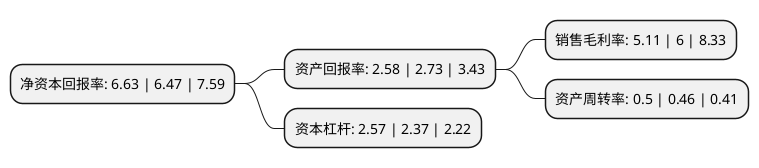

> 本页面由自动化程序生成于 2022年5月20日 01:33
> 内容可能存在错误，如有bug请提交issue至：https://github.com/Eroleice/doc-pi/issues
{.is-warning}

# 上市公司基本情况

## 基本资料

江苏海鸥冷却塔股份有限公司（以下简称“海鸥股份”）成立于1993年11月12日，常州市。于2017年05月17日在上交所主板上市。

海鸥股份注册资本11,251.887万元，公司主要从事工业冷却塔的研发，设计，制造及安装业务，并依托自身产品和技术优势提供工业冷却塔相关的技术服务。公司主要产品为机力通风冷却塔，具体包括:常规冷却塔(包括钢混结构塔，玻璃钢结构塔和钢结构塔)，开式环保节能型冷却塔(包括节水塔，消雾塔和降噪塔)等。以下是详细信息：

- 公司名称: 江苏海鸥冷却塔股份有限公司
- 股票代码: 603269.SH
- 所在地: 江苏 - 常州市
- 成立日期: 1993年11月12日
- 注册资本: 11,251.887万元
- 法定代表人: 金敖大
- 主营业务: 公司主要从事工业冷却塔的研发，设计，制造及安装业务，并依托自身产品和技术优势提供工业冷却塔相关的技术服务公司主要产品为机力通风冷却塔，具体包括:常规冷却塔(包括钢混结构塔，玻璃钢结构塔和钢结构塔)，开式环保节能型冷却塔(包括节水塔，消雾塔和降噪塔)等
- 公司官网: www.seagull-ct.cn
- 公司介绍: 公司从事工业冷却塔的研发、设计、制造及安装业务，并依托产品和技术优势提供工业冷却塔相关的技术服务，主要产品为机力通风冷却塔。公司系第一批制造业单项冠军培育企业、江苏省服务型制造示范企业、美国CTI(美国冷却塔协会)会员，产品通过欧盟CE认证。公司作为主要参编单位之一参与起草了中国冷却塔行业标准GB/T7190-2008、GB/T50102-2014、GB/T18870-2011、CCTI TL001-2014和ZTXB100.001-2016。公司设有江苏省超大型高效节能冷却塔工程技术中心，涵盖工程热力学、工程流体力学、给水排水工程、化工设备等专业，具备工艺、电气、空气动力等综合性专业设计能力和经验。公司及子公司共获得76项专利，多个系列产品获得高新技术产品认定，在节能节水技术、消雾技术、降噪技术、海水循环技术等领域获得多项研究成果。

## 股东及高管情况

上市公司第一大股东为金敖大，持股16,789,500股，占比14.92%，**疑似为**上市公司实际控制人。

截至2022年03月31日，上市公司的前十大股东中，共有8名自然人股东，2名机构股东，其中5%以上大股东共有3名。上市公司前十大股东明细如下：

> 未能通过持股比例判定出上市公司实际控制人（持股30%以上）
> 可能存在通过间接持股、联合持股、协议控制等方式拥有实际控制权的主体，具体请参考上市公司定期公告！
{.is-warning}

> 截至2022年03月31日，上市公司前十大股东信息如下：

| 股东名称 | 持股数量（股） | 持股比例 |
| --- | --- | --- |
| 金敖大 | 16,789,500 | 14.92% |
| 金敖大 | 16,780,400 | 14.9134% |
| 吴祝平 | 14,812,500 | 13.16% |
| 杨华 | 5,064,519 | 4.5% |
| 共青城天保兴投资合伙企业(有限合伙) | 3,786,744 | 3.37% |
| 张中协 | 2,856,525 | 2.54% |
| 江仁锡 | 1,840,000 | 1.64% |
| 许智钧 | 1,334,437 | 1.19% |
| 杨智杰 | 1,299,000 | 1.15% |
| 常州南部投资有限公司 | 1,215,000 | 1.08% |

## 利润表分析

上市公司2021年总收入为11.29亿元，净利润为0.57亿元，实现盈利。

## 杜邦分析

> 数据列示周期：2021年 | 2020年 | 2019年
{.is-info}

上市公司的净资产收益率在近一年有所上升，上升幅度为2.47%，其变化情况分解如下：
- 上市公司的销售毛利率在近一年下降了-14.83%，可能是生产效率的下降、商品原材料价格上涨或商品价格的下跌所致。
- 上市公司的资产周转率在近一年上升了8.7%，可能是源自于更快的销售回款或库存管理效果提升。
- 上市公司的财务杠杆比率在近一年上升了8.44%，可能是增加负债扩大生产规模。

