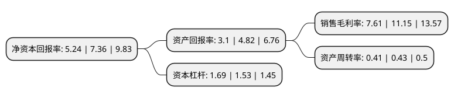

> 本页面由自动化程序生成于 2022年5月20日 01:33
> 内容可能存在错误，如有bug请提交issue至：https://github.com/Eroleice/doc-pi/issues
{.is-warning}

# 上市公司基本情况

## 基本资料

辽宁福鞍重工股份有限公司（以下简称“福鞍股份”）成立于2004年07月14日，鞍山市。于2015年04月24日在上交所主板上市。

福鞍股份注册资本30,702.626万元，主要从事重大技术装备配套大型铸钢件的生产和销售，按照用途，公司产品可以分为火电设备铸件，水电设备铸件，其他发电设备铸件以及其他铸件。以下是详细信息：

- 公司名称: 辽宁福鞍重工股份有限公司
- 股票代码: 603315.SH
- 所在地: 辽宁 - 鞍山市
- 成立日期: 2004年07月14日
- 注册资本: 30,702.626万元
- 法定代表人: 石鹏
- 主营业务: 主要从事重大技术装备配套大型铸钢件的生产和销售，按照用途，公司产品可以分为火电设备铸件，水电设备铸件，其他发电设备铸件以及其他铸件
- 公司官网: www.lnfa.com.cn
- 公司介绍: 公司一直致力于开发、研制、生产大型核心高技术含量的重型铸钢件，拥有省级技术研发中心一个,并已成为高新技术企业。福鞍重工一直致力于高端优质铸钢件生产的创新研发，把提高铸件的原始质量达到国际先进水平、提高铸件的交货质量、实现客户零投诉做为福鞍重工的努力方向。制造“零缺陷”铸件是福鞍重工的追求目标，近年来取得了实质性进步。在重型燃机压缩机排汽缸体、透平缸体、汽轮机外汽缸、内汽缸、超超临界阀体及轨道交通内燃机转向架等高难度、高标准产品上，实现了高质量水平批量制造；对水轮机的主要部件的制造，如，上冠、下环、叶片、转轮体、导叶、推力头等，已在多台套机组的铸件实现了“零缺陷”铸件的制造。经过几年的奋斗，福鞍重工铸钢件的质量已达到了国际先进的水平。公司产品远销国内外多家知名的企业，共同见证“客我双赢”的福鞍理念。

## 股东及高管情况

上市公司第一大股东为中科(辽宁)实业有限公司，持股87,075,363股，占比28.36%，**疑似为**上市公司实际控制人。

截至2022年04月29日，上市公司的前十大股东中，共有7名自然人股东，2名机构股东，1个海外主体，其中5%以上大股东共有3名。上市公司前十大股东明细如下：

> 未能通过持股比例判定出上市公司实际控制人（持股30%以上）
> 可能存在通过间接持股、联合持股、协议控制等方式拥有实际控制权的主体，具体请参考上市公司定期公告！
{.is-warning}

> 截至2022年04月29日，上市公司前十大股东信息如下：

| 股东名称 | 持股数量（股） | 持股比例 |
| --- | --- | --- |
| 中科(辽宁)实业有限公司 | 87,075,363 | 28.36% |
| 福鞍控股-财通证券-20福01EB担保及信托财产专户 | 70,000,000 | 22.8% |
| 福鞍控股有限公司 | 36,302,820 | 11.82% |
| 李士俊 | 10,383,600 | 3.38% |
| 谢雁禧 | 2,536,400 | 0.83% |
| 刘晨 | 2,389,500 | 0.78% |
| 许桂胜 | 1,410,300 | 0.46% |
| 蔡红彬 | 1,394,800 | 0.45% |
| 张学艳 | 1,156,600 | 0.38% |
| 许晓玲 | 1,121,800 | 0.37% |

## 利润表分析

上市公司2021年总收入为9.51亿元，净利润为0.72亿元，实现盈利。

## 杜邦分析

> 数据列示周期：2021年 | 2020年 | 2019年
{.is-info}

上市公司的净资产收益率在近一年有所下降，下降幅度为-28.8%，其变化情况分解如下：
- 上市公司的销售毛利率在近一年下降了-31.75%，可能是生产效率的下降、商品原材料价格上涨或商品价格的下跌所致。
- 上市公司的资产周转率在近一年下降了-4.65%，可能是源自于更慢的销售回款或库存管理效果下降。
- 上市公司的财务杠杆比率在近一年上升了10.46%，可能是增加负债扩大生产规模。

