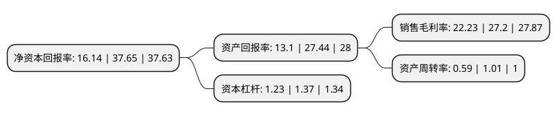

> 本页面由自动化程序生成于 2022年5月20日 01:37
> 内容可能存在错误，如有bug请提交issue至：https://github.com/Eroleice/doc-pi/issues
{.is-warning}

# 上市公司基本情况

## 基本资料

江苏长龄液压股份有限公司（以下简称“长龄液压”）成立于2006年12月04日，无锡市。于2021年03月22日在上交所主板上市。

长龄液压注册资本7,300万元，主要从事液压元件及零部件的研发，生产和销售，主要产品为中央回转接头，张紧装置等。以下是详细信息：

- 公司名称: 江苏长龄液压股份有限公司
- 股票代码: 605389.SH
- 所在地: 江苏 - 无锡市
- 成立日期: 2006年12月04日
- 注册资本: 7,300万元
- 法定代表人: 夏继发
- 主营业务: 主要从事液压元件及零部件的研发，生产和销售，主要产品为中央回转接头，张紧装置等
- 公司官网: www.changlingmach.cn
- 公司介绍: 公司是一家拥有自主知识产权、集研发、生产、销售于一体的专业工程机械用液压关键部件企业，主要产品为工程机械用液压中央回转接头、液压涨紧装置、液压泵阀等产品，是国家“液压挖掘机中央回转接头”标准的起草单位。公司已与国内工程机械龙头企业三一、柳工、玉柴、徐工、龙工等，以及外资着名企业日本小松、韩国现代、美国卡特彼勒等四十家整机工厂建立了长期、稳定的合作关系。

## 股东及高管情况

上市公司第一大股东为夏继发，持股42,000,000股，占比43.15%，为上市公司实际控制人。

截至2022年03月31日，上市公司的前十大股东中，共有6名自然人股东，4名机构股东，其中5%以上大股东共有2名。上市公司前十大股东明细如下：

> 截至2022年03月31日，上市公司前十大股东信息如下：

| 股东名称 | 持股数量（股） | 持股比例 |
| --- | --- | --- |
| 夏继发 | 42,000,000 | 43.15% |
| 夏泽民 | 28,000,000 | 28.77% |
| 江阴澜海浩龙企业管理合伙企业(有限合伙) | 3,000,000 | 3.08% |
| 上海景贤投资有限公司 | 1,150,404 | 1.18% |
| 傅莺 | 162,600 | 0.17% |
| 张娜 | 139,900 | 0.14% |
| 康龙 | 133,600 | 0.14% |
| 韩杰 | 130,456 | 0.13% |
| 重庆领航兄弟商业管理有限公司 | 130,000 | 0.13% |
| 深圳市荣晟泰房地产开发有限公司 | 109,100 | 0.11% |

## 利润表分析

上市公司2021年总收入为9.06亿元，净利润为2.01亿元，实现盈利。

## 杜邦分析

> 数据列示周期：2021年 | 2020年 | 2019年
{.is-info}

上市公司的净资产收益率在近一年有所下降，下降幅度为-57.13%，其变化情况分解如下：
- 上市公司的销售毛利率在近一年下降了-18.27%，可能是生产效率的下降、商品原材料价格上涨或商品价格的下跌所致。
- 上市公司的资产周转率在近一年下降了-41.58%，可能是源自于更慢的销售回款或库存管理效果下降。
- 上市公司的财务杠杆比率在近一年下降了-10.22%，可能是减少负债降低财务费用。

