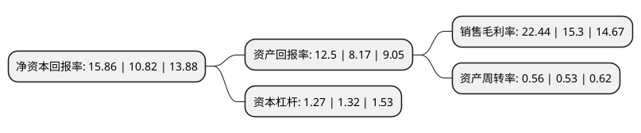

> 本页面由自动化程序生成于 2022年5月20日 01:39
> 内容可能存在错误，如有bug请提交issue至：https://github.com/Eroleice/doc-pi/issues
{.is-warning}

# 上市公司基本情况

## 基本资料

株洲欧科亿数控精密刀具股份有限公司（以下简称“欧科亿”）成立于1996年01月23日，株洲市。于2020年12月10日在上交所科创板上市。

欧科亿注册资本10,000万元，专业从事数控刀具产品和硬质合金制品的研发，生产和销售以下是详细信息：

- 公司名称: 株洲欧科亿数控精密刀具股份有限公司
- 股票代码: 688308.SH
- 所在地: 湖南 - 株洲市
- 成立日期: 1996年01月23日
- 注册资本: 10,000万元
- 法定代表人: 袁美和
- 主营业务: 专业从事数控刀具产品和硬质合金制品的研发，生产和销售
- 公司官网: www.oke-carbide.com
- 公司介绍: 公司是一家专业从事数控刀具产品和硬质合金制品的研发、生产和销售，具有自主研发和创新能力的高新技术企业，公司生产的数控刀具产品主要是数控刀片。公司自成立之日起，便致力于硬质合金制品的研制，积累了丰富的生产工艺和质量管理经验。公司目前是国内锯齿刀片生产规模最大的企业，与百得工具(BLACK+DECKER)、乐客(LEUCO)、金田锯业、日东工具、永泰锯业等国内外知名的工具企业建立了长期稳定的合作关系，并且多次获得国际工具巨头百得工具(BLACK+DECKER)的“优秀供应商”称号。公司是国家级高新技术企业、湖南省新材料企业、湖南省企业技术中心、湖南省两型建设示范企业、湖南省小巨人企业。公司“OKE”品牌在第四届切削刀具用户调查中被评选为“用户满意品牌”，自主研制的不锈钢材料加工刀片获得“金锋奖”(首届切削刀具创新产品奖)。

## 股东及高管情况

上市公司第一大股东为袁美和，持股18,060,000股，占比18.06%，**疑似为**上市公司实际控制人。

截至2022年03月31日，上市公司的前十大股东中，共有3名自然人股东，4名机构股东，3个产品账户，其中5%以上大股东共有5名。上市公司前十大股东明细如下：

> 未能通过持股比例判定出上市公司实际控制人（持股30%以上）
> 可能存在通过间接持股、联合持股、协议控制等方式拥有实际控制权的主体，具体请参考上市公司定期公告！
{.is-warning}

> 截至2022年03月31日，上市公司前十大股东信息如下：

| 股东名称 | 持股数量（股） | 持股比例 |
| --- | --- | --- |
| 袁美和 | 18,060,000 | 18.06% |
| 格林美股份有限公司 | 13,002,500 | 13% |
| 谭文清 | 10,247,400 | 10.25% |
| 乐清市德汇股权投资合伙企业(有限合伙) | 8,813,540 | 8.81% |
| 株洲精锐投资管理合伙企业(有限合伙) | 5,821,800 | 5.82% |
| 深圳同创伟业资产管理股份有限公司-深圳南海成长同赢股权投资基金(有限合伙) | 4,004,800 | 4% |
| 广东粤科纵横融通创业投资合伙企业(有限合伙) | 3,800,000 | 3.8% |
| 马怀义 | 3,075,054 | 3.08% |
| 招商银行股份有限公司-交银施罗德新成长混合型证券投资基金 | 2,640,387 | 2.64% |
| 中国农业银行股份有限公司-交银施罗德精选混合型证券投资基金 | 1,888,886 | 1.89% |

## 利润表分析

上市公司2021年总收入为9.9亿元，净利润为2.22亿元，实现盈利。

## 杜邦分析

> 数据列示周期：2021年 | 2020年 | 2019年
{.is-info}

上市公司的净资产收益率在近一年有所上升，上升幅度为46.58%，其变化情况分解如下：
- 上市公司的销售毛利率在近一年上升了46.67%，可能是生产效率的提升、商品原材料价格下跌或商品价格的上涨所致。
- 上市公司的资产周转率在近一年上升了5.66%，可能是源自于更快的销售回款或库存管理效果提升。
- 上市公司的财务杠杆比率在近一年下降了-3.79%，可能是减少负债降低财务费用。

