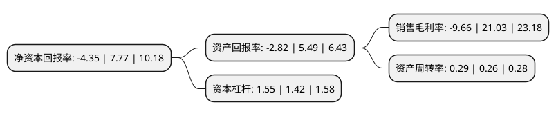

> 本页面由自动化程序生成于 2022年5月20日 01:39
> 内容可能存在错误，如有bug请提交issue至：https://github.com/Eroleice/doc-pi/issues
{.is-warning}

# 上市公司基本情况

## 基本资料

西安铂力特增材技术股份有限公司（以下简称“铂力特”）成立于2011年07月06日，西安市。于2019年07月22日在上交所科创板上市。

铂力特注册资本8,079.125万元，公司自主研制开发了激光选区熔化成形，激光高性能修复等系列金属3D打印设备，专注于工业级金属增材制造(3D打印)的高新技术企业。以下是详细信息：

- 公司名称: 西安铂力特增材技术股份有限公司
- 股票代码: 688333.SH
- 所在地: 陕西 - 西安市
- 成立日期: 2011年07月06日
- 注册资本: 8,079.125万元
- 法定代表人: 薛蕾
- 主营业务: 公司自主研制开发了激光选区熔化成形，激光高性能修复等系列金属3D打印设备，专注于工业级金属增材制造(3D打印)的高新技术企业
- 公司官网: www.xa-blt.com
- 公司介绍: 公司是一家专注于工业级金属增材制造(3D打印)的高新技术企业，为客户提供金属增材制造与再制造技术全套解决方案。作为国内增材制造行业早期的参与者之一，公司通过多年技术研发创新及产业化应用，在金属增材制造领域积累了独特的技术优势。公司围绕金属增材制造产业链，开展金属3D打印设备、金属3D打印定制化产品及金属3D打印原材料的研发、生产、销售，同时向客户提供金属3D打印工艺设计开发及相关技术服务，构建了较为完整的金属3D打印产业生态链，整体实力在国内外金属增材制造领域处于领先地位。公司产品及服务广泛应用于航空航天、工业机械、能源动力、科研院所、医疗研究、汽车制造、船舶制造及电子工业等领域，尤其在航空航天领域，市场占有率较高，公司已成为空中客车公司金属增材制造服务的合格供应商。

## 股东及高管情况

上市公司第一大股东为折生阳，持股17,441,190股，占比21.59%，**疑似为**上市公司实际控制人。

截至2022年03月31日，上市公司的前十大股东中，共有4名自然人股东，4名机构股东，2个产品账户，其中5%以上大股东共有2名。上市公司前十大股东明细如下：

> 未能通过持股比例判定出上市公司实际控制人（持股30%以上）
> 可能存在通过间接持股、联合持股、协议控制等方式拥有实际控制权的主体，具体请参考上市公司定期公告！
{.is-warning}

> 截至2022年03月31日，上市公司前十大股东信息如下：

| 股东名称 | 持股数量（股） | 持股比例 |
| --- | --- | --- |
| 折生阳 | 17,441,190 | 21.59% |
| 萍乡晶屹商务信息咨询合伙企业(有限合伙) | 9,073,460 | 11.23% |
| 薛蕾 | 3,663,855 | 4.53% |
| 上海高毅资产管理合伙企业(有限合伙)-高毅邻山1号远望基金 | 3,000,000 | 3.71% |
| 朱雀基金-陕西煤业股份有限公司-陕煤朱雀新材料产业2期单一资产管理计划 | 2,536,075 | 3.14% |
| 西安高新技术产业风险投资有限责任公司 | 2,326,929 | 2.88% |
| 雷开贵 | 2,015,405 | 2.49% |
| 萍乡博睿企业管理合伙企业(有限合伙) | 1,944,005 | 2.41% |
| 王萍 | 1,783,377 | 2.21% |
| 西安西北工业大学资产经营管理有限公司 | 1,698,526 | 2.1% |

## 利润表分析

上市公司2021年总收入为5.51亿元，净利润为-0.54亿元，**未实现盈利**。

## 杜邦分析

> 数据列示周期：2021年 | 2020年 | 2019年
{.is-info}

上市公司的净资产收益率在近一年有所下降，下降幅度为-155.98%，其变化情况分解如下：
- 上市公司的销售毛利率在近一年下降了-145.93%，可能是生产效率的下降、商品原材料价格上涨或商品价格的下跌所致。
- 上市公司的资产周转率在近一年上升了11.54%，可能是源自于更快的销售回款或库存管理效果提升。
- 上市公司的财务杠杆比率在近一年上升了9.15%，可能是增加负债扩大生产规模。

