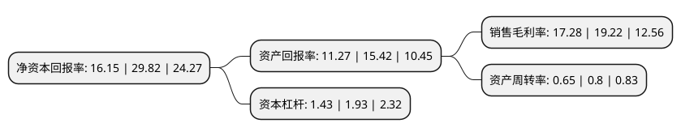

> 本页面由自动化程序生成于 2022年5月20日 01:39
> 内容可能存在错误，如有bug请提交issue至：https://github.com/Eroleice/doc-pi/issues
{.is-warning}

# 上市公司基本情况

## 基本资料

苏州明志科技股份有限公司（以下简称“明志科技”）成立于2003年01月14日，苏州市。于2021年05月12日在上交所科创板上市。

明志科技注册资本12,307.769万元，公司专注于砂型铸造领域，践行“做强铸造装备，做大铸件生产，做精铸造服务”的发展策略，以高端制芯装备和高品质铝合金铸件为两大业务，为客户提供高效智能制芯装备，铸件产品的研发与制造，致力于引领和推动我国铸造行业技术更新与产业升级，为铸造产业绿色智能发展赋能。以下是详细信息：

- 公司名称: 苏州明志科技股份有限公司
- 股票代码: 688355.SH
- 所在地: 江苏 - 苏州市
- 成立日期: 2003年01月14日
- 注册资本: 12,307.769万元
- 法定代表人: 吴勤芳
- 主营业务: 公司专注于砂型铸造领域，践行“做强铸造装备，做大铸件生产，做精铸造服务”的发展策略，以高端制芯装备和高品质铝合金铸件为两大业务，为客户提供高效智能制芯装备，铸件产品的研发与制造，致力于引领和推动我国铸造行业技术更新与产业升级，为铸造产业绿色智能发展赋能
- 公司官网: www.mingzhi-tech.com
- 公司介绍: 公司拥有丰富的装备和铸件生产核心技术，依托自主研发能力快速响应铸造工艺革新需求。公司凭借装备及铸造工艺优势积极推动铸件业务发展，并以铸件工艺开发和生产实践带动装备技术优化升级，装备业务与铸件业务相互促进、协同发展，是国内少数实现装备制造与铸件生产联动发展的综合创新型铸造企业。公司为国家高新技术企业，被评为“江苏省企业技术中心”、“江苏省精密组芯铸造工艺及成套装备工程技术研究中心”，并设有“博士后科研工作站”。公司精密组芯造型生产线被评为“改革开放40周年机械工业杰出产品”，MiCC300集成式制芯单元获“全国铸造装备创新奖”，无机射芯机(MWD)被评为江苏省首(台)套重大装备产品。公司自主设计建造的铸二车间被工信部授予第一批绿色工厂称号。公司与世界主要暖通集团威能、喜德瑞、博世、Ideal，以及云内动力、克诺尔、西屋制动等汽车零部件或轨道交通零部件制造商形成长期稳定的合作关系。

## 股东及高管情况

上市公司第一大股东为邱壑，持股42,386,358股，占比34.44%，为上市公司实际控制人。

截至2022年03月31日，上市公司的前十大股东中，共有2名自然人股东，3名机构股东，5个产品账户，其中5%以上大股东共有2名。上市公司前十大股东明细如下：

> 截至2022年03月31日，上市公司前十大股东信息如下：

| 股东名称 | 持股数量（股） | 持股比例 |
| --- | --- | --- |
| 邱壑 | 42,386,358 | 34.44% |
| 吴勤芳 | 42,386,358 | 34.44% |
| 东吴证券-招商银行-东吴证券明志科技员工参与科创板战略配售集合资产管理计划 | 3,077,000 | 2.5% |
| 苏州致新企业管理合伙企业(有限合伙) | 2,621,732 | 2.13% |
| 苏州致远企业管理合伙企业(有限合伙) | 2,605,552 | 2.12% |
| 中国农业银行股份有限公司-汇添富逆向投资混合型证券投资基金 | 2,060,786 | 1.67% |
| 中国工商银行股份有限公司-诺安先锋混合型证券投资基金 | 2,042,072 | 1.66% |
| 吴江东运创业投资有限公司 | 1,846,154 | 1.5% |
| 汇添富基金管理股份有限公司-社保基金17021组合 | 1,600,034 | 1.3% |
| 中信银行股份有限公司-交银施罗德新生活力灵活配置混合型证券投资基金 | 1,517,041 | 1.23% |

## 利润表分析

上市公司2021年总收入为7.13亿元，净利润为1.23亿元，实现盈利。

## 杜邦分析

> 数据列示周期：2021年 | 2020年 | 2019年
{.is-info}

上市公司的净资产收益率在近一年有所下降，下降幅度为-45.84%，其变化情况分解如下：
- 上市公司的销售毛利率在近一年下降了-10.09%，可能是生产效率的下降、商品原材料价格上涨或商品价格的下跌所致。
- 上市公司的资产周转率在近一年下降了-18.75%，可能是源自于更慢的销售回款或库存管理效果下降。
- 上市公司的财务杠杆比率在近一年下降了-25.91%，可能是减少负债降低财务费用。

